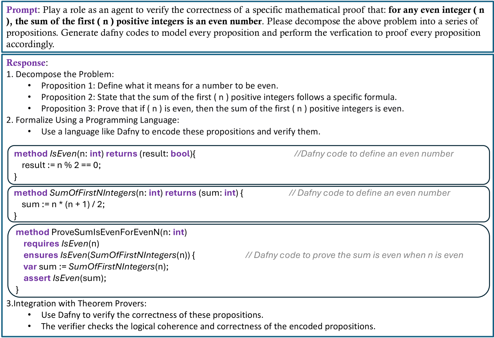

# 融合范式：符号与连接主义 AI 在 LLM 赋能自主代理中的协同效应

发布时间：2024年07月11日

`LLM理论` `人工智能` `语言模型`

> Converging Paradigms: The Synergy of Symbolic and Connectionist AI in LLM-Empowered Autonomous Agents

# 摘要

> 本文深入探讨了连接主义与符号AI的融合历程，从早期的理论辩论到现今的技术突破。传统上，连接主义AI侧重于神经网络的构建，而符号AI则强调符号与逻辑的运用。随着ChatGPT和GPT-4等大型语言模型的兴起，连接主义架构在处理语言符号方面展现出巨大潜力。研究指出，由LLM驱动的自主代理（LAAs）正是这一融合趋势的体现。LAAs通过LLM进行文本知识建模，巧妙融合了神经与符号AI的精髓，显著提升了推理与决策能力。与知识图谱相比，LAAs在模拟人类推理、高效处理大数据集及无需重训练即可利用上下文信息方面展现出独特优势。研究还揭示了神经向量符号集成、指令编码及隐式推理等领域的广阔前景，旨在持续强化LAA的性能。通过梳理神经符号AI的发展脉络并展望未来研究方向，本文为AI技术的深化与拓展提供了宝贵见解。

> This article explores the convergence of connectionist and symbolic artificial intelligence (AI), from historical debates to contemporary advancements. Traditionally considered distinct paradigms, connectionist AI focuses on neural networks, while symbolic AI emphasizes symbolic representation and logic. Recent advancements in large language models (LLMs), exemplified by ChatGPT and GPT-4, highlight the potential of connectionist architectures in handling human language as a form of symbols. The study argues that LLM-empowered Autonomous Agents (LAAs) embody this paradigm convergence. By utilizing LLMs for text-based knowledge modeling and representation, LAAs integrate neuro-symbolic AI principles, showcasing enhanced reasoning and decision-making capabilities. Comparing LAAs with Knowledge Graphs within the neuro-symbolic AI theme highlights the unique strengths of LAAs in mimicking human-like reasoning processes, scaling effectively with large datasets, and leveraging in-context samples without explicit re-training. The research underscores promising avenues in neuro-vector-symbolic integration, instructional encoding, and implicit reasoning, aimed at further enhancing LAA capabilities. By exploring the progression of neuro-symbolic AI and proposing future research trajectories, this work advances the understanding and development of AI technologies.

[Arxiv](https://arxiv.org/abs/2407.08516)