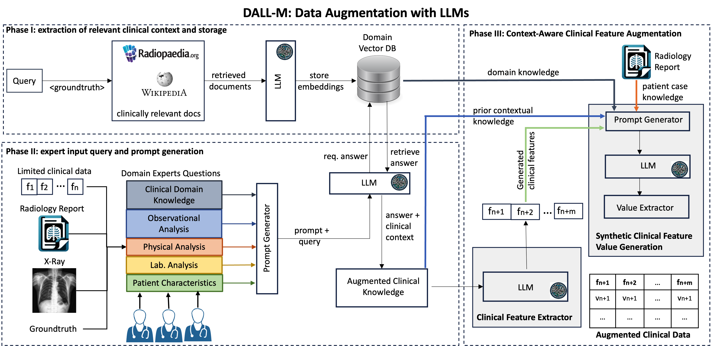
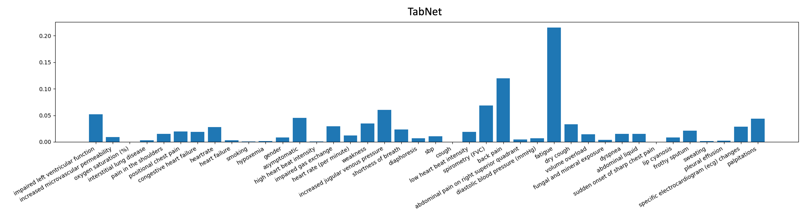

# DALL-M：利用大型语言模型实现上下文感知的临床数据增强

发布时间：2024年07月11日

`LLM应用` `人工智能`

> DALL-M: Context-Aware Clinical Data Augmentation with LLMs

# 摘要

> X射线在医学诊断中扮演关键角色，但缺乏临床背景限制了其效能。放射科医生常需更多临床信息来准确诊断。我们创新地利用临床表格数据增强技术，提升X射线诊断的准确性与可靠性。通过大型语言模型生成患者合成数据，不仅保护了真实数据，还通过相关合成特征丰富了数据集，大幅提升模型性能。DALL-M的三阶段特征生成流程，包括临床上下文存储、专家查询生成和上下文感知特征增强，有效整合了X射线图像与报告，为799个案例生成了91个增强特征。这是首次在数据增强中结合患者报告、性别和年龄，生成新旧特征的上下文值，并创造新知识。实证测试显示，包括决策树、随机森林等模型，性能显著提升，F1分数增加16.5%，精确度和召回率提升约25%。DALL-M填补了临床数据增强的空白，为生成丰富上下文的数据集提供了坚实框架。

> X-ray images are vital in medical diagnostics, but their effectiveness is limited without clinical context. Radiologists often find chest X-rays insufficient for diagnosing underlying diseases, necessitating comprehensive clinical features and data integration. We present a novel technique to enhance the clinical context through augmentation techniques with clinical tabular data, thereby improving its applicability and reliability in AI medical diagnostics. To address this, we introduce a pioneering approach to clinical data augmentation that employs large language models (LLMs) to generate patient contextual synthetic data. This methodology is crucial for training more robust deep learning models in healthcare. It preserves the integrity of real patient data while enriching the dataset with contextually relevant synthetic features, significantly enhancing model performance. DALL-M uses a three-phase feature generation process: (i) clinical context storage, (ii) expert query generation, and (iii) context-aware feature augmentation. DALL-M generates new, clinically relevant features by synthesizing chest X-ray images and reports. Applied to 799 cases using nine features from the MIMIC-IV dataset, it created an augmented set of 91 features. This is the first work to generate contextual values for existing and new features based on patients' X-ray reports, gender, and age and to produce new contextual knowledge during data augmentation. Empirical validation with machine learning models, including Decision Trees, Random Forests, XGBoost, and TabNET, showed significant performance improvements. Incorporating augmented features increased the F1 score by 16.5% and Precision and Recall by approximately 25%. DALL-M addresses a critical gap in clinical data augmentation, offering a robust framework for generating contextually enriched datasets.

[Arxiv](https://arxiv.org/abs/2407.08227)