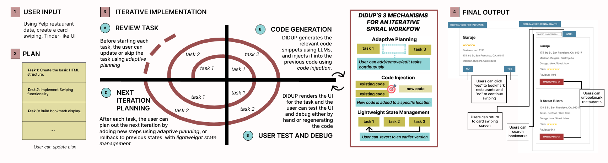
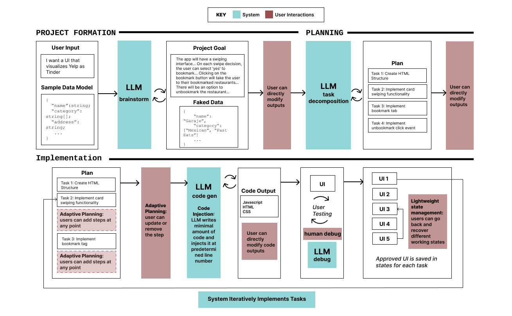
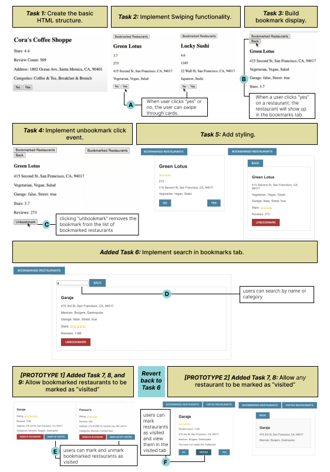

# DIDUP：为 UI 原型设计带来动态迭代开发

发布时间：2024年07月11日

`LLM应用` `软件开发` `用户体验`

> DIDUP: Dynamic Iterative Development for UI Prototyping

# 摘要

> 大型语言模型（LLM）在编码方面表现卓越。其中，基于代码的用户界面原型设计是人类与LLM合作的一个亮点，它让用户能全面参与并体验界面。我们研究了GPT Pilot，发现其一旦启动开发便难以适应变化，这在故障预防和动态规划上显得不足，其工作流程类似传统的瀑布模型。为此，我们推出了DIDUP，一个采用迭代螺旋模型的系统，能灵活应对开发中的变化。我们还提出了三项创新机制：适应性规划，让计划随实施动态调整；代码注入，减少重写，帮助用户理解代码演变；轻量级状态管理，简化版本控制，便于用户快速回溯。这些功能共同助力用户高效迭代原型。

> Large language models (LLMs) are remarkably good at writing code. A particularly valuable case of human-LLM collaboration is code-based UI prototyping, a method for creating interactive prototypes that allows users to view and fully engage with a user interface. We conduct a formative study of GPT Pilot, a leading LLM-generated code-prototyping system, and find that its inflexibility towards change once development has started leads to weaknesses in failure prevention and dynamic planning; it closely resembles the linear workflow of the waterfall model. We introduce DIDUP, a system for code-based UI prototyping that follows an iterative spiral model, which takes changes and iterations that come up during the development process into account. We propose three novel mechanisms for LLM-generated code-prototyping systems: (1) adaptive planning, where plans should be dynamic and reflect changes during implementation, (2) code injection, where the system should write a minimal amount of code and inject it instead of rewriting code so users have a better mental model of the code evolution, and (3) lightweight state management, a simplified version of source control so users can quickly revert to different working states. Together, this enables users to rapidly develop and iterate on prototypes.

[Arxiv](https://arxiv.org/abs/2407.08474)