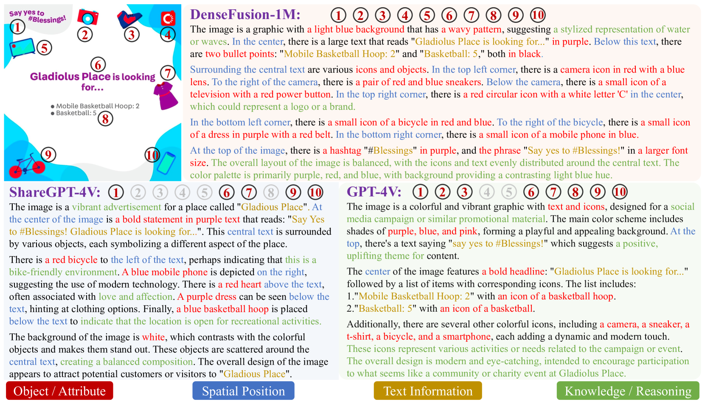
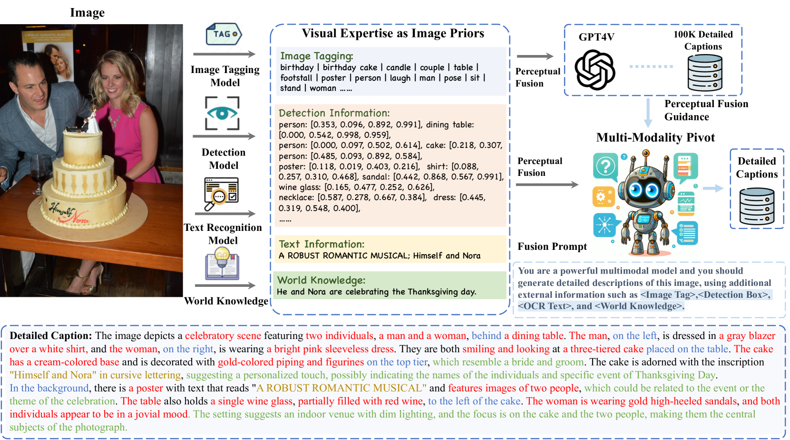
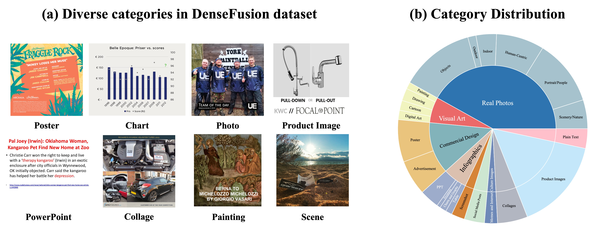
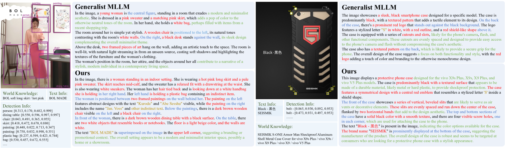

# DenseFusion-1M：汇聚视觉专家之力，打造全面多模态感知新境界

发布时间：2024年07月11日

`LLM应用` `计算机视觉` `人工智能`

> DenseFusion-1M: Merging Vision Experts for Comprehensive Multimodal Perception

# 摘要

> 多模态大型语言模型 (MLLMs) 正日益注重对复杂视觉元素的深入理解，包括多对象、文本信息及空间关系。这些模型的全面视觉感知能力，依赖于提供多样化视觉元素和详尽图像描述的高质量图像-文本数据集。然而，这类超详细数据集的稀缺，成为 MLLM 领域发展的瓶颈。问题在于现有字幕引擎的感知能力不足，无法提供完整准确的注释。为此，我们提出“感知融合”方案，采用低成本高效能的字幕引擎，实现完整准确的图像描述。该方案整合了多元感知专家的图像先验信息，并利用高效 MLLM 核心，模拟高级 MLLMs 的感知能力。我们从 LAION 数据集中精选了 100 万张代表性图像，通过我们的引擎生成密集描述，命名为 DenseFusion-1M。实验证明，我们的引擎性能卓越，生成的数据集大幅提升了 MLLMs 在多样视觉语言任务中的感知与认知能力，尤其在高分辨率图像输入时表现突出。相关数据集与代码已公开，详见 https://github.com/baaivision/DenseFusion。

> Existing Multimodal Large Language Models (MLLMs) increasingly emphasize complex understanding of various visual elements, including multiple objects, text information, and spatial relations. Their development for comprehensive visual perception hinges on the availability of high-quality image-text datasets that offer diverse visual elements and throughout image descriptions. However, the scarcity of such hyper-detailed datasets currently hinders progress within the MLLM community. The bottleneck stems from the limited perceptual capabilities of current caption engines, which fall short in providing complete and accurate annotations. To facilitate the cutting-edge research of MLLMs on comprehensive vision perception, we thereby propose Perceptual Fusion, using a low-budget but highly effective caption engine for complete and accurate image descriptions. Specifically, Perceptual Fusion integrates diverse perception experts as image priors to provide explicit information on visual elements and adopts an efficient MLLM as a centric pivot to mimic advanced MLLMs' perception abilities. We carefully select 1M highly representative images from uncurated LAION dataset and generate dense descriptions using our engine, dubbed DenseFusion-1M. Extensive experiments validate that our engine outperforms its counterparts, where the resulting dataset significantly improves the perception and cognition abilities of existing MLLMs across diverse vision-language benchmarks, especially with high-resolution images as inputs. The dataset and code are publicly available at https://github.com/baaivision/DenseFusion.

[Arxiv](https://arxiv.org/abs/2407.08303)