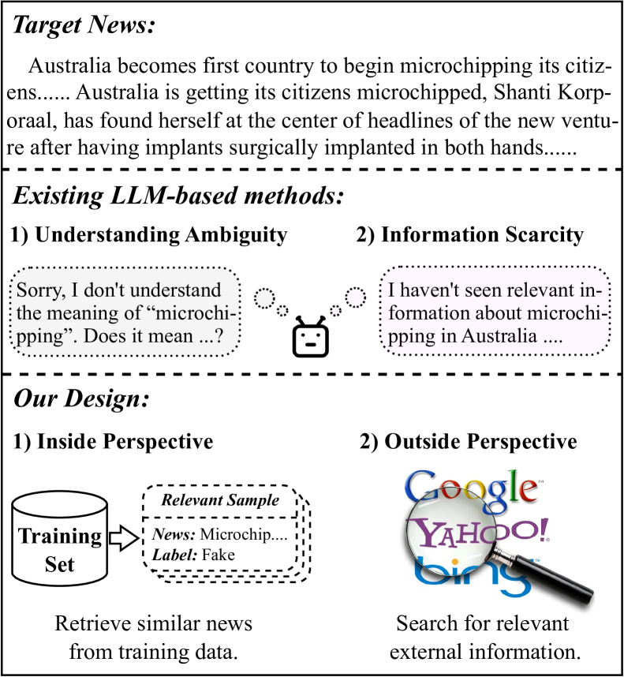
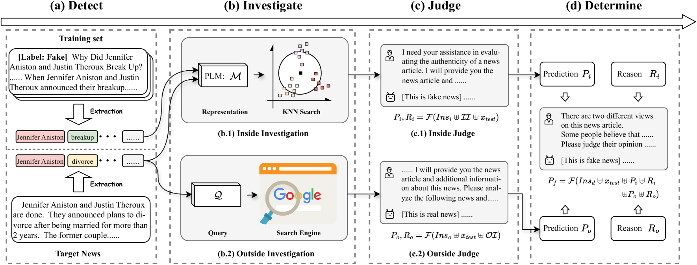
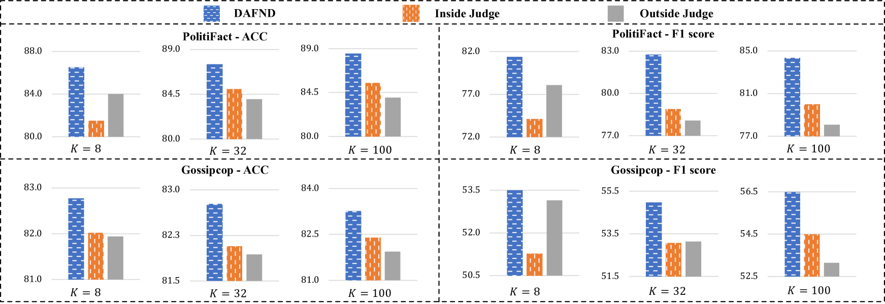
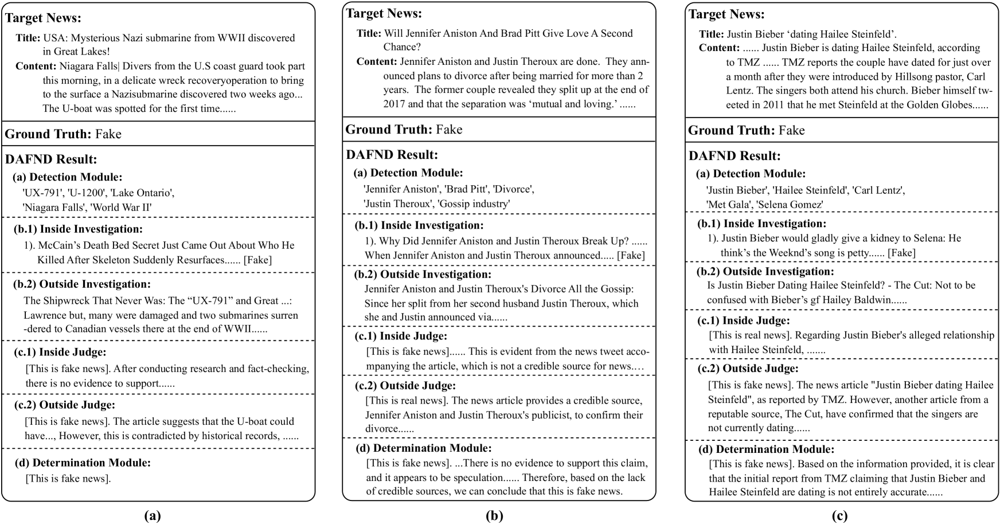
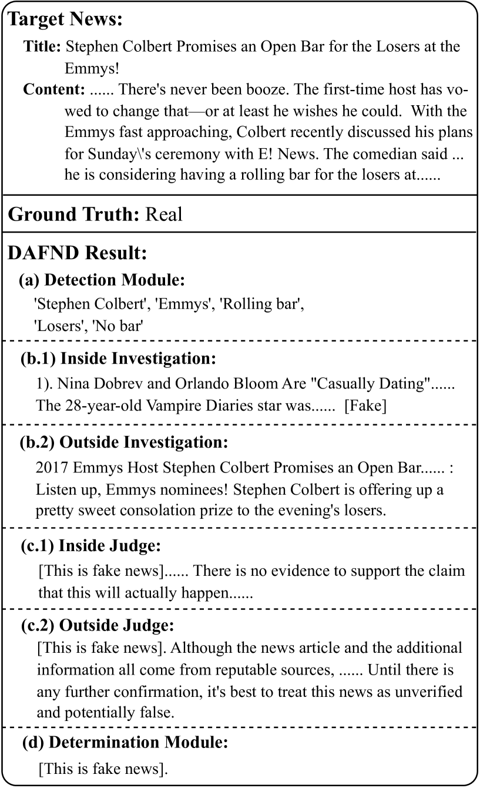

# 我们提出了一种基于大型语言模型的新框架，通过检测、调查、判断和确定四个步骤，有效进行少样本假新闻检测。

发布时间：2024年07月11日

`LLM应用` `社交媒体` `新闻检测`

> Detect, Investigate, Judge and Determine: A Novel LLM-based Framework for Few-shot Fake News Detection

# 摘要

> Few-Shot Fake News Detection (FS-FND) 旨在极低资源环境下识别假新闻。随着假新闻在社交媒体上的泛滥，这一任务备受瞩目。大型语言模型 (LLM) 凭借其先验知识和上下文学习能力，表现出色。但现有方法受限于理解歧义和信息稀缺，限制了 LLM 的潜力。为此，我们提出了双视角增强的假新闻检测 (DAFND) 模型，从内外两方面强化 LLM。DAFND 首先通过检测模块提取新闻关键词，再通过创新的调查模块搜集相关内外信息，最后由判断模块得出两个预测结果，并由决定模块整合得出最终结论。实验证明，DAFND 在低资源环境下表现优异。

> Few-Shot Fake News Detection (FS-FND) aims to distinguish inaccurate news from real ones in extremely low-resource scenarios. This task has garnered increased attention due to the widespread dissemination and harmful impact of fake news on social media. Large Language Models (LLMs) have demonstrated competitive performance with the help of their rich prior knowledge and excellent in-context learning abilities. However, existing methods face significant limitations, such as the Understanding Ambiguity and Information Scarcity, which significantly undermine the potential of LLMs. To address these shortcomings, we propose a Dual-perspective Augmented Fake News Detection (DAFND) model, designed to enhance LLMs from both inside and outside perspectives. Specifically, DAFND first identifies the keywords of each news article through a Detection Module. Subsequently, DAFND creatively designs an Investigation Module to retrieve inside and outside valuable information concerning to the current news, followed by another Judge Module to derive its respective two prediction results. Finally, a Determination Module further integrates these two predictions and derives the final result. Extensive experiments on two publicly available datasets show the efficacy of our proposed method, particularly in low-resource settings.

[Arxiv](https://arxiv.org/abs/2407.08952)