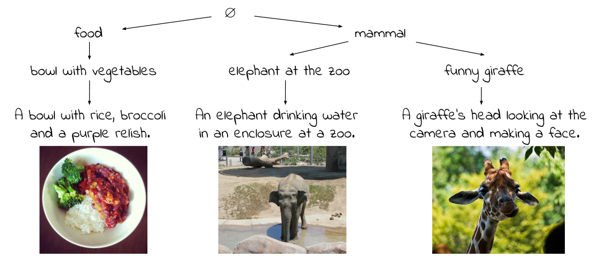
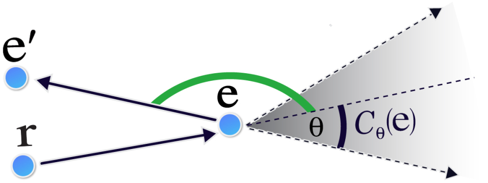
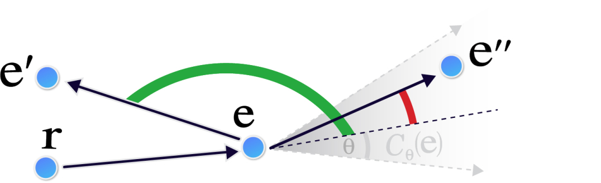
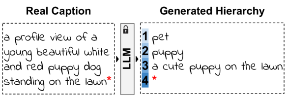
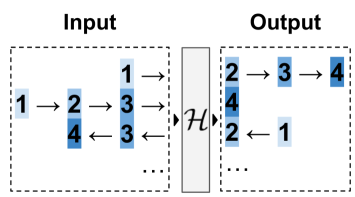
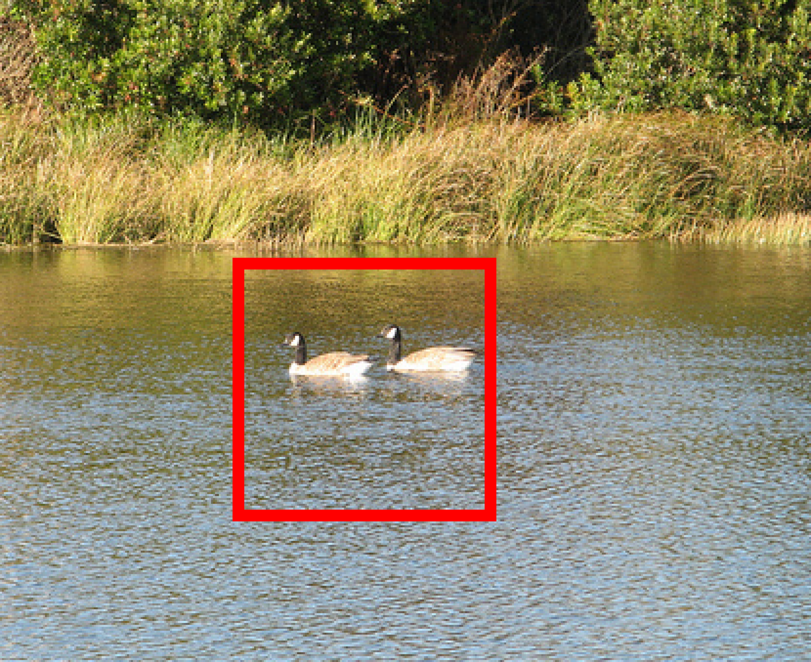
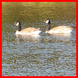

# 图像-文本表示中涌现的视觉-语义层次结构

发布时间：2024年07月11日

`LLM应用` `计算机视觉`

> Emergent Visual-Semantic Hierarchies in Image-Text Representations

# 摘要

> 尽管如CLIP这样的视觉与语言模型在分析文本和图像方面表现出色，但它们并未明确考虑描述图像的文本集合的分层结构。相反，传统多模态分层学习方法需从零开始训练，未能利用现有先进模型的知识。我们研究发现，这些模型虽未专门训练，却能自发理解视觉-语义层次。为此，我们提出径向嵌入框架，并创建HierarCaps数据集，助力分层知识研究。实验表明，基础模型在无需专门训练的情况下，其分层理解能力超越了传统模型。此外，通过仅文本微调，这些模型能更好地适应分层推理，同时保留预训练知识。

> While recent vision-and-language models (VLMs) like CLIP are a powerful tool for analyzing text and images in a shared semantic space, they do not explicitly model the hierarchical nature of the set of texts which may describe an image. Conversely, existing multimodal hierarchical representation learning methods require costly training from scratch, failing to leverage the knowledge encoded by state-of-the-art multimodal foundation models. In this work, we study the knowledge of existing foundation models, finding that they exhibit emergent understanding of visual-semantic hierarchies despite not being directly trained for this purpose. We propose the Radial Embedding (RE) framework for probing and optimizing hierarchical understanding, and contribute the HierarCaps dataset, a benchmark facilitating the study of hierarchical knowledge in image--text representations, constructed automatically via large language models. Our results show that foundation VLMs exhibit zero-shot hierarchical understanding, surpassing the performance of prior models explicitly designed for this purpose. Furthermore, we show that foundation models may be better aligned to hierarchical reasoning via a text-only fine-tuning phase, while retaining pretraining knowledge.

[Arxiv](https://arxiv.org/abs/2407.08521)