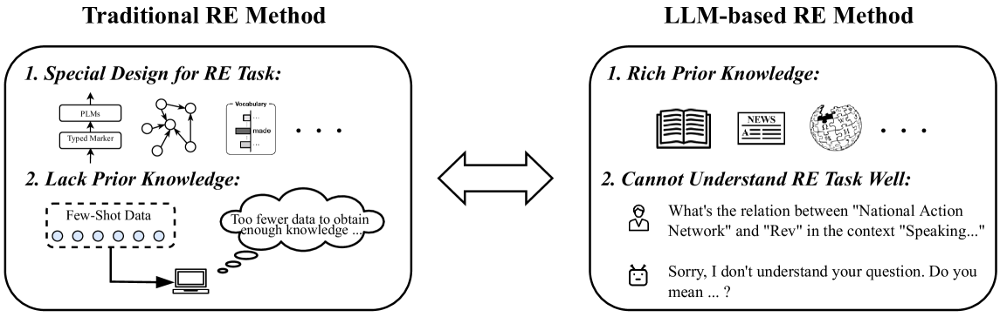
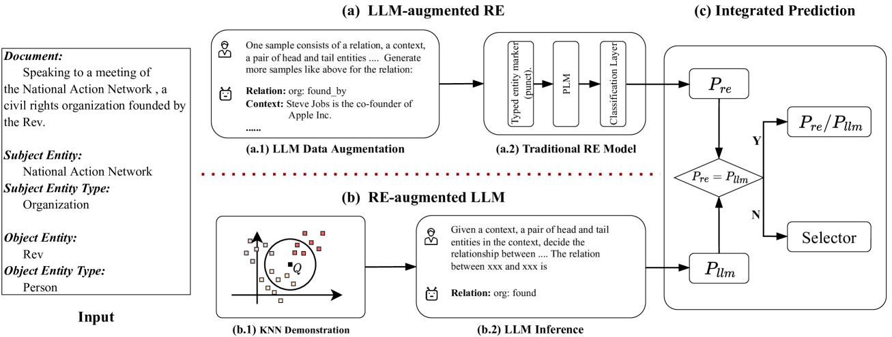
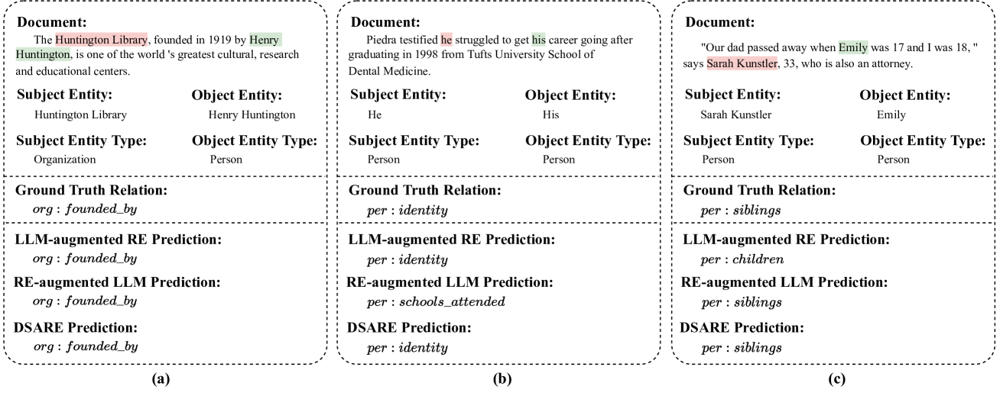

# 结合传统关系抽取技术与大型语言模型，提升少样本关系抽取的效能。

发布时间：2024年07月11日

`LLM应用` `机器学习`

> Empowering Few-Shot Relation Extraction with The Integration of Traditional RE Methods and Large Language Models

# 摘要

> Few-Shot Relation Extraction (FSRE) 因其能在极低资源环境下提取文本信息而备受 NLP 研究者青睐。主要方法包括基于预训练语言模型的微调和提示调优。随着大型语言模型的兴起，许多研究者开始通过 In-Context Learning 探索 FSRE。然而，传统 RE 模型缺乏先验知识，而 LLMs 在 RE 任务上表现不佳。为此，我们提出了双系统增强的关系提取器 (DSARE)，它巧妙结合了传统 RE 模型与 LLMs，不仅将 LLMs 的先验知识融入传统模型，还通过关系提取增强提升了 LLMs 的 RE 任务能力。通过集成预测模块，DSARE 综合两种预测得出最终结果。实验证明，我们的方法卓有成效。

> Few-Shot Relation Extraction (FSRE), a subtask of Relation Extraction (RE) that utilizes limited training instances, appeals to more researchers in Natural Language Processing (NLP) due to its capability to extract textual information in extremely low-resource scenarios. The primary methodologies employed for FSRE have been fine-tuning or prompt tuning techniques based on Pre-trained Language Models (PLMs). Recently, the emergence of Large Language Models (LLMs) has prompted numerous researchers to explore FSRE through In-Context Learning (ICL). However, there are substantial limitations associated with methods based on either traditional RE models or LLMs. Traditional RE models are hampered by a lack of necessary prior knowledge, while LLMs fall short in their task-specific capabilities for RE. To address these shortcomings, we propose a Dual-System Augmented Relation Extractor (DSARE), which synergistically combines traditional RE models with LLMs. Specifically, DSARE innovatively injects the prior knowledge of LLMs into traditional RE models, and conversely enhances LLMs' task-specific aptitude for RE through relation extraction augmentation. Moreover, an Integrated Prediction module is employed to jointly consider these two respective predictions and derive the final results. Extensive experiments demonstrate the efficacy of our proposed method.

[Arxiv](https://arxiv.org/abs/2407.08967)