# FlashAttention-3：借助异步处理与低精度计算，实现高效且精准的注意力机制。

发布时间：2024年07月11日

`LLM理论` `半导体` `高性能计算`

> FlashAttention-3: Fast and Accurate Attention with Asynchrony and Low-precision

# 摘要

> 注意力机制，作为Transformer架构的核心，已成为大型语言模型和长上下文应用的瓶颈。FlashAttention通过减少内存读写操作，提升了GPU上的注意力计算速度。然而，FlashAttention-2在最新的H100 GPU上仅达到35%的利用率，未能充分利用新硬件的潜力。为此，我们研发了三项关键技术，以进一步加速Hopper GPU上的注意力计算：首先，通过张量核心和TMA的异步特性，实现计算与数据移动的重叠；其次，交错执行块状矩阵乘法和softmax操作；最后，利用硬件对FP8低精度的支持，进行块量化和不连贯处理。实验表明，我们的FlashAttention-3方法在H100 GPU上实现了1.5至2.0倍的加速，FP16精度下达到740 TFLOPs/s（75%利用率），FP8精度下接近1.2 PFLOPs/s。此外，FP8 FlashAttention-3相比基准FP8注意力，数值误差降低了2.6倍。

> Attention, as a core layer of the ubiquitous Transformer architecture, is the bottleneck for large language models and long-context applications. FlashAttention elaborated an approach to speed up attention on GPUs through minimizing memory reads/writes. However, it has yet to take advantage of new capabilities present in recent hardware, with FlashAttention-2 achieving only 35% utilization on the H100 GPU. We develop three main techniques to speed up attention on Hopper GPUs: exploiting asynchrony of the Tensor Cores and TMA to (1) overlap overall computation and data movement via warp-specialization and (2) interleave block-wise matmul and softmax operations, and (3) block quantization and incoherent processing that leverages hardware support for FP8 low-precision. We demonstrate that our method, FlashAttention-3, achieves speedup on H100 GPUs by 1.5-2.0$\times$ with FP16 reaching up to 740 TFLOPs/s (75% utilization), and with FP8 reaching close to 1.2 PFLOPs/s. We validate that FP8 FlashAttention-3 achieves 2.6$\times$ lower numerical error than a baseline FP8 attention.

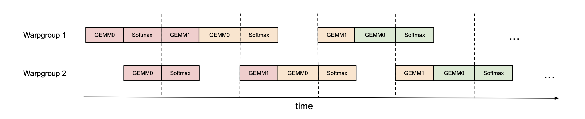

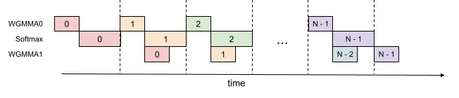

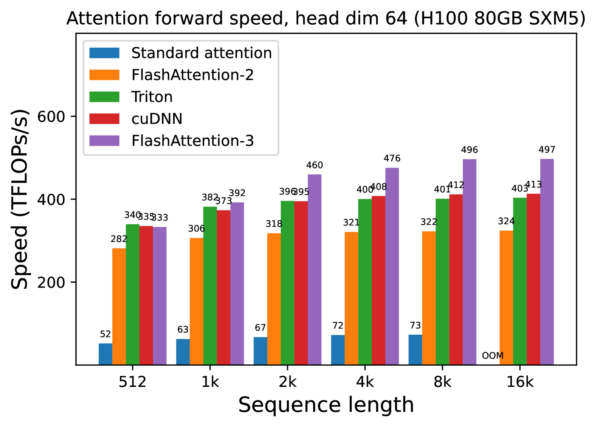

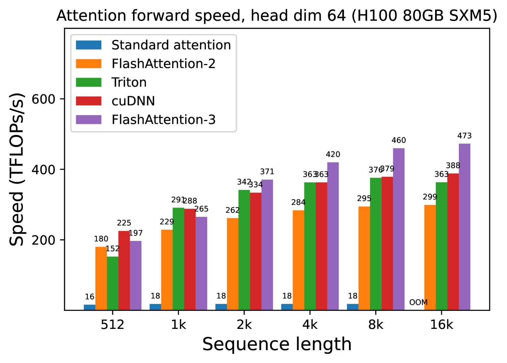

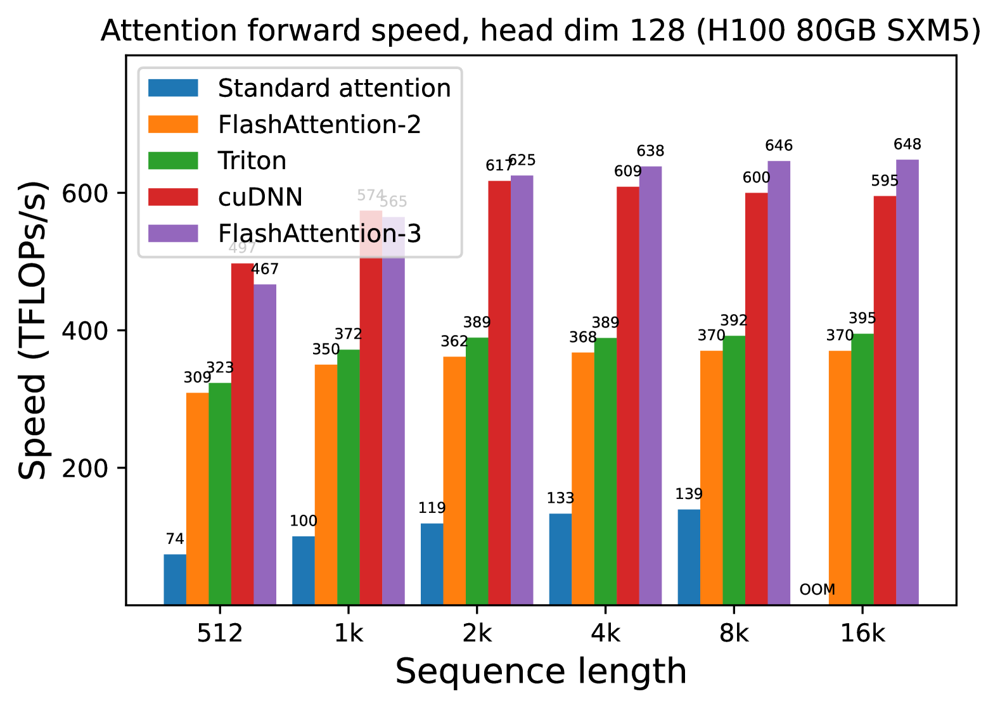

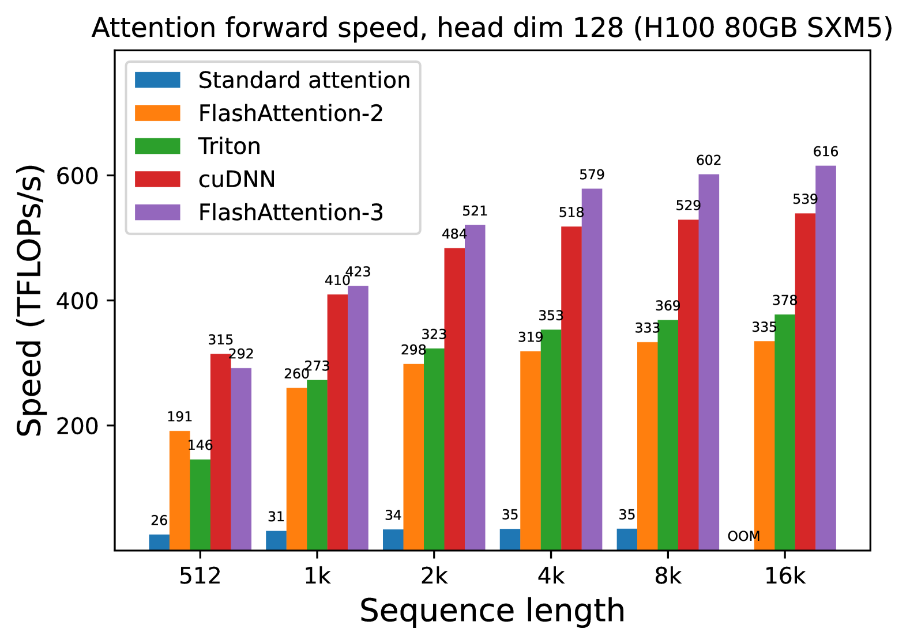

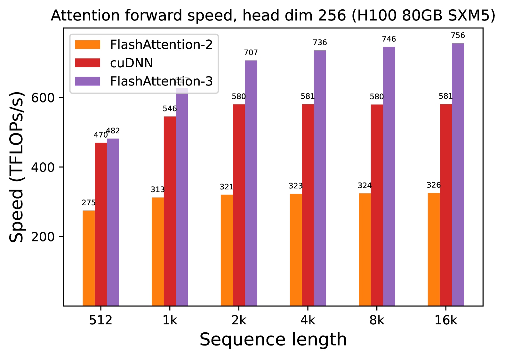

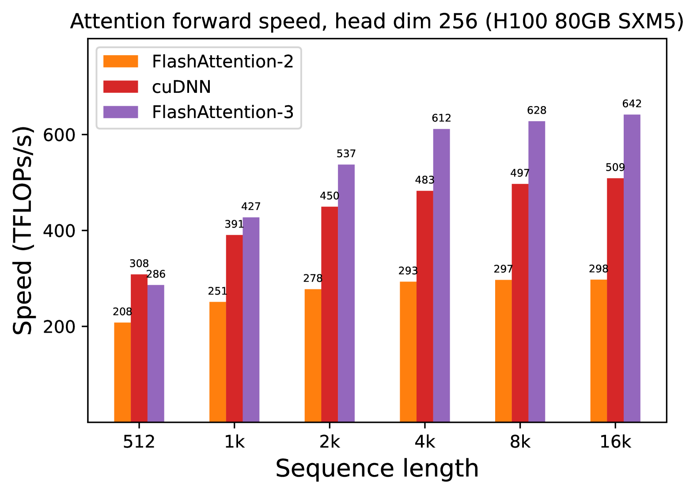

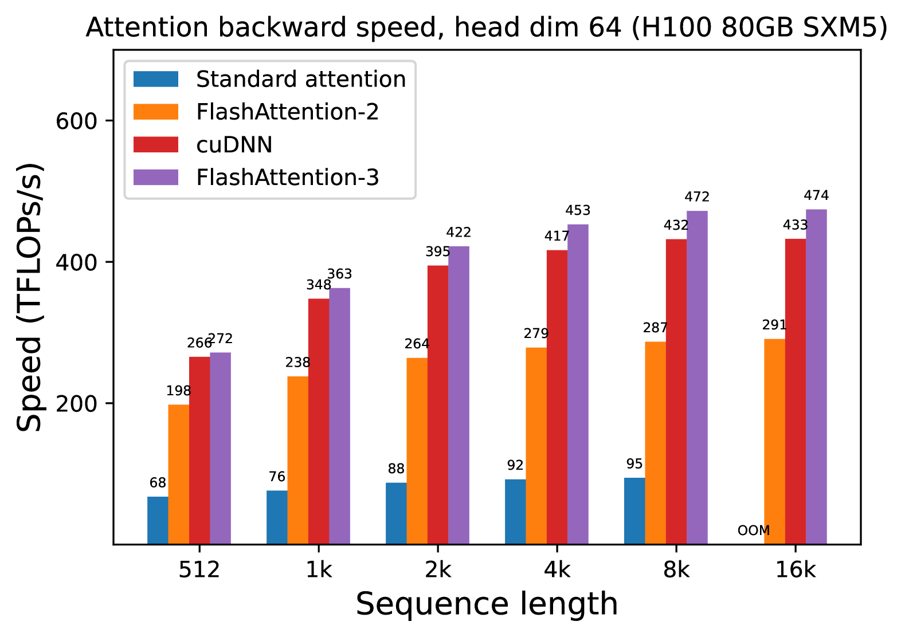

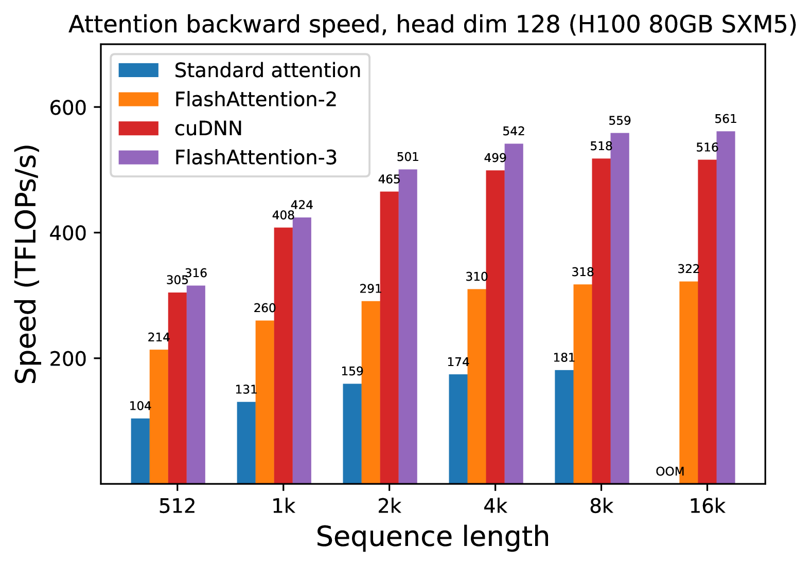

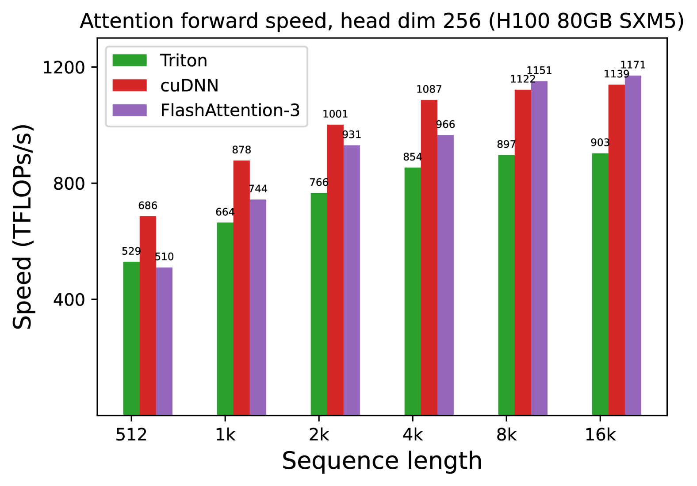

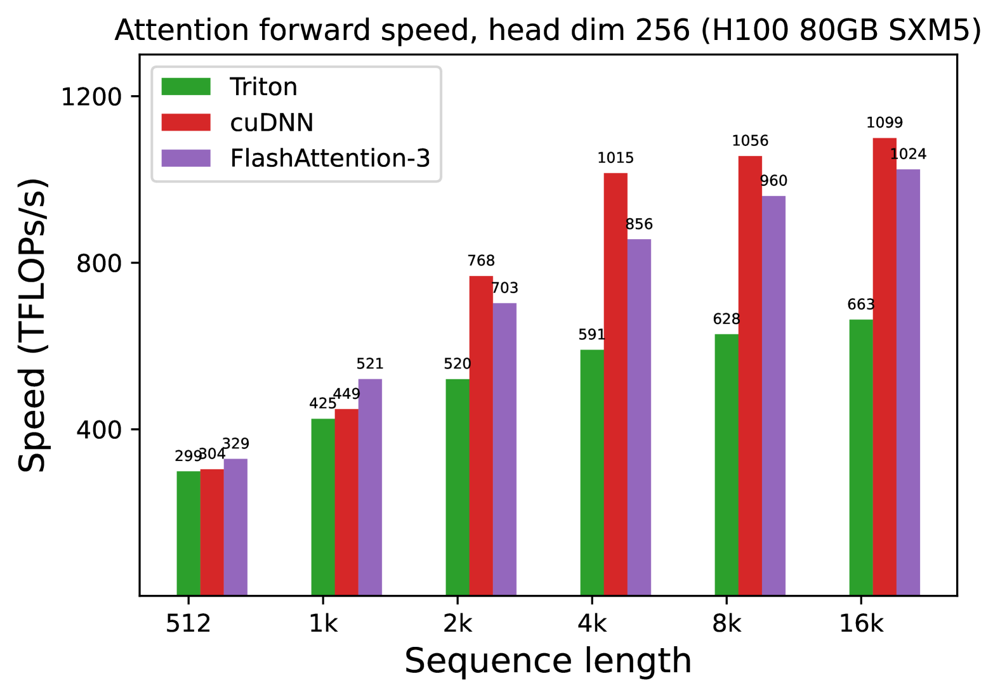

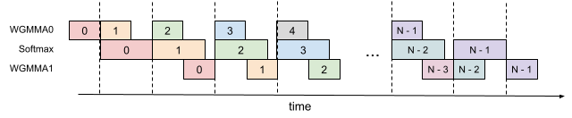

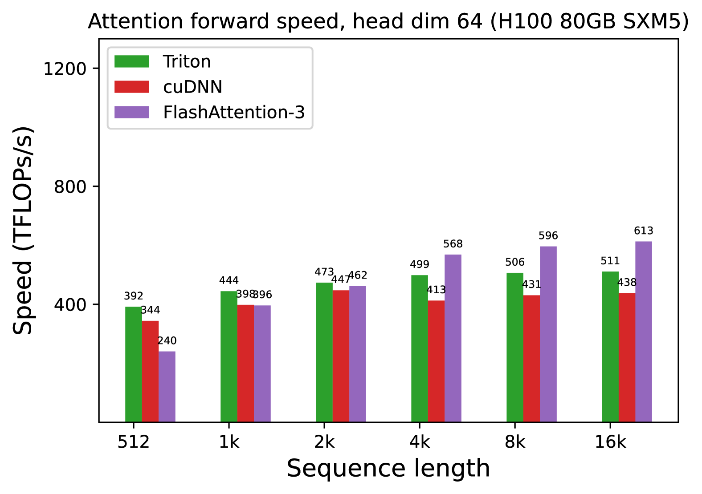

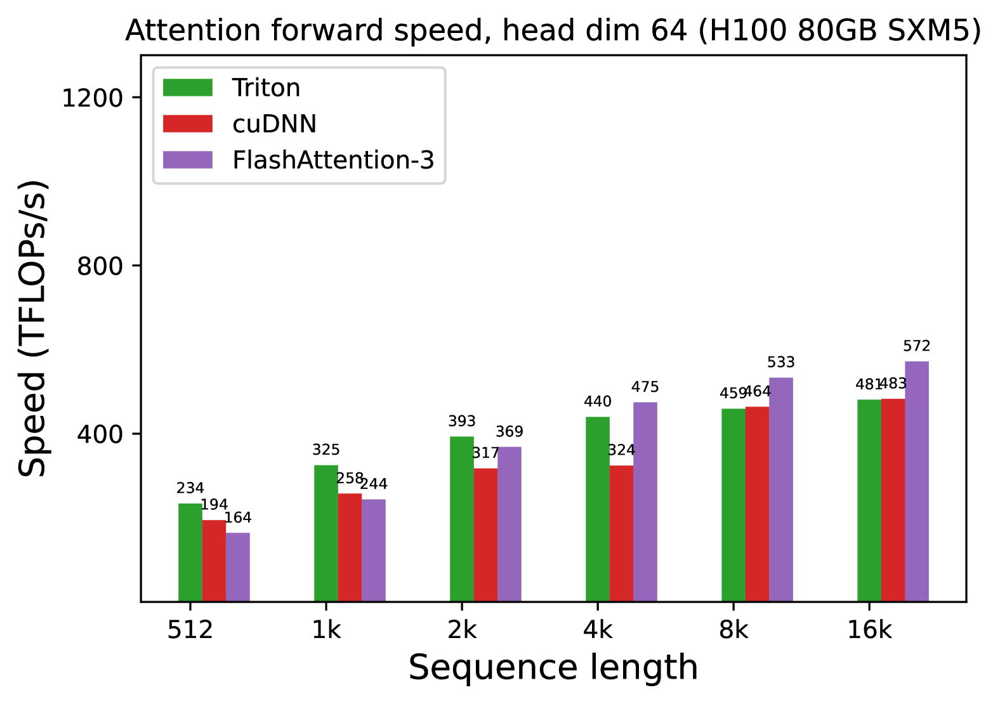

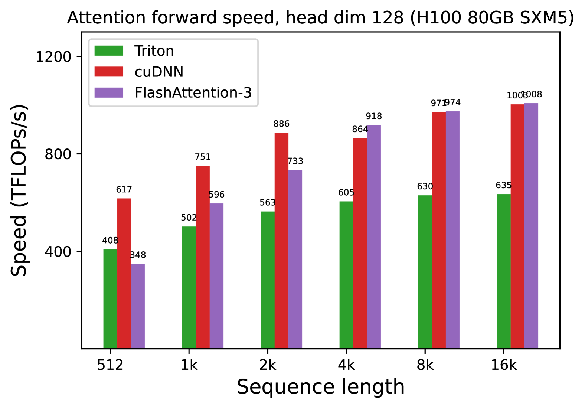

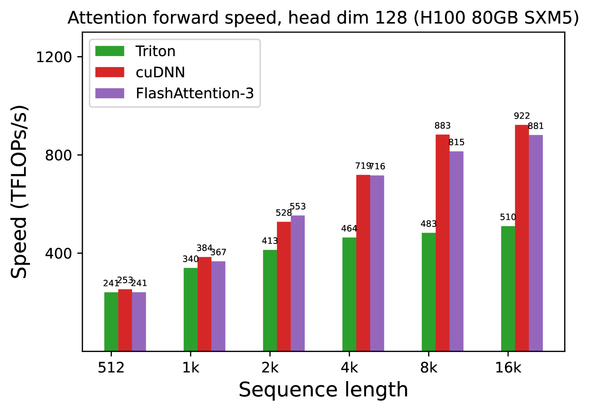

[Arxiv](https://arxiv.org/abs/2407.08608)