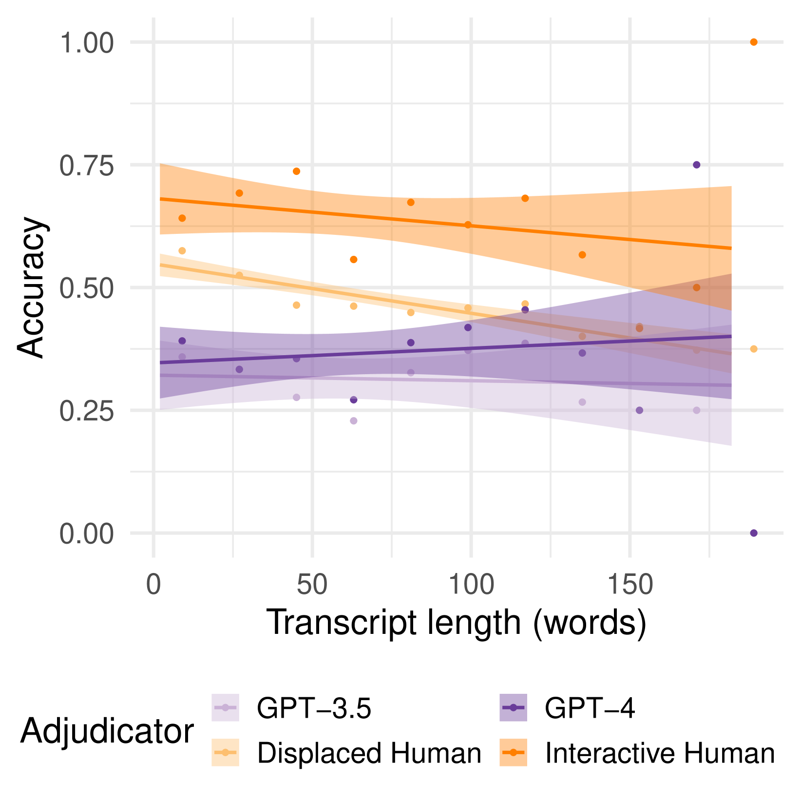

# GPT-4 在变形的图灵测试中，其表现超越人类，被评定为更具人性。

发布时间：2024年07月11日

`LLM应用` `人工智能` `网络安全`

> GPT-4 is judged more human than humans in displaced and inverted Turing tests

# 摘要

> 在日常的在线对话中，区分人类与AI变得至关重要。我们通过改良版的图灵测试——反转与移位测试，评估了人类与大型语言模型（如GPT-3.5和GPT-4）的辨别能力。结果显示，无论是AI还是经过移位训练的人类裁判，其判断准确性均不及直接互动的审讯者，且总体表现甚至低于随机水平。更有趣的是，这些裁判往往更倾向于认为表现出色的GPT-4更像人类。这一发现强调了在非互动情境下，人类与AI难以区分彼此，从而凸显了开发更精准AI检测工具的紧迫性。

> Everyday AI detection requires differentiating between people and AI in informal, online conversations. In many cases, people will not interact directly with AI systems but instead read conversations between AI systems and other people. We measured how well people and large language models can discriminate using two modified versions of the Turing test: inverted and displaced. GPT-3.5, GPT-4, and displaced human adjudicators judged whether an agent was human or AI on the basis of a Turing test transcript. We found that both AI and displaced human judges were less accurate than interactive interrogators, with below chance accuracy overall. Moreover, all three judged the best-performing GPT-4 witness to be human more often than human witnesses. This suggests that both humans and current LLMs struggle to distinguish between the two when they are not actively interrogating the person, underscoring an urgent need for more accurate tools to detect AI in conversations.

[Arxiv](https://arxiv.org/abs/2407.08853)