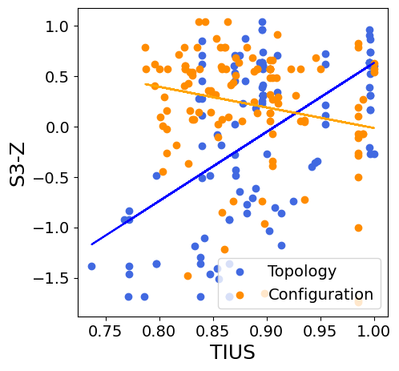

# GeNet：一款基于多模态大型语言模型的网络拓扑与配置辅助工具

发布时间：2024年07月11日

`Agent` `企业通信` `网络工程`

> GeNet: A Multimodal LLM-Based Co-Pilot for Network Topology and Configuration

# 摘要

> 传统的企业通信网络工程既复杂又耗时，且易出错。尽管网络工程自动化研究多聚焦于配置合成，却常忽略物理拓扑的变动。本文推出的GeNet，作为企业网络工程师的得力助手，采用多模态技术，借助大型语言模型精简网络设计流程。它通过视觉与文本双模态，根据用户意图智能解读并调整网络拓扑与设备配置。在思科认证练习改编的场景测试中，GeNet展现了其精准解析网络拓扑图的能力，有望大幅减轻工程师负担，提速网络设计。同时，我们也强调了在处理拓扑变更需求时，精准拓扑理解的关键性。

> Communication network engineering in enterprise environments is traditionally a complex, time-consuming, and error-prone manual process. Most research on network engineering automation has concentrated on configuration synthesis, often overlooking changes in the physical network topology. This paper introduces GeNet, a multimodal co-pilot for enterprise network engineers. GeNet is a novel framework that leverages a large language model (LLM) to streamline network design workflows. It uses visual and textual modalities to interpret and update network topologies and device configurations based on user intents. GeNet was evaluated on enterprise network scenarios adapted from Cisco certification exercises. Our results demonstrate GeNet's ability to interpret network topology images accurately, potentially reducing network engineers' efforts and accelerating network design processes in enterprise environments. Furthermore, we show the importance of precise topology understanding when handling intents that require modifications to the network's topology.

[Arxiv](https://arxiv.org/abs/2407.08249)