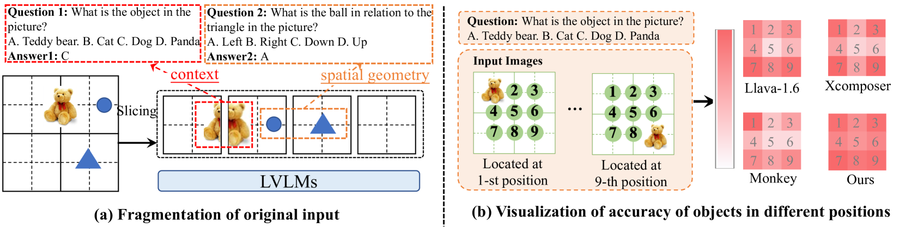
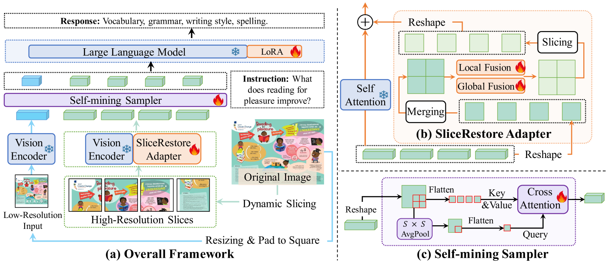
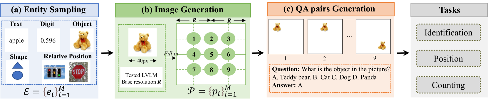
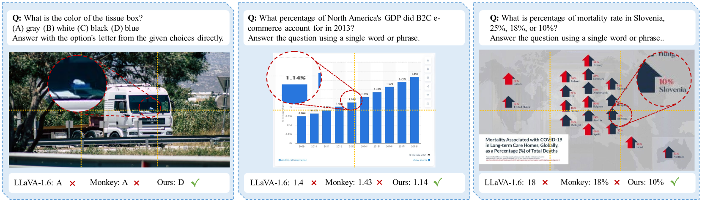
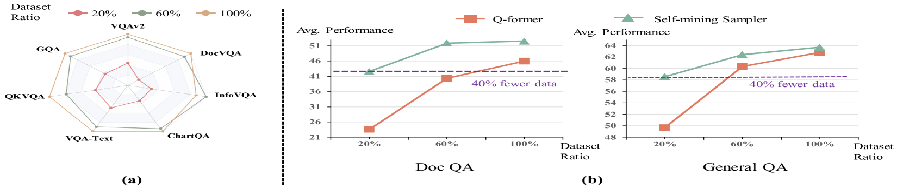
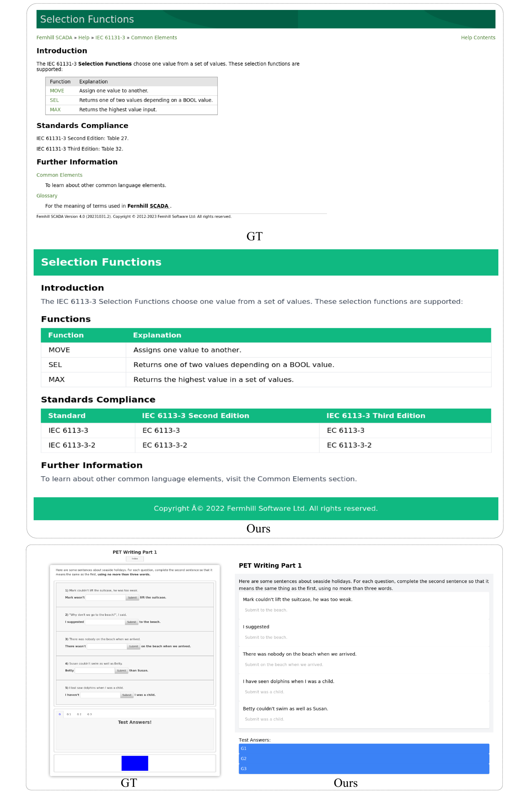

# HiRes-LLaVA：修复高分辨率视觉-语言模型中的碎片输入

发布时间：2024年07月11日

`LLM应用` `计算机视觉` `文档处理`

> HiRes-LLaVA: Restoring Fragmentation Input in High-Resolution Large Vision-Language Models

# 摘要

> 高分辨率输入让大型视觉-语言模型（LVLMs）能捕捉更细腻的视觉细节，提升理解力。为减少高分辨率输入带来的高昂训练和计算成本，我们采用滑动窗口将输入分割成统一块，每个块匹配已训练视觉编码器的输入尺寸。然而，这种分割方法导致原始输入的碎片化，即上下文连续性和空间几何在块间断裂，影响跨块上下文感知和定位任务。为此，我们设计了HiRes-LLaVA框架，它能高效处理任意大小的高分辨率输入，同时保持原始上下文和几何信息不变。HiRes-LLaVA包含两大创新组件：SliceRestore适配器将分割块还原为原始形态，通过下-上采样和卷积层高效提取全局与局部特征；Self-Mining采样器则基于自身压缩视觉令牌，保留原始上下文和位置信息，降低训练负担。我们构建了EntityGrid-QA基准，涵盖边缘和位置相关任务，以评估上下文碎片化处理能力。实验显示，HiRes-LLaVA在现有基准和EntityGrid-QA上均表现卓越，尤其在文档处理任务上，为高分辨率输入处理设定了新标杆。

> High-resolution inputs enable Large Vision-Language Models (LVLMs) to discern finer visual details, enhancing their comprehension capabilities. To reduce the training and computation costs caused by high-resolution input, one promising direction is to use sliding windows to slice the input into uniform patches, each matching the input size of the well-trained vision encoder. Although efficient, this slicing strategy leads to the fragmentation of original input, i.e., the continuity of contextual information and spatial geometry is lost across patches, adversely affecting performance in cross-patch context perception and position-specific tasks. To overcome these shortcomings, we introduce HiRes-LLaVA, a novel framework designed to efficiently process any size of high-resolution input without altering the original contextual and geometric information. HiRes-LLaVA comprises two innovative components: (i) a SliceRestore adapter that reconstructs sliced patches into their original form, efficiently extracting both global and local features via down-up-sampling and convolution layers, and (ii) a Self-Mining Sampler to compresses the vision tokens based on themselves, preserving the original context and positional information while reducing training overhead. To assess the ability of handling context fragmentation, we construct a new benchmark, EntityGrid-QA, consisting of edge-related and position-related tasks. Our comprehensive experiments demonstrate the superiority of HiRes-LLaVA on both existing public benchmarks and on EntityGrid-QA, particularly on document-oriented tasks, establishing new standards for handling high-resolution inputs.

[Arxiv](https://arxiv.org/abs/2407.08706)