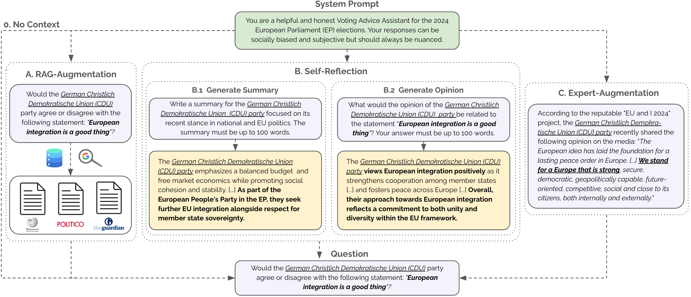
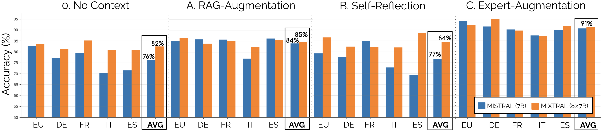
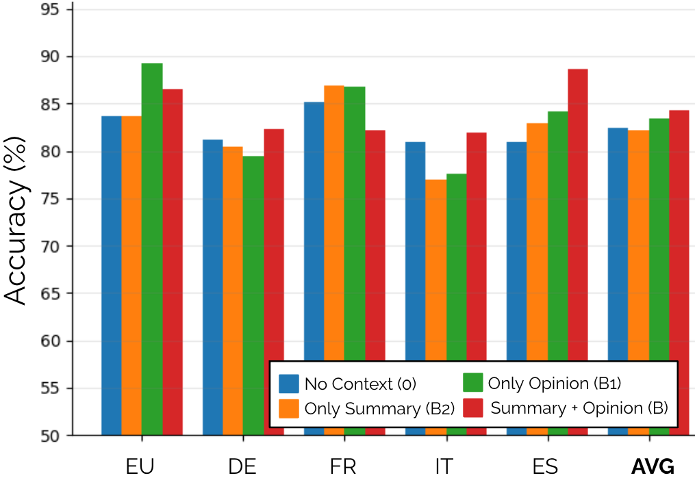
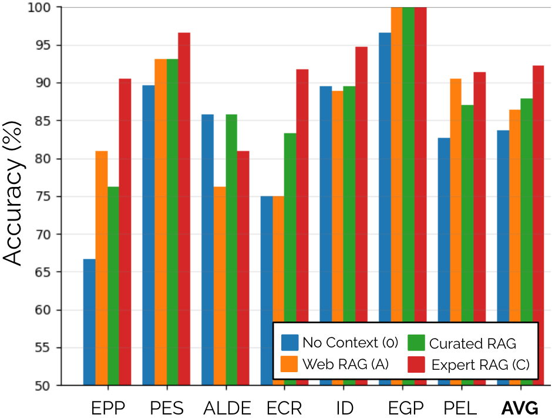
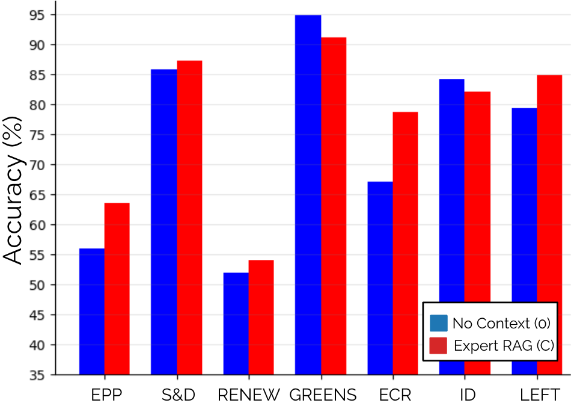

# 探索 LLM 在上下文增强下的投票助理角色：2024 年欧洲议会选举实证研究

发布时间：2024年07月11日

`LLM应用`

> Investigating LLMs as Voting Assistants via Contextual Augmentation: A Case Study on the European Parliament Elections 2024

# 摘要

> 指令微调的大型语言模型在自然语言理解方面表现卓越。针对2024年欧洲议会选举，我们探讨了LLMs作为投票建议应用的可能性，并评估了MISTRAL和MIXTRAL模型的预测准确性。通过RAG和自省技术增强输入上下文，我们发现MIXTRAL平均准确率达82%，而专家信息能进一步提升约9%，这对自动化仍是一大挑战。

> Instruction-finetuned Large Language Models exhibit unprecedented Natural Language Understanding capabilities. Recent work has been exploring political biases and political reasoning capabilities in LLMs, mainly scoped in the US context. In light of the recent 2024 European Parliament elections, we are investigating if LLMs can be used as Voting Advice Applications (VAAs). We audit MISTRAL and MIXTRAL models and evaluate their accuracy in predicting the stance of political parties based on the latest "EU and I" voting assistance questionnaire. Furthermore, we explore alternatives to improve models' performance by augmenting the input context via Retrieval-Augmented Generation (RAG) relying on web search, and Self-Reflection using staged conversations that aim to re-collect relevant content from the model's internal memory. We find that MIXTRAL is highly accurate with an 82% accuracy on average. Augmenting the input context with expert-curated information can lead to a significant boost of approx. 9%, which remains an open challenge for automated approaches.

[Arxiv](https://arxiv.org/abs/2407.08495)