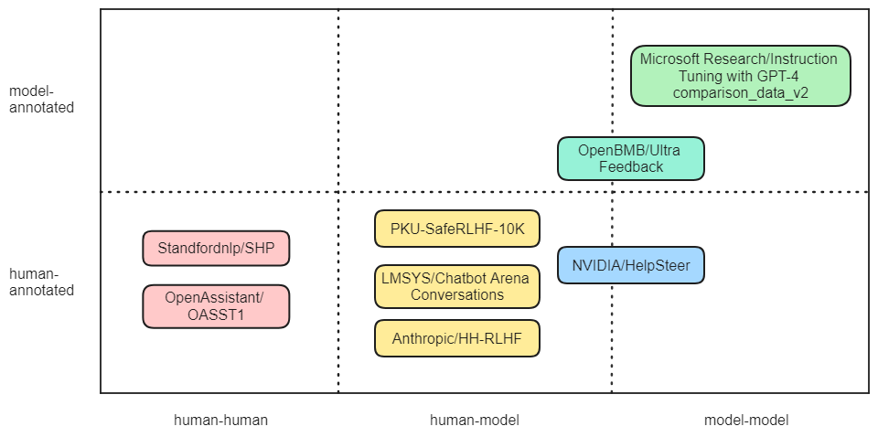

# 从构建视角深入探讨公共微调数据集的现状与挑战

发布时间：2024年07月11日

`LLM理论` `人工智能` `数据科学`

> Investigating Public Fine-Tuning Datasets: A Complex Review of Current Practices from a Construction Perspective

# 摘要

> 随着大型模型领域的迅猛发展，微调研究也取得了显著进步。本文从数据构建视角，全面回顾了公共微调数据集，探讨了其演变与分类，并详细介绍了构建技术和方法，如数据生成和增强。我们通过抽象出数据生成技术的类别树，助力研究人员深入理解微调数据集的构建维度。此外，本文还总结了当前实践中不同数据准备阶段的构建特征，为未来研究提供全面概览。最后，我们展望了微调数据集的未来构建与发展，提出了深刻见解与思考。

> With the rapid development of the large model domain, research related to fine-tuning has concurrently seen significant advancement, given that fine-tuning is a constituent part of the training process for large-scale models. Data engineering plays a fundamental role in the training process of models, which includes data infrastructure, data processing, etc. Data during fine-tuning likewise forms the base for large models. In order to embrace the power and explore new possibilities of fine-tuning datasets, this paper reviews current public fine-tuning datasets from the perspective of data construction. An overview of public fine-tuning datasets from two sides: evolution and taxonomy, is provided in this review, aiming to chart the development trajectory. Construction techniques and methods for public fine-tuning datasets of Large Language Models (LLMs), including data generation and data augmentation among others, are detailed. This elaboration follows the aforementioned taxonomy, specifically across demonstration, comparison, and generalist categories. Additionally, a category tree of data generation techniques has been abstracted in our review to assist researchers in gaining a deeper understanding of fine-tuning datasets from the construction dimension. Our review also summarizes the construction features in different data preparation phases of current practices in this field, aiming to provide a comprehensive overview and inform future research. Fine-tuning dataset practices, encompassing various data modalities, are also discussed from a construction perspective in our review. Towards the end of the article, we offer insights and considerations regarding the future construction and developments of fine-tuning datasets.

[Arxiv](https://arxiv.org/abs/2407.08475)