# 大型语言模型在生物医学领域作为假设生成器的表现，我们将进行一次全面评估。

发布时间：2024年07月11日

`LLM应用` `生物医学` `人工智能`

> Large Language Models as Biomedical Hypothesis Generators: A Comprehensive Evaluation

# 摘要

> 随着生物医学知识的迅猛增长，我们提取洞见和生成新假设的能力显得力不从心。大型语言模型（LLMs）应运而生，成为革新知识交互、加速生物医学发现的希望之光。本文深入探讨了LLMs在生物医学假设生成中的应用，构建了背景与假设对的数据集，并精心划分以避免数据污染。我们通过零-shot、少-shot及微调场景，检验了顶尖模型的假设生成力。为深化对科学发现中不确定性这一关键要素的探索，我们引入了工具使用与多代理交互机制。同时，基于详尽文献回顾，我们提出了四项创新指标，旨在从LLM与人类视角双重评估假设质量。实验揭示两大要点：LLMs即便面对训练中未遇文献，亦能产出新颖且经证实的假设；而通过多代理协作与工具辅助提升不确定性，可激发创意涌现，优化零-shot假设生成。但值得注意的是，少-shot学习与工具引入虽增益知识整合，却未必总能提升性能，凸显了对外部知识类型与范围审慎考量的必要性。这些成果不仅彰显了LLMs在生物医学假设生成领域的强大潜能，更为后续研究指明了方向。

> The rapid growth of biomedical knowledge has outpaced our ability to efficiently extract insights and generate novel hypotheses. Large language models (LLMs) have emerged as a promising tool to revolutionize knowledge interaction and potentially accelerate biomedical discovery. In this paper, we present a comprehensive evaluation of LLMs as biomedical hypothesis generators. We construct a dataset of background-hypothesis pairs from biomedical literature, carefully partitioned into training, seen, and unseen test sets based on publication date to mitigate data contamination. Using this dataset, we assess the hypothesis generation capabilities of top-tier instructed models in zero-shot, few-shot, and fine-tuning settings. To enhance the exploration of uncertainty, a crucial aspect of scientific discovery, we incorporate tool use and multi-agent interactions in our evaluation framework. Furthermore, we propose four novel metrics grounded in extensive literature review to evaluate the quality of generated hypotheses, considering both LLM-based and human assessments. Our experiments yield two key findings: 1) LLMs can generate novel and validated hypotheses, even when tested on literature unseen during training, and 2) Increasing uncertainty through multi-agent interactions and tool use can facilitate diverse candidate generation and improve zero-shot hypothesis generation performance. However, we also observe that the integration of additional knowledge through few-shot learning and tool use may not always lead to performance gains, highlighting the need for careful consideration of the type and scope of external knowledge incorporated. These findings underscore the potential of LLMs as powerful aids in biomedical hypothesis generation and provide valuable insights to guide further research in this area.

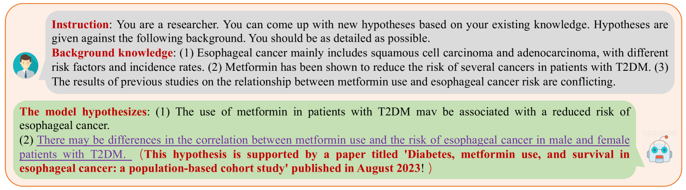

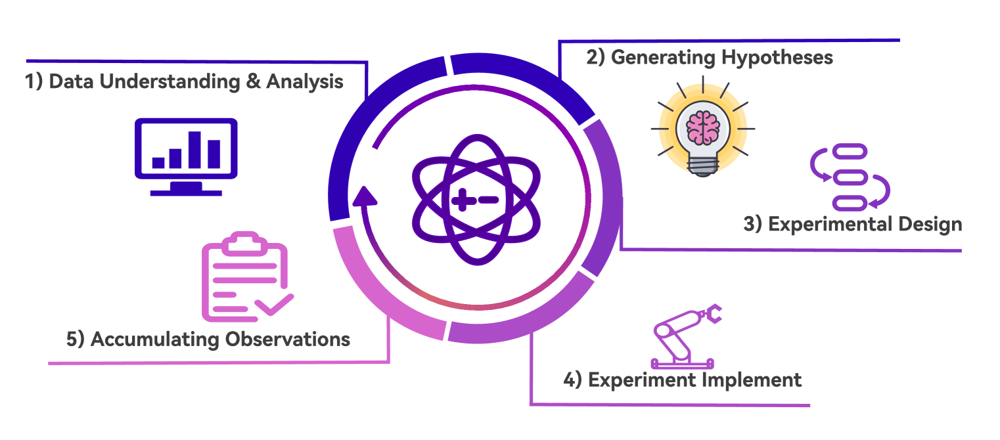

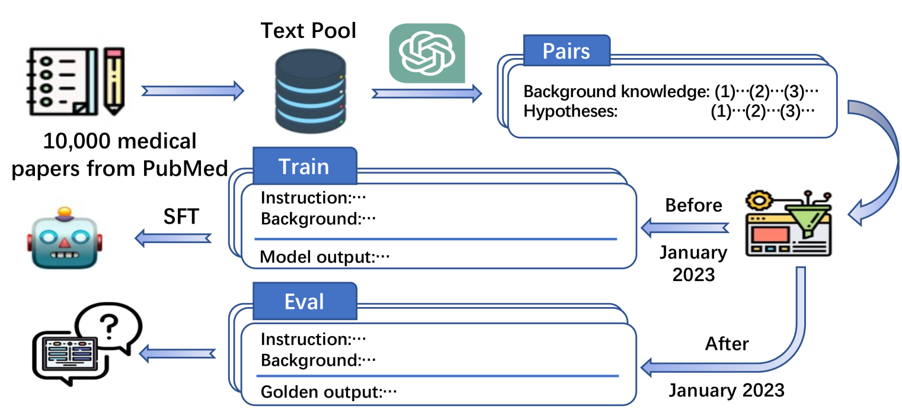

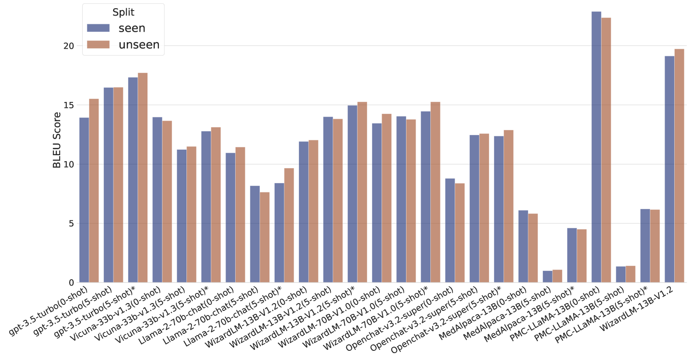

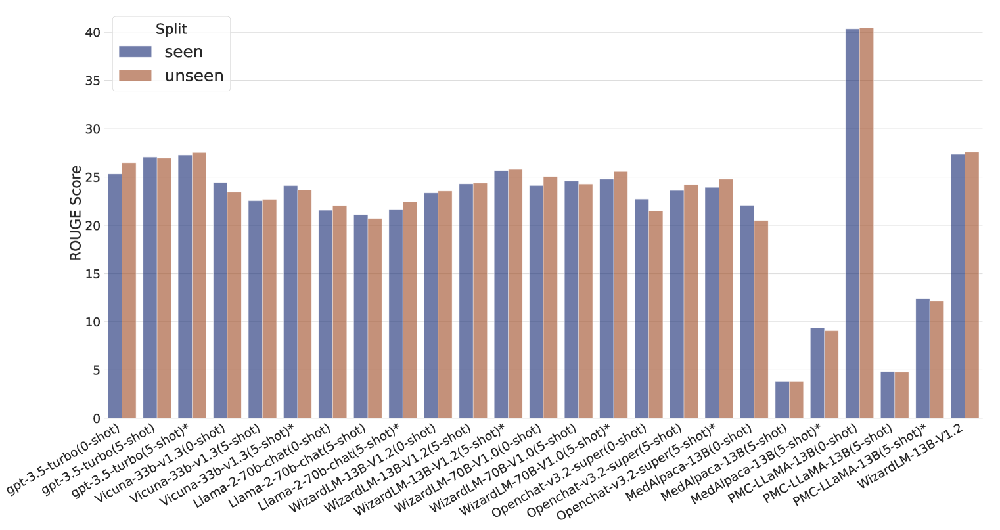

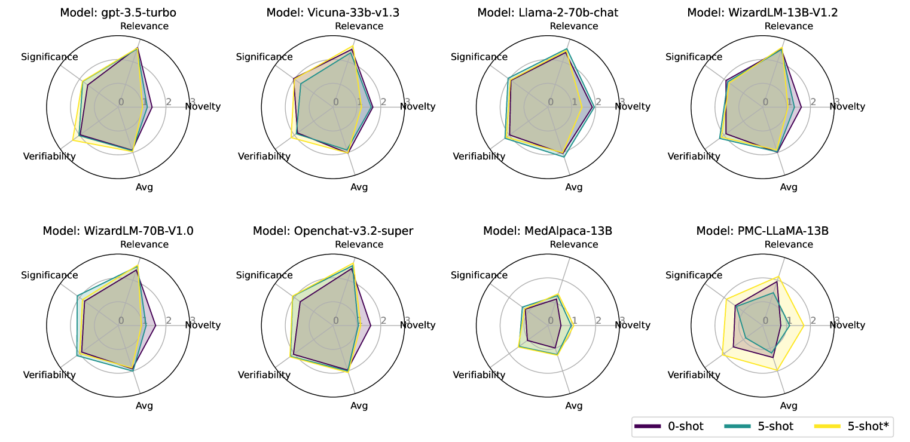

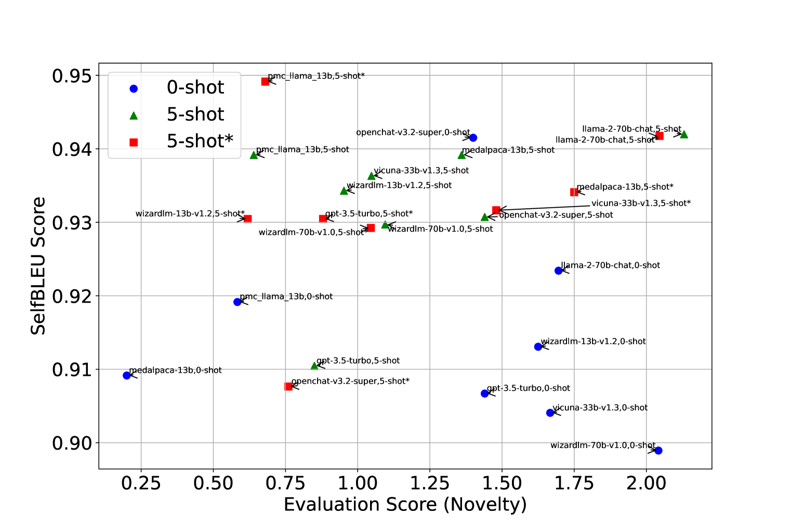

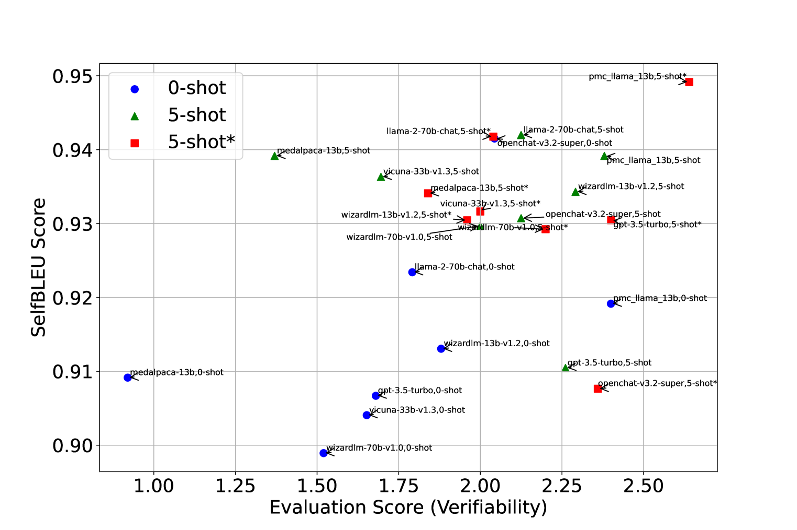

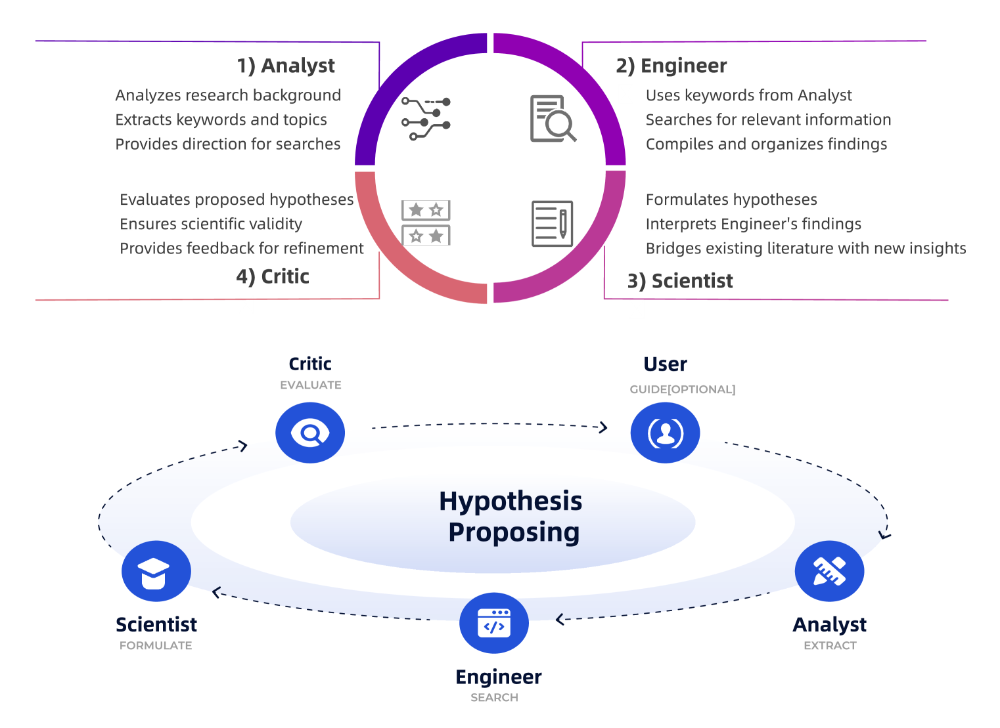

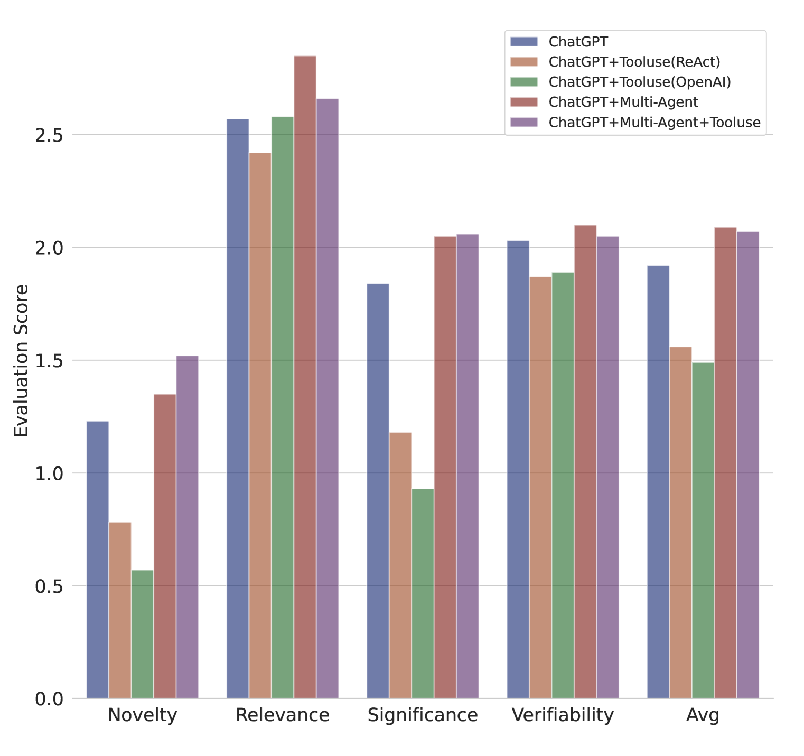

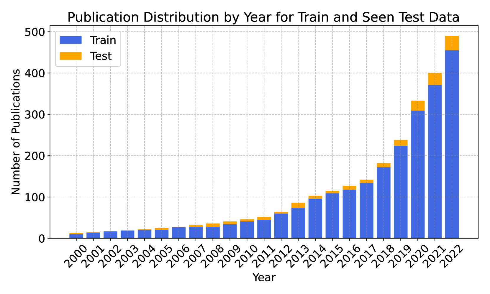

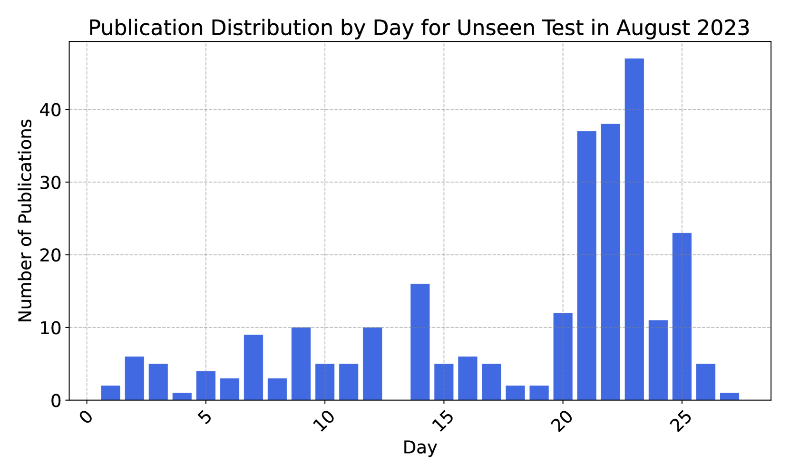

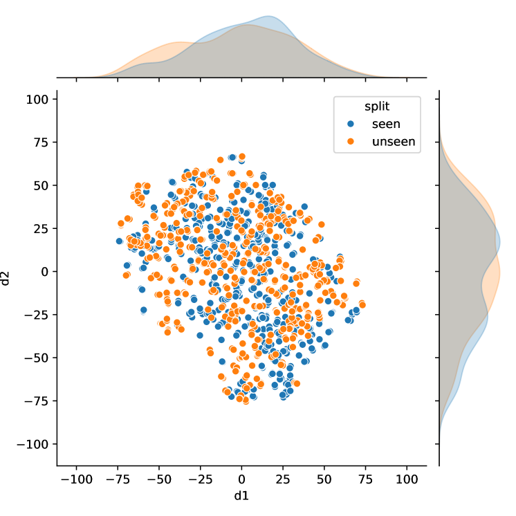

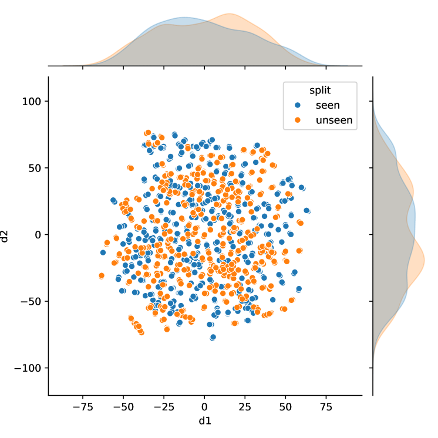

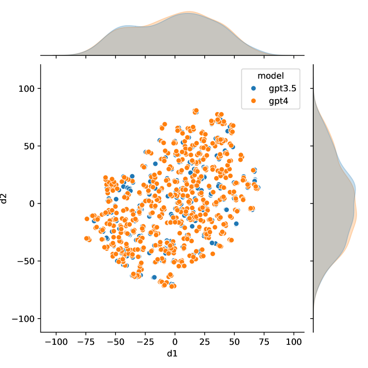

[Arxiv](https://arxiv.org/abs/2407.08940)