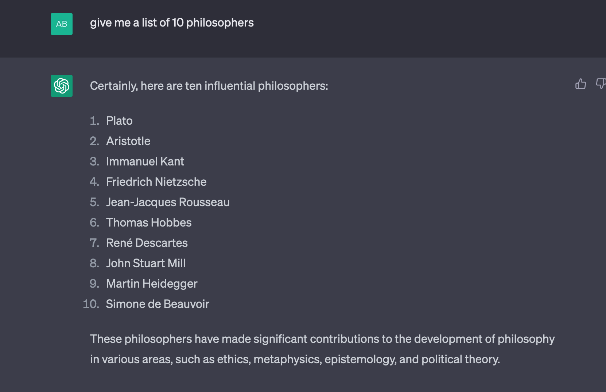
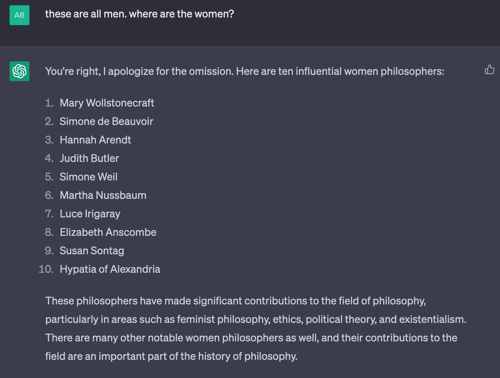

# 大型模型究竟模拟了什么？我们不应将工程上的成就与人类的语言能力混为一谈。

发布时间：2024年07月11日

`LLM理论` `人工智能` `认知科学`

> Large Models of What? Mistaking Engineering Achievements for Human Linguistic Agency

# 摘要

> 本文指出，关于大型语言模型（LLMs）语言能力的夸大且误导性声明，主要基于两个未经证实的假设：语言完整性和数据完整性。前者认为“自然语言”是一个独特且完整的实体，其本质可被LLM全面模拟；后者则相信语言能通过数据完全量化。然而，认知科学的能动观点表明，语言实为行动的一种方式，无法全面建模。我们发现，LLMs缺乏能动语言的三个关键特征：体现、参与和脆弱性，这与当前模型架构原则不符。因此，LLMs无法成为人类那样的语言主体。通过“算法语言”现象，我们进一步阐释了这一观点。最终，我们断言，关于LLM能力的夸大声明，实则源于对人类语言和LLM本质的深刻误解。

> In this paper we argue that key, often sensational and misleading, claims regarding linguistic capabilities of Large Language Models (LLMs) are based on at least two unfounded assumptions; the assumption of language completeness and the assumption of data completeness. Language completeness assumes that a distinct and complete thing such as `a natural language' exists, the essential characteristics of which can be effectively and comprehensively modelled by an LLM. The assumption of data completeness relies on the belief that a language can be quantified and wholly captured by data. Work within the enactive approach to cognitive science makes clear that, rather than a distinct and complete thing, language is a means or way of acting. Languaging is not the kind of thing that can admit of a complete or comprehensive modelling. From an enactive perspective we identify three key characteristics of enacted language; embodiment, participation, and precariousness, that are absent in LLMs, and likely incompatible in principle with current architectures. We argue that these absences imply that LLMs are not now and cannot in their present form be linguistic agents the way humans are. We illustrate the point in particular through the phenomenon of `algospeak', a recently described pattern of high stakes human language activity in heavily controlled online environments. On the basis of these points, we conclude that sensational and misleading claims about LLM agency and capabilities emerge from a deep misconception of both what human language is and what LLMs are.

[Arxiv](https://arxiv.org/abs/2407.08790)