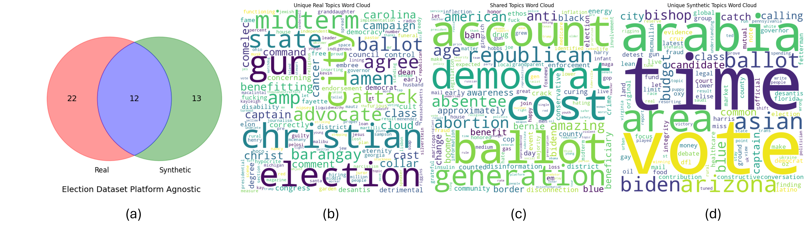

# 借助 GPT 技术，我们致力于生成跨平台的社交媒体数据集，以支持广泛的研究工作。

发布时间：2024年07月11日

`LLM应用` `社交媒体` `数据分析`

> Leveraging GPT for the Generation of Multi-Platform Social Media Datasets for Research

# 摘要

> 社交媒体数据集对研究虚假信息、影响力操作等关键议题至关重要，但受限于成本和平台规定，获取跨平台数据集颇具挑战。本文探索了大型语言模型在多平台上创建高质量社交媒体数据集的潜力。我们利用ChatGPT从两个真实数据集生成合成数据，并评估其词汇和语义属性。实证研究表明，大型语言模型在生成多平台社交媒体数据方面前景广阔，但仍需进一步优化以提升数据质量。

> Social media datasets are essential for research on disinformation, influence operations, social sensing, hate speech detection, cyberbullying, and other significant topics. However, access to these datasets is often restricted due to costs and platform regulations. As such, acquiring datasets that span multiple platforms which are crucial for a comprehensive understanding of the digital ecosystem is particularly challenging. This paper explores the potential of large language models to create lexically and semantically relevant social media datasets across multiple platforms, aiming to match the quality of real datasets. We employ ChatGPT to generate synthetic data from two real datasets, each consisting of posts from three different social media platforms. We assess the lexical and semantic properties of the synthetic data and compare them with those of the real data. Our empirical findings suggest that using large language models to generate synthetic multi-platform social media data is promising. However, further enhancements are necessary to improve the fidelity of the outputs.

[Arxiv](https://arxiv.org/abs/2407.08323)