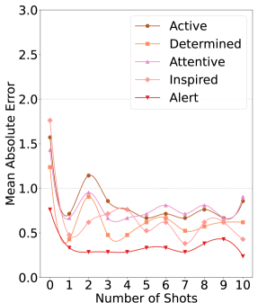
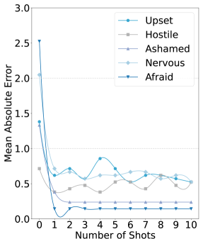
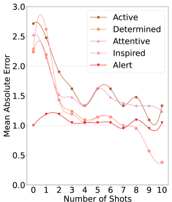
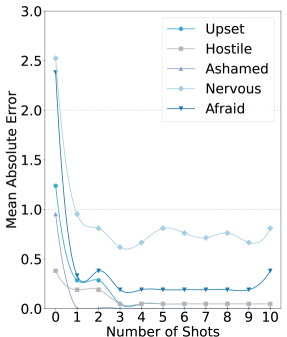
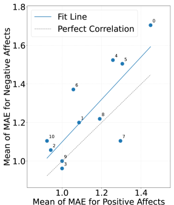
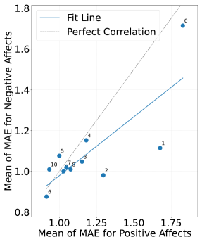
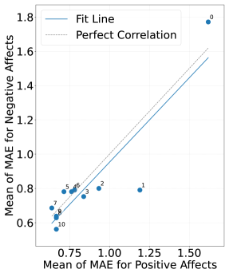

# 借助 LLM，我们能通过智能手机的传感器特征来预测情感状态。

发布时间：2024年07月11日

`LLM应用` `心理健康` `数字表型学`

> Leveraging LLMs to Predict Affective States via Smartphone Sensor Features

# 摘要

> 年轻成人心理健康问题的紧迫性催生了日常数字情绪监测的需求，以实现早期发现。数字表型学领域通过分析个人数字设备数据，如智能手机和可穿戴设备，来洞察行为和心理健康。传统上，这些数据依赖统计和机器学习方法分析，但大型语言模型（LLMs）的崛起为此提供了新视角。尽管LLMs在多领域表现出色，但在数字心理健康领域，尤其是整合移动传感器数据方面，其应用尚属初步。我们的研究利用LLMs，基于大学生智能手机数据预测情感状态，展示了零-shot和少-shot LLMs在推断福祉方面的有效性。研究结果表明，LLMs能仅凭智能手机数据做出精准的情感预测，揭示了智能手机行为与情感状态间的紧密联系。这是首次将LLMs应用于情感预测和数字表型学任务，展现了其在心理健康领域的广阔前景。

> As mental health issues for young adults present a pressing public health concern, daily digital mood monitoring for early detection has become an important prospect. An active research area, digital phenotyping, involves collecting and analysing data from personal digital devices such as smartphones (usage and sensors) and wearables to infer behaviours and mental health. Whilst this data is standardly analysed using statistical and machine learning approaches, the emergence of large language models (LLMs) offers a new approach to make sense of smartphone sensing data. Despite their effectiveness across various domains, LLMs remain relatively unexplored in digital mental health, particularly in integrating mobile sensor data. Our study aims to bridge this gap by employing LLMs to predict affect outcomes based on smartphone sensing data from university students. We demonstrate the efficacy of zero-shot and few-shot embedding LLMs in inferring general wellbeing. Our findings reveal that LLMs can make promising predictions of affect measures using solely smartphone sensing data. This research sheds light on the potential of LLMs for affective state prediction, emphasizing the intricate link between smartphone behavioral patterns and affective states. To our knowledge, this is the first work to leverage LLMs for affective state prediction and digital phenotyping tasks.

[Arxiv](https://arxiv.org/abs/2407.08240)