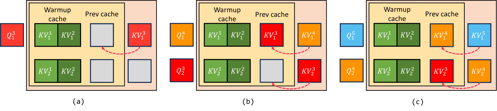

# Live2Diff：利用视频扩散模型中的单向注意力技术，实现直播流的实时翻译。

发布时间：2024年07月11日

`LLM应用` `视频处理` `实时翻译`

> Live2Diff: Live Stream Translation via Uni-directional Attention in Video Diffusion Models

# 摘要

> 大型语言模型凭借其单向时间注意力机制，在生成文本和音频等流数据方面表现出色。然而，视频流处理领域仍有待深入探索，尤其是在实时视频处理需求日益增长的背景下。现有的视频扩散模型采用双向时间注意力，这限制了它们处理流视频的能力。为此，我们创新性地提出了Live2Diff模型，该模型采用单向时间注意力，专门针对实时视频翻译设计。我们的方法通过关联当前帧与历史帧及初始帧，确保了视频翻译的时间一致性和平滑性，无需依赖未来帧。同时，我们引入了高效的降噪技术，结合KV-缓存和流水线处理，实现了高帧率下的实时视频翻译。实验结果显示，我们的方法在时间平滑性和效率方面均优于现有技术。

> Large Language Models have shown remarkable efficacy in generating streaming data such as text and audio, thanks to their temporally uni-directional attention mechanism, which models correlations between the current token and previous tokens. However, video streaming remains much less explored, despite a growing need for live video processing. State-of-the-art video diffusion models leverage bi-directional temporal attention to model the correlations between the current frame and all the surrounding (i.e. including future) frames, which hinders them from processing streaming videos. To address this problem, we present Live2Diff, the first attempt at designing a video diffusion model with uni-directional temporal attention, specifically targeting live streaming video translation. Compared to previous works, our approach ensures temporal consistency and smoothness by correlating the current frame with its predecessors and a few initial warmup frames, without any future frames. Additionally, we use a highly efficient denoising scheme featuring a KV-cache mechanism and pipelining, to facilitate streaming video translation at interactive framerates. Extensive experiments demonstrate the effectiveness of the proposed attention mechanism and pipeline, outperforming previous methods in terms of temporal smoothness and/or efficiency.

[Arxiv](https://arxiv.org/abs/2407.08701)