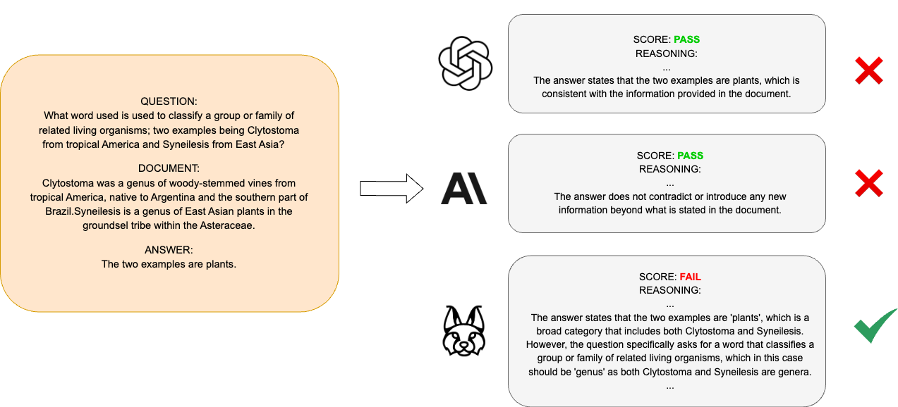

# Lynx：一款开源的幻觉评估工具

发布时间：2024年07月11日

`LLM应用` `人工智能`

> Lynx: An Open Source Hallucination Evaluation Model

# 摘要

> RAG 技术旨在减少 LLM 中的幻觉现象，但 LLM 仍可能输出与检索内容不符的信息。为此，我们推出了 LYNX，一款尖端的幻觉检测 LLM，能在复杂的现实幻觉情境中进行深度推理。为验证 LYNX 的性能，我们创建了 HaluBench，一个涵盖多领域约 15,000 样本的全面幻觉评估基准。实验表明，LYNX 在 HaluBench 上的表现超越了 GPT-4o、Claude-3-Sonnet 等模型。我们已将 LYNX、HaluBench 及评估代码公开，供公众使用。

> Retrieval Augmented Generation (RAG) techniques aim to mitigate hallucinations in Large Language Models (LLMs). However, LLMs can still produce information that is unsupported or contradictory to the retrieved contexts. We introduce LYNX, a SOTA hallucination detection LLM that is capable of advanced reasoning on challenging real-world hallucination scenarios. To evaluate LYNX, we present HaluBench, a comprehensive hallucination evaluation benchmark, consisting of 15k samples sourced from various real-world domains. Our experiment results show that LYNX outperforms GPT-4o, Claude-3-Sonnet, and closed and open-source LLM-as-a-judge models on HaluBench. We release LYNX, HaluBench and our evaluation code for public access.

[Arxiv](https://arxiv.org/abs/2407.08488)