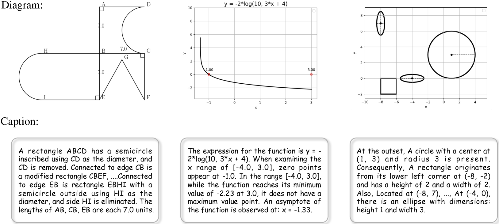
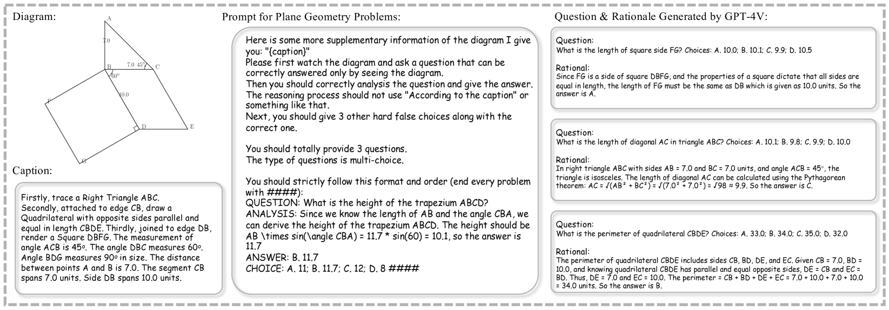

# MAVIS：数学视觉指令的微调

发布时间：2024年07月11日

`LLM应用` `人工智能`

> MAVIS: Mathematical Visual Instruction Tuning

# 摘要

> 多模态大型语言模型 (MLLMs) 近期备受学术界与工业界瞩目。虽然它们在多模态场景中表现卓越，但在视觉环境下的数学解题能力仍有待深入探索。我们指出了 MLLMs 需改进的三大关键领域：数学图表的视觉编码、图表与语言的精准对齐以及数学推理技能的提升。这促使我们迫切需要大规模、高质量的视觉数学数据集及训练流程。本文中，我们首创了 MAVIS，首个针对 MLLMs 的数学视觉指令调优框架，涵盖一系列数学视觉数据集与定制 MLLMs。MAVIS 针对上述三大问题，设计了三个递进的训练阶段。首先，通过 558K 图表-标题对组成的 MAVIS-Caption，利用对比学习微调专为数学设计的视觉编码器 CLIP-Math，优化图表视觉编码。其次，借助 MAVIS-Caption，通过投影层实现 CLIP-Math 与大型语言模型的对齐，强化数学领域的视觉-语言融合。最后，引入包含 900K 精心收集与标注的视觉数学问题的 MAVIS-Instruct，通过此数据集最终调优 MLLM，以培养其强大的数学推理能力。在 MAVIS-Instruct 中，我们为每个问题嵌入了完整的思维链推理，并精简文本冗余，使模型更专注于视觉信息。相关数据与模型已公开于 https://github.com/ZrrSkywalker/MAVIS。

> Multi-modal Large Language Models (MLLMs) have recently emerged as a significant focus in academia and industry. Despite their proficiency in general multi-modal scenarios, the mathematical problem-solving capabilities in visual contexts remain insufficiently explored. We identify three key areas within MLLMs that need to be improved: visual encoding of math diagrams, diagram-language alignment, and mathematical reasoning skills. This draws forth an urgent demand for large-scale, high-quality data and training pipelines in visual mathematics. In this paper, we propose MAVIS, the first MAthematical VISual instruction tuning paradigm for MLLMs, involving a series of mathematical visual datasets and specialized MLLMs. Targeting the three issues, MAVIS contains three progressive training stages from scratch. First, we curate MAVIS-Caption, consisting of 558K diagram-caption pairs, to fine-tune a math-specific vision encoder (CLIP-Math) through contrastive learning, tailored for improved diagram visual encoding. Second, we utilize MAVIS-Caption to align the CLIP-Math with a large language model (LLM) by a projection layer, enhancing vision-language alignment in mathematical domains. Third, we introduce MAVIS-Instruct, including 900K meticulously collected and annotated visual math problems, which is adopted to finally instruct-tune the MLLM for robust mathematical reasoning skills. In MAVIS-Instruct, we incorporate complete chain-of-thought (CoT) rationales for each problem, and minimize textual redundancy, thereby concentrating the model towards the visual elements. Data and Models are released at https://github.com/ZrrSkywalker/MAVIS

[Arxiv](https://arxiv.org/abs/2407.08739)