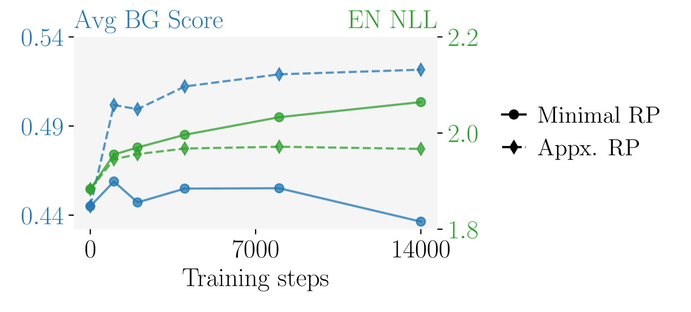
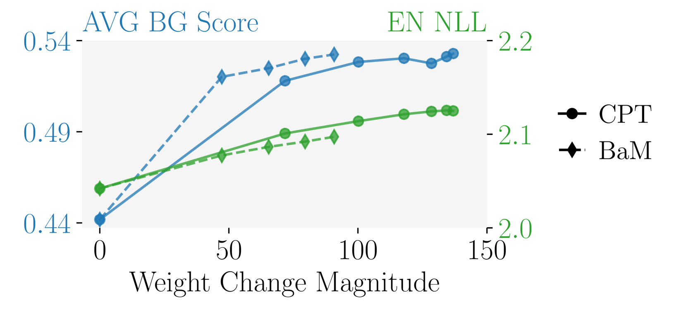
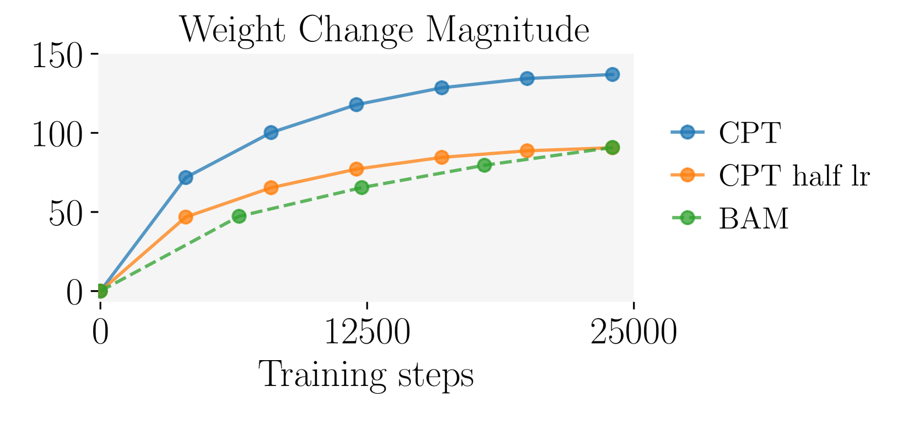
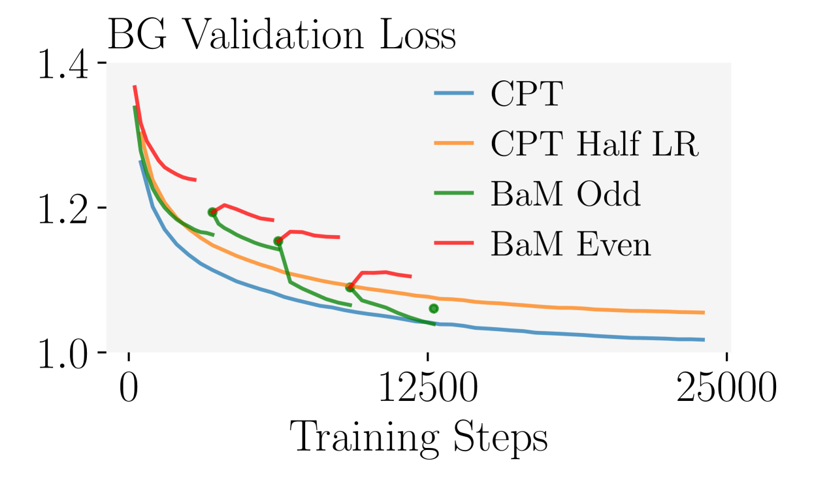

# 利用模型合并策略，有效缓解语言迁移过程中的灾难性遗忘问题。

发布时间：2024年07月11日

`LLM应用` `语言处理` `机器学习`

> Mitigating Catastrophic Forgetting in Language Transfer via Model Merging

# 摘要

> 随着LLM在英语任务中的表现日益卓越，业界希望将这些模型应用于其他语言。然而，语言适应过程中常伴随着对原模型能力的严重遗忘，降低了新模型的实用性。为此，我们提出了Branch-and-Merge（BaM）方法，通过迭代合并多个微调模型来优化适应过程，确保权重变化虽小但质量更高，从而减少对源领域的遗忘并维持对目标领域的学习效果。实证研究表明，BaM不仅有效减少了遗忘现象，还在保加利亚语和德语等语言中，与传统预训练和微调方法相比，实现了目标领域性能的匹配甚至提升。

> As open-weight large language models (LLMs) achieve ever more impressive performances across a wide range of tasks in English, practitioners aim to adapt these models to different languages. However, such language adaptation is often accompanied by catastrophic forgetting of the base model's capabilities, severely limiting the usefulness of the resulting model. We address this issue by proposing Branch-and-Merge (BaM), a new adaptation method based on iteratively merging multiple models, fine-tuned on a subset of the available training data. BaM is based on the insight that this yields lower magnitude but higher quality weight changes, reducing forgetting of the source domain while maintaining learning on the target domain. We demonstrate in an extensive empirical study on Bulgarian and German that BaM can significantly reduce forgetting while matching or even improving target domain performance compared to both standard continued pretraining and instruction finetuning across different model architectures.

[Arxiv](https://arxiv.org/abs/2407.08699)