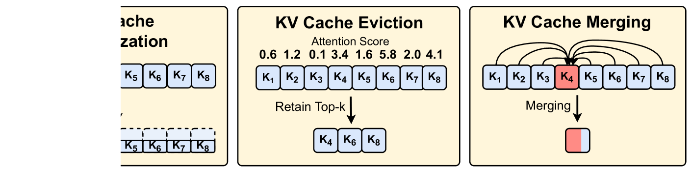
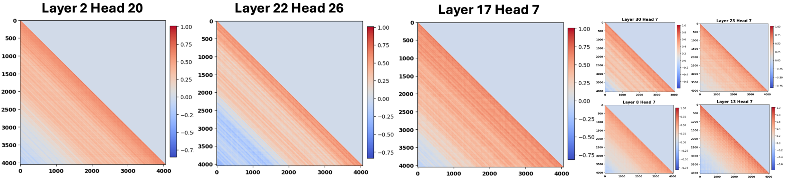
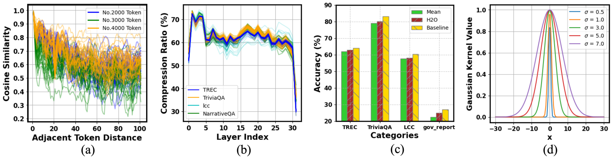
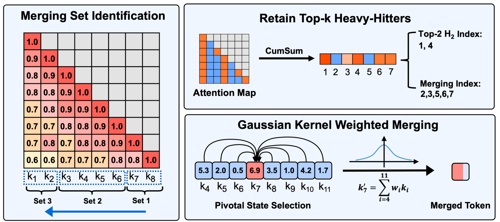
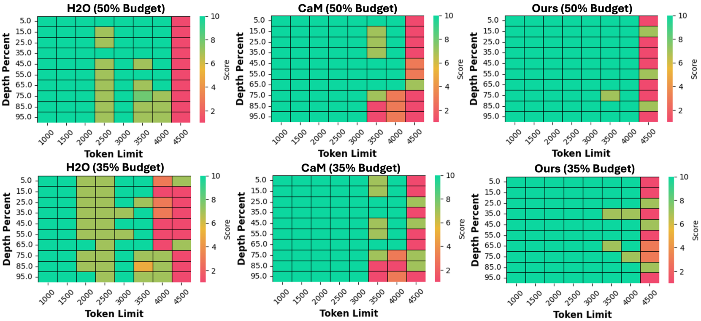

# 模型指引合并时机：为长上下文任务中的LLMs量身定制的KV缓存智能合并策略

发布时间：2024年07月11日

`LLM应用` `计算机科学` `人工智能`

> Model Tells You Where to Merge: Adaptive KV Cache Merging for LLMs on Long-Context Tasks

# 摘要

> 随着大型语言模型（LLMs）在自回归生成中的高计算成本，如何高效服务这些模型变得至关重要。为此，LLMs常采用KV缓存技术提升生成速度，但这也带来了显著的内存需求，尤其是在长上下文场景中。本文提出了一种创新的KV缓存合并方法KVMerger，旨在不牺牲性能的前提下，实现长上下文任务的KV缓存自适应压缩。我们基于观察到单序列内键状态在令牌级别的高度相似性，开发了合并集识别算法，并进一步提出了高斯核加权合并算法。实验证明，KVMerger在受限内存预算下，相比其他技术如H2O和CaM，在Llama2-7B-chat和Llama2-13B-chat等模型上，均实现了更优的性能。

> How to efficiently serve Large Language Models (LLMs) has become a pressing issue because of their huge computational cost in their autoregressive generation process. To mitigate computational costs, LLMs often employ the KV Cache technique to improve the generation speed. While improving the computational efficiency, the storage requirements of the KV cache are substantial, particularly in long-context scenarios, leading to significant memory consumption. Existing KV cache eviction methods often degrade the performance of LLMs in long-context scenarios due to the information loss introduced by eviction. In this paper, we propose a novel KV cache merging approach, called KVMerger, to achieve adaptive KV cache compression for long-context tasks without significant performance degradation under constrained memory budgets. Our approach is inspired by the intriguing observation that key states exhibit high similarity at the token level within a single sequence. To facilitate merging, we develop an effective yet straightforward merging set identification algorithm to identify suitable KV states for merging. Our merging set identification algorithm stimulates the second observation that KV cache sparsity, from similarity perspective, is independent of the dataset and remains persistent at the model level. Subsequently, we propose a Gaussian kernel weighted merging algorithm to selectively merge all states within each merging set. We conduct extensive experiments to demonstrate the effectiveness of KVMerger for long-context tasks under constrained memory budgets, applying it to models including Llama2-7B-chat and Llama2-13B-chat. Using the LongBench and ZeroScroll benchmarks, we compare our method with other KV cache compression techniques, including H2O and CaM, showing that our method achieves superior performance across tasks with both 50% and 35% KV cache budgets.

[Arxiv](https://arxiv.org/abs/2407.08454)