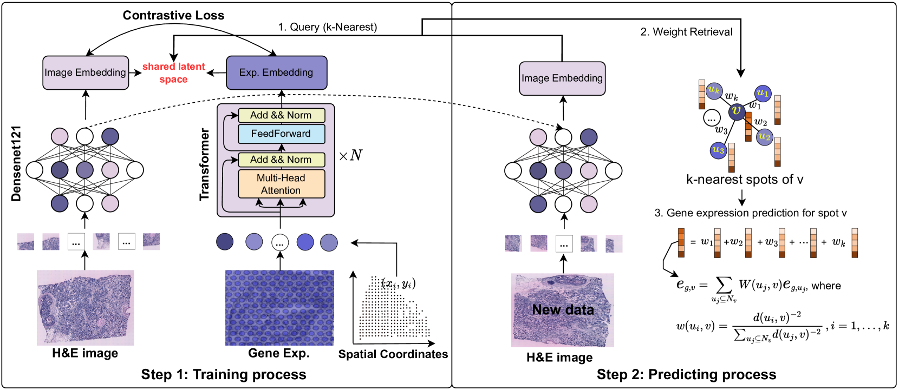
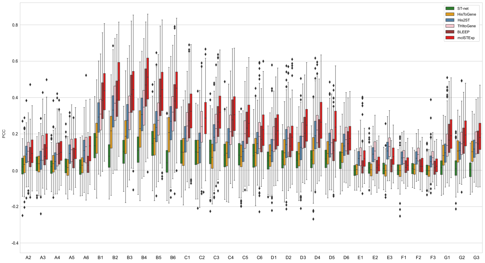
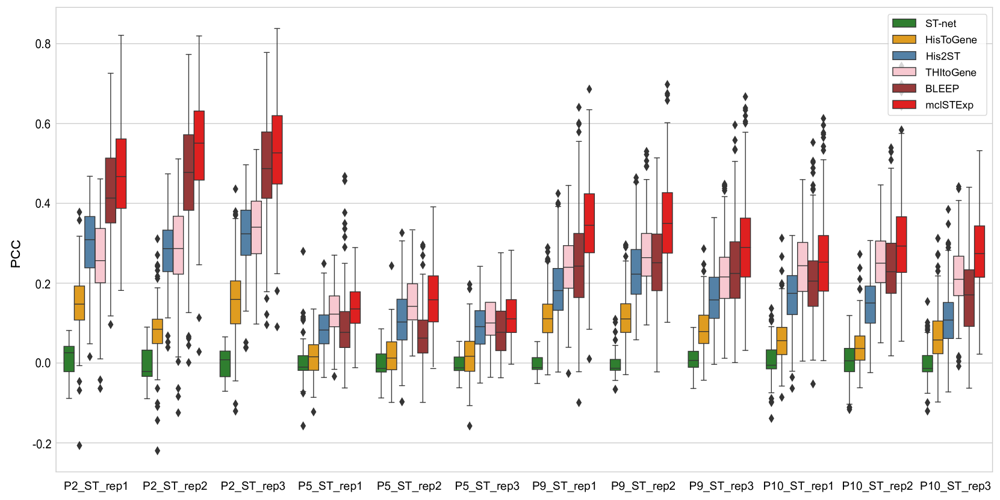
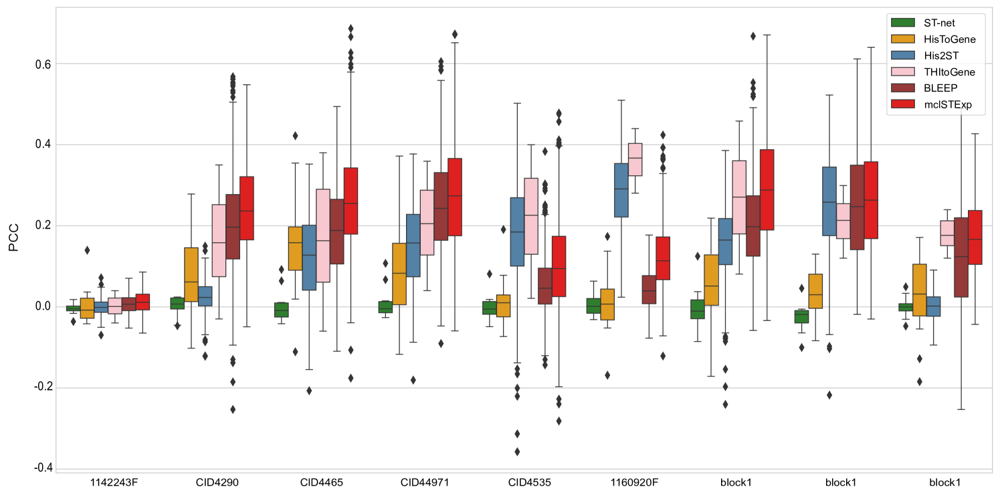

# 通过组织学图像预测空间基因表达，我们采用了多模态对比学习方法。

发布时间：2024年07月11日

`LLM应用` `生物技术`

> Multimodal contrastive learning for spatial gene expression prediction using histology images

# 摘要

> 近年来，空间转录组学技术为探索复杂生物系统中的基因表达模式开辟了新天地。然而，高昂的成本限制了其在大型研究中的应用。为此，我们提出了一种经济高效的方案：利用人工智能，通过H&E染色的全切片图像预测基因表达。本文中，我们引入了**mclSTExp**，一种结合Transformer和Densenet-121编码器的多模态对比学习方法，用于精准预测空间转录组表达。我们将每个点比作“单词”，通过Transformer的自注意力机制，巧妙融合其内在特征与空间环境。通过对比学习，进一步强化了图像特征的整合，大幅提升了预测准确性。在乳腺癌和皮肤鳞状细胞癌数据集上的测试表明，mclSTExp不仅在基因表达预测上表现卓越，还能深入解析癌症特异性基因、免疫相关基因，并精准识别由专家注释的特定空间区域。源代码已公开，供研究者参考使用。

> In recent years, the advent of spatial transcriptomics (ST) technology has unlocked unprecedented opportunities for delving into the complexities of gene expression patterns within intricate biological systems. Despite its transformative potential, the prohibitive cost of ST technology remains a significant barrier to its widespread adoption in large-scale studies. An alternative, more cost-effective strategy involves employing artificial intelligence to predict gene expression levels using readily accessible whole-slide images (WSIs) stained with Hematoxylin and Eosin (H\&E). However, existing methods have yet to fully capitalize on multimodal information provided by H&E images and ST data with spatial location. In this paper, we propose \textbf{mclSTExp}, a multimodal contrastive learning with Transformer and Densenet-121 encoder for Spatial Transcriptomics Expression prediction. We conceptualize each spot as a "word", integrating its intrinsic features with spatial context through the self-attention mechanism of a Transformer encoder. This integration is further enriched by incorporating image features via contrastive learning, thereby enhancing the predictive capability of our model. Our extensive evaluation of \textbf{mclSTExp} on two breast cancer datasets and a skin squamous cell carcinoma dataset demonstrates its superior performance in predicting spatial gene expression. Moreover, mclSTExp has shown promise in interpreting cancer-specific overexpressed genes, elucidating immune-related genes, and identifying specialized spatial domains annotated by pathologists. Our source code is available at https://github.com/shizhiceng/mclSTExp.

[Arxiv](https://arxiv.org/abs/2407.08216)