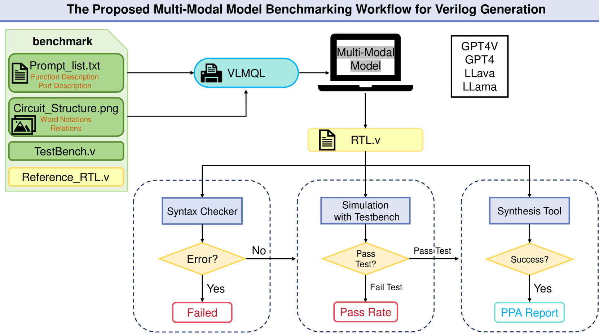

# 仅凭自然语言远远不够：我们正在为 Verilog 生成任务，对多模态生成 AI 进行基准测试。

发布时间：2024年07月11日

`LLM应用` `硬件设计` `人工智能`

> Natural language is not enough: Benchmarking multi-modal generative AI for Verilog generation

# 摘要

> 自然语言接口在自动生成Verilog方面潜力巨大，但本文指出，视觉表示对于空间复杂的硬件设计至关重要，可能优于纯语言输入。为此，我们推出了一个开源的多模态生成模型基准，专门用于从视觉-语言输入合成Verilog，涵盖简单与复杂模块。同时，我们开发了一个开源的视觉与自然语言Verilog查询框架，以简化多模态查询。通过与仅使用自然语言的方法对比，我们的多模态生成Verilog在准确性上显著提升。我们期待在大规模硬件设计时代，推动硬件设计方法的多样化和高效化。

> Natural language interfaces have exhibited considerable potential in the automation of Verilog generation derived from high-level specifications through the utilization of large language models, garnering significant attention. Nevertheless, this paper elucidates that visual representations contribute essential contextual information critical to design intent for hardware architectures possessing spatial complexity, potentially surpassing the efficacy of natural-language-only inputs. Expanding upon this premise, our paper introduces an open-source benchmark for multi-modal generative models tailored for Verilog synthesis from visual-linguistic inputs, addressing both singular and complex modules. Additionally, we introduce an open-source visual and natural language Verilog query language framework to facilitate efficient and user-friendly multi-modal queries. To evaluate the performance of the proposed multi-modal hardware generative AI in Verilog generation tasks, we compare it with a popular method that relies solely on natural language. Our results demonstrate a significant accuracy improvement in the multi-modal generated Verilog compared to queries based solely on natural language. We hope to reveal a new approach to hardware design in the large-hardware-design-model era, thereby fostering a more diversified and productive approach to hardware design.

[Arxiv](https://arxiv.org/abs/2407.08473)