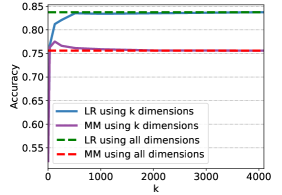

# 探索 LLM 内部的真实性普遍性

发布时间：2024年07月11日

`LLM理论` `人工智能` `数据科学`

> On the Universal Truthfulness Hyperplane Inside LLMs

# 摘要

> 尽管 LLM 在多领域表现出色，幻觉问题仍是一大难题。最新研究通过分析内部表征，尝试解读 LLM 对事实的忠实度。但这些方法常难以适应新数据，引发了对内部表征是否真正反映事实意识，还是仅过度适应特定数据集的疑虑。本研究探索模型中是否存在一个普遍的真理超平面，能区分正确与错误输出。我们扩大训练数据集至40多个，全面评估其泛化能力。结果显示，数据集多样性提升显著增强性能，而数据量影响较小。这支持了模型内可能存在普遍真理超平面的乐观假设，为未来研究指明方向。

> While large language models (LLMs) have demonstrated remarkable abilities across various fields, hallucination remains a significant challenge. Recent studies have explored hallucinations through the lens of internal representations, proposing mechanisms to decipher LLMs' adherence to facts. However, these approaches often fail to generalize to out-of-distribution data, leading to concerns about whether internal representation patterns reflect fundamental factual awareness, or only overfit spurious correlations on the specific datasets. In this work, we investigate whether a universal truthfulness hyperplane that distinguishes the model's factually correct and incorrect outputs exists within the model. To this end, we scale up the number of training datasets and conduct an extensive evaluation -- we train the truthfulness hyperplane on a diverse collection of over 40 datasets and examine its cross-task, cross-domain, and in-domain generalization. Our results indicate that increasing the diversity of the training datasets significantly enhances the performance in all scenarios, while the volume of data samples plays a less critical role. This finding supports the optimistic hypothesis that a universal truthfulness hyperplane may indeed exist within the model, offering promising directions for future research.

[Arxiv](https://arxiv.org/abs/2407.08582)