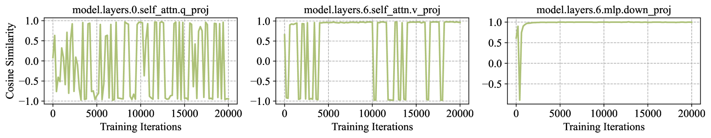
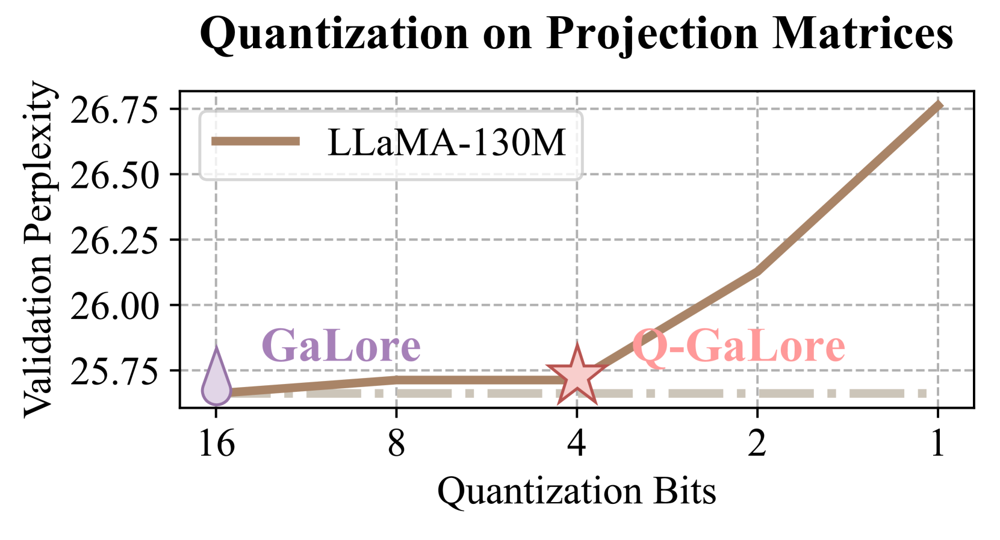
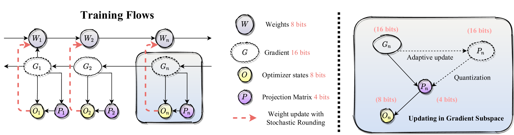
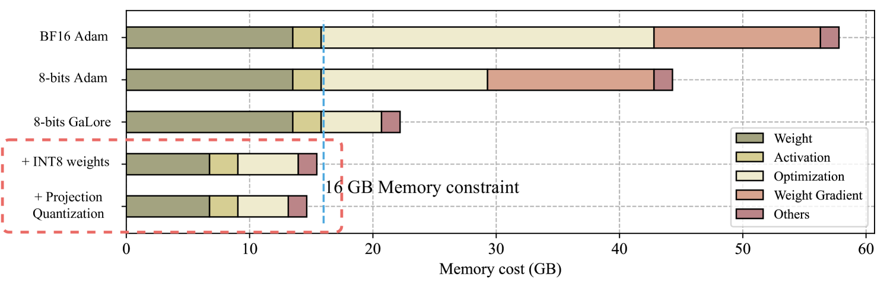
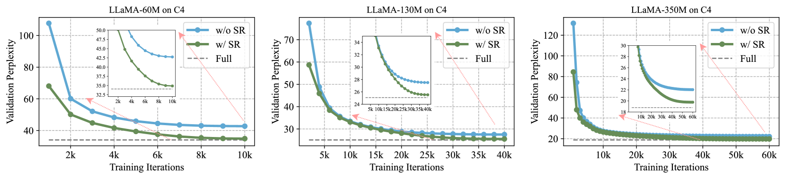
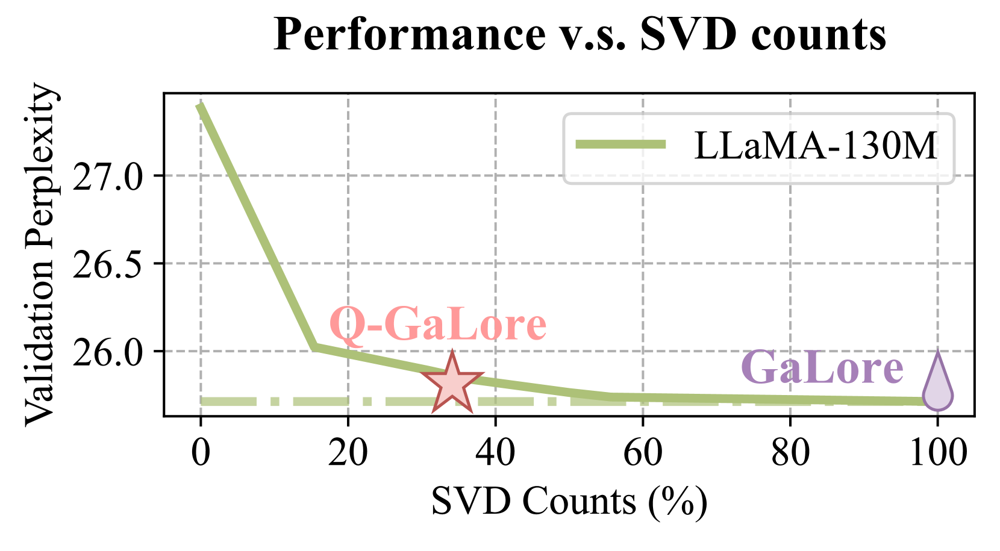

# Q-GaLore：结合 INT4 投影与层适应低秩梯度的量化 GaLore技术

发布时间：2024年07月11日

`LLM理论` `计算机科学` `人工智能`

> Q-GaLore: Quantized GaLore with INT4 Projection and Layer-Adaptive Low-Rank Gradients

# 摘要

> 训练大型语言模型因大量参数和优化状态而内存密集。新方法 GaLore 通过将权重梯度投影到低秩子空间来减少内存使用，但依赖耗时的 SVD 操作且频繁更新导致训练时间开销大。与 LoRA 相比，GaLore 在准确性和效率上的改进有限。为此，我们提出 Q-Galore，结合量化和低秩投影，显著减少内存使用，超越 GaLore。基于两个关键观察：梯度子空间多样性及投影矩阵对低比特量化的弹性，Q-Galore 自适应更新梯度子空间，减少 SVD 操作，保持投影矩阵在 INT4 格式，权重在 INT8 格式，结合随机舍入捕捉梯度信息，实现高精度训练。在预训练中，Q-Galore 使 LLaMA-7B 模型能在单个 NVIDIA RTX 4060 Ti 上从头开始训练，仅需 16 GB 内存。在微调中，与 LoRA 和 GaLore 相比，内存消耗减少高达 50%，且在相同内存成本下始终优于 QLoRA。

> Training Large Language Models (LLMs) is memory-intensive due to the large number of parameters and associated optimization states. GaLore, a recent method, reduces memory usage by projecting weight gradients into a low-rank subspace without compromising performance. However, GaLore relies on time-consuming Singular Value Decomposition (SVD) operations to identify the subspace, and the frequent subspace updates lead to significant training time overhead. Moreover, GaLore offers minimal improvements in accuracy and efficiency compared to LoRA in more accessible fine-tuning scenarios. To address these limitations, we introduce Q-Galore, a novel approach that substantially reduces memory usage by combining quantization and low-rank projection, surpassing the benefits of GaLore. Our method is based on two key observations: (i) the gradient subspace exhibits diverse properties, with some layers converging early in training while others are subject to frequent changes; (ii) the projection matrices are highly resilient to low-bit quantization. Leveraging these insights, Q-GaLore adaptively updates the gradient subspace based on its convergence statistics, achieving comparable performance while significantly reducing the number of SVD operations. We maintain the projection matrices in INT4 format and weights in INT8 format, incorporating stochastic rounding to capture accumulated gradient information. This approach enables a high-precision training trajectory using only low-precision weights. We demonstrate that Q-GaLore achieves highly competitive performance with exceptional memory efficiency. At pre-training, Q-GaLore facilitates training a LLaMA-7B model from scratch on a single NVIDIA RTX 4060 Ti with only 16 GB memory. At fine-tuning, it reduces memory consumption by up to 50% compared to LoRA and GaLore, while consistently outperforming QLoRA at the same memory cost.

[Arxiv](https://arxiv.org/abs/2407.08296)