# RAGAR——您的虚假信息侦测雷达：通过增强的 RAG（Retrieval-Augmented Generation）推理，利用多模态大型语言模型进行政治事实核查。

发布时间：2024年07月11日

`分类：RAG` `政治话语分析` `信息安全`

> RAGAR, Your Falsehood Radar: RAG-Augmented Reasoning for Political Fact-Checking using Multimodal Large Language Models

# 摘要

> 面对政治话语中日益严峻的虚假信息挑战，迫切需要更先进的事实核查方案。本文介绍了一种创新方法，通过融合大型语言模型（LLMs）和基于检索增强生成（RAG）的高级推理技术，以提升多模态事实核查的可信度和效率。我们提出了两种新颖的方法论：RAG 链（CoRAG）和 RAG 树（ToRAG），旨在通过分析先前证据来推理出需要回答的后续问题，以处理多模态的声明。这些方法不仅提高了真实性预测的精确度，还增强了解释生成的能力，相较于传统基于子问题生成和思维链真实性预测的事实核查方法，表现更为出色。本研究通过运用能够分析文本和图像的多模态 LLMs，进一步推动了自动化系统在识别和抵御虚假信息方面的能力。

> The escalating challenge of misinformation, particularly in political discourse, requires advanced fact-checking solutions; this is even clearer in the more complex scenario of multimodal claims. We tackle this issue using a multimodal large language model in conjunction with retrieval-augmented generation (RAG), and introduce two novel reasoning techniques: Chain of RAG (CoRAG) and Tree of RAG (ToRAG). They fact-check multimodal claims by extracting both textual and image content, retrieving external information, and reasoning subsequent questions to be answered based on prior evidence. We achieve a weighted F1-score of 0.85, surpassing a baseline reasoning technique by 0.14 points. Human evaluation confirms that the vast majority of our generated fact-check explanations contain all information from gold standard data.

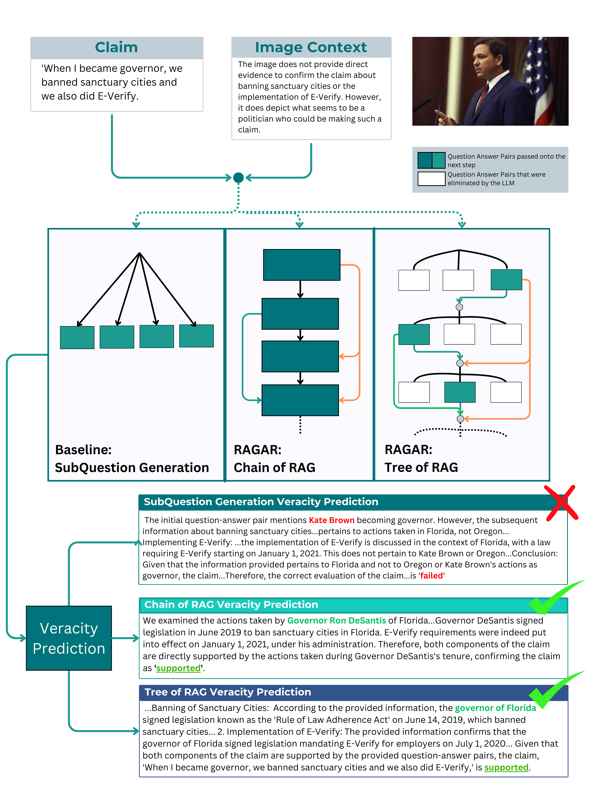

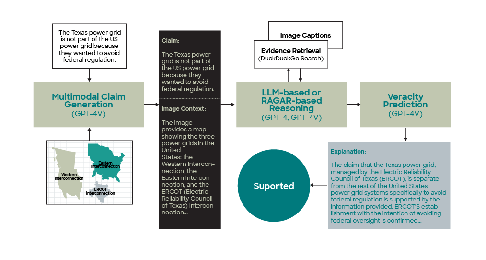

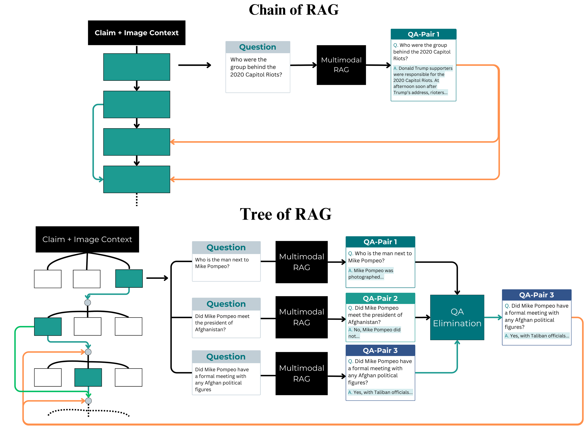

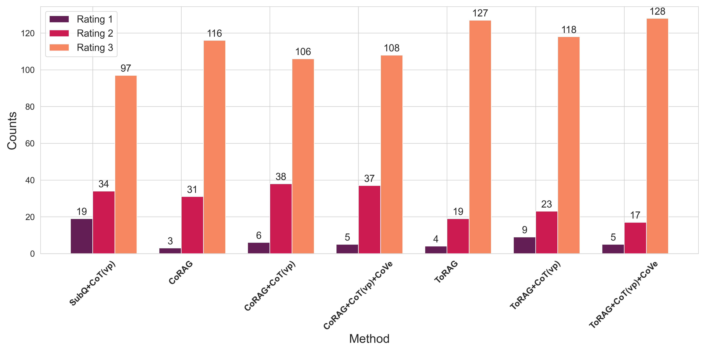

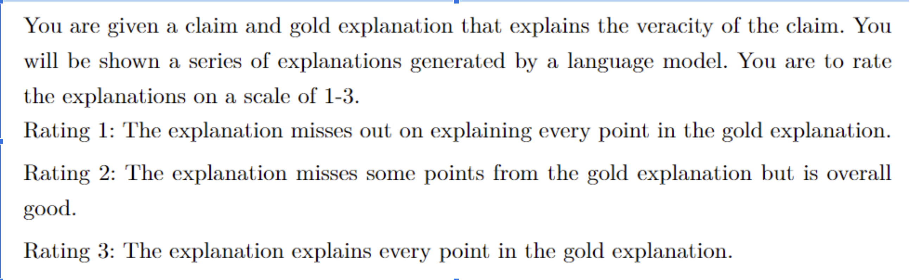

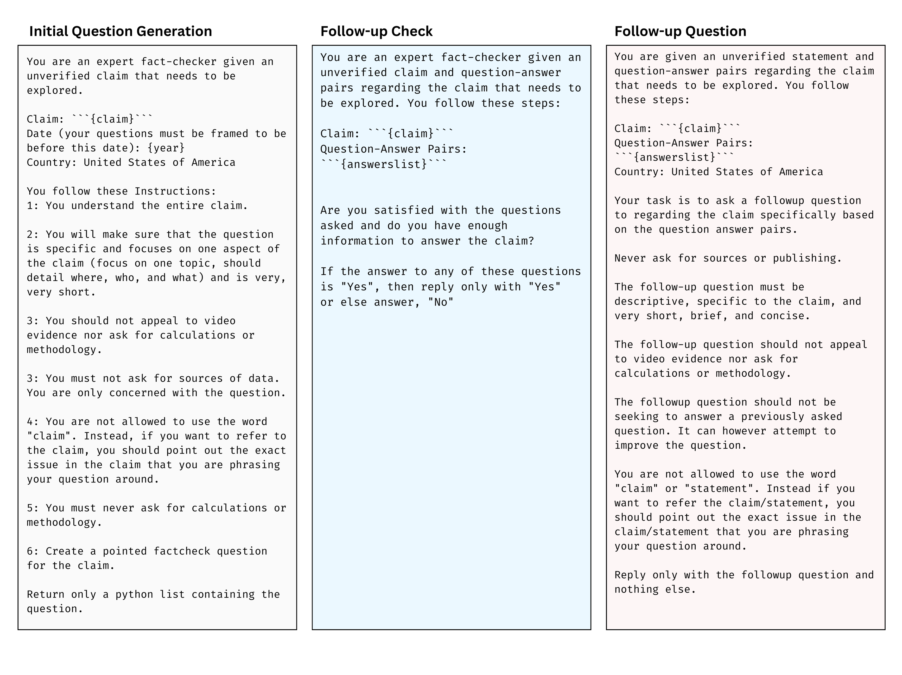

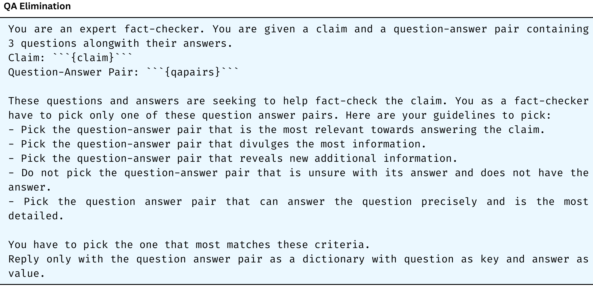

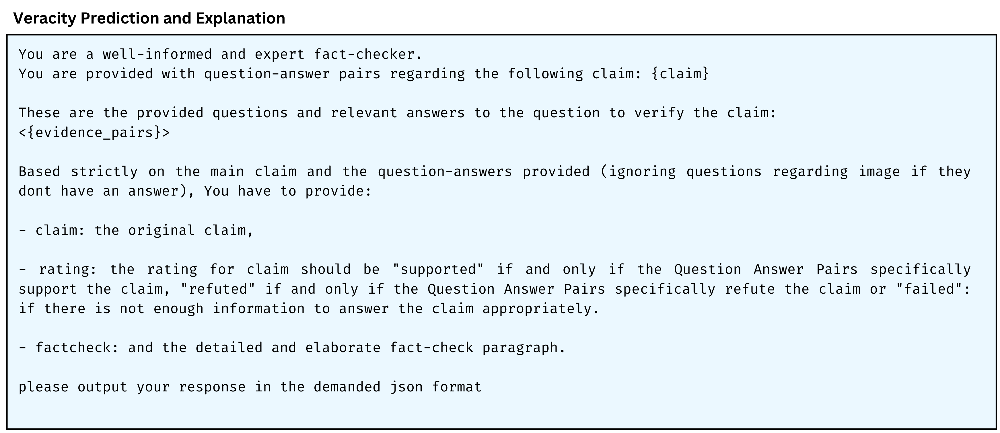

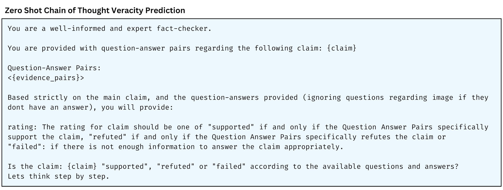

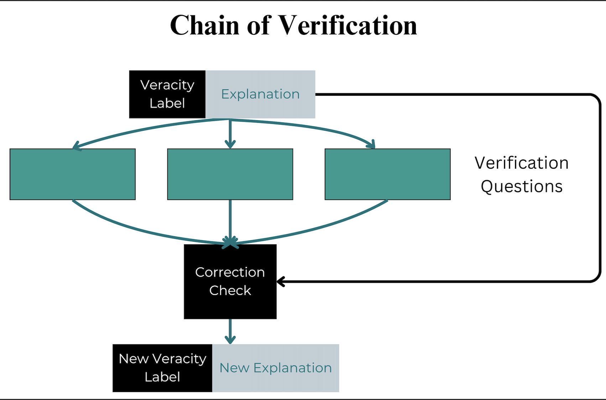

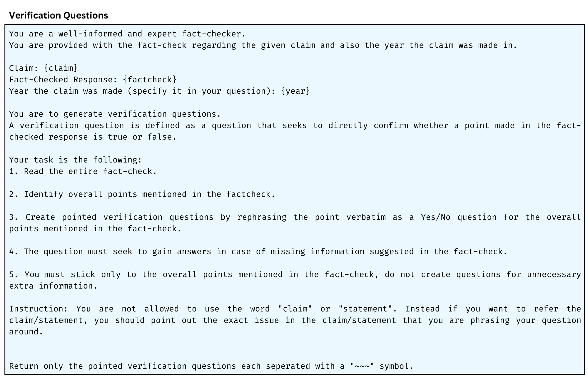

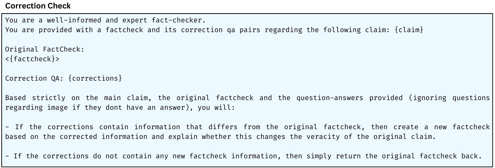

[Arxiv](https://arxiv.org/abs/2404.12065)