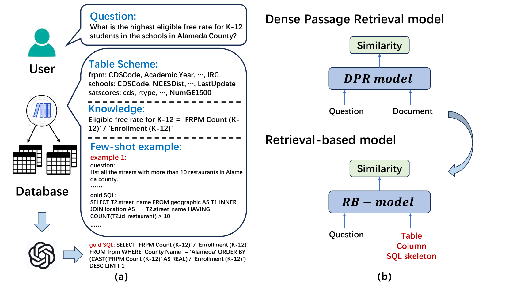
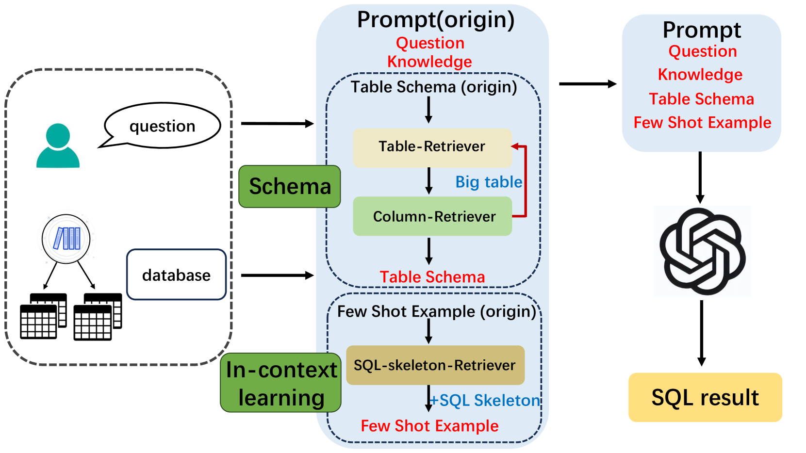
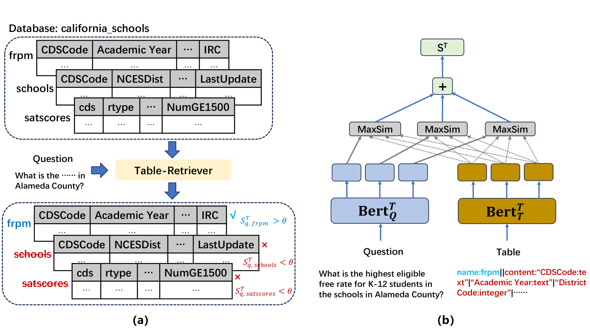
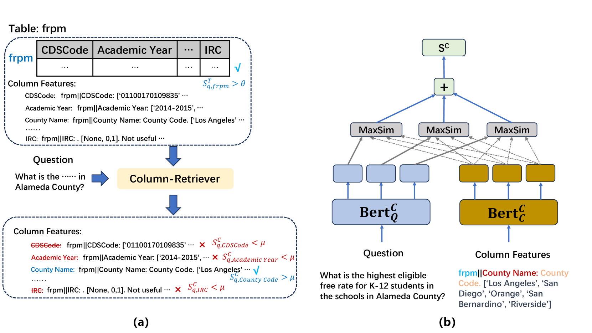
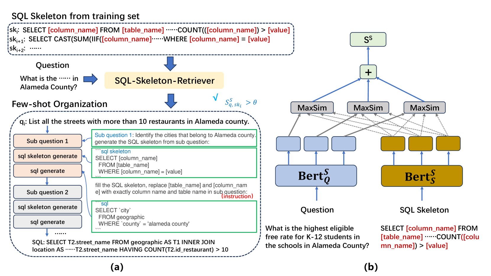
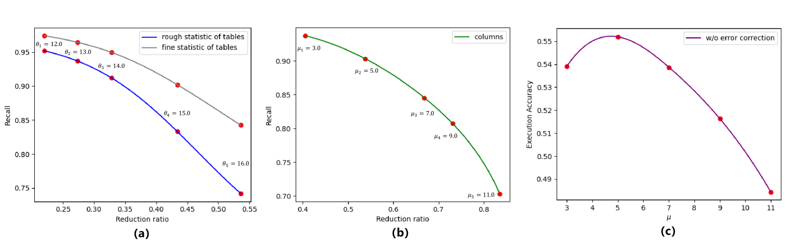

# RB-SQL：一款基于检索的 LLM 框架，专为文本转 SQL 设计。

发布时间：2024年07月11日

`LLM应用` `数据库` `软件开发`

> RB-SQL: A Retrieval-based LLM Framework for Text-to-SQL

# 摘要

> 通过上下文学习，大型语言模型 (LLM) 在文本到 SQL 任务上取得了显著进步。尽管以往研究多聚焦于通过专用 SQL 生成提示提升 LLM 推理能力，但这些方法往往难以应对包含众多表和列的大型数据库，且忽略了数据库预处理和信息提取对高效提示设计的重要性。为此，我们创新性地提出了 RB-SQL 框架，该框架通过三个模块，智能检索简洁的表和列结构及针对性的学习示例，以优化上下文提示工程。实验证明，RB-SQL 在 BIRD 和 Spider 等公共数据集上表现卓越，超越了多个竞争模型。

> Large language models (LLMs) with in-context learning have significantly improved the performance of text-to-SQL task. Previous works generally focus on using exclusive SQL generation prompt to improve the LLMs' reasoning ability. However, they are mostly hard to handle large databases with numerous tables and columns, and usually ignore the significance of pre-processing database and extracting valuable information for more efficient prompt engineering. Based on above analysis, we propose RB-SQL, a novel retrieval-based LLM framework for in-context prompt engineering, which consists of three modules that retrieve concise tables and columns as schema, and targeted examples for in-context learning. Experiment results demonstrate that our model achieves better performance than several competitive baselines on public datasets BIRD and Spider.

[Arxiv](https://arxiv.org/abs/2407.08273)