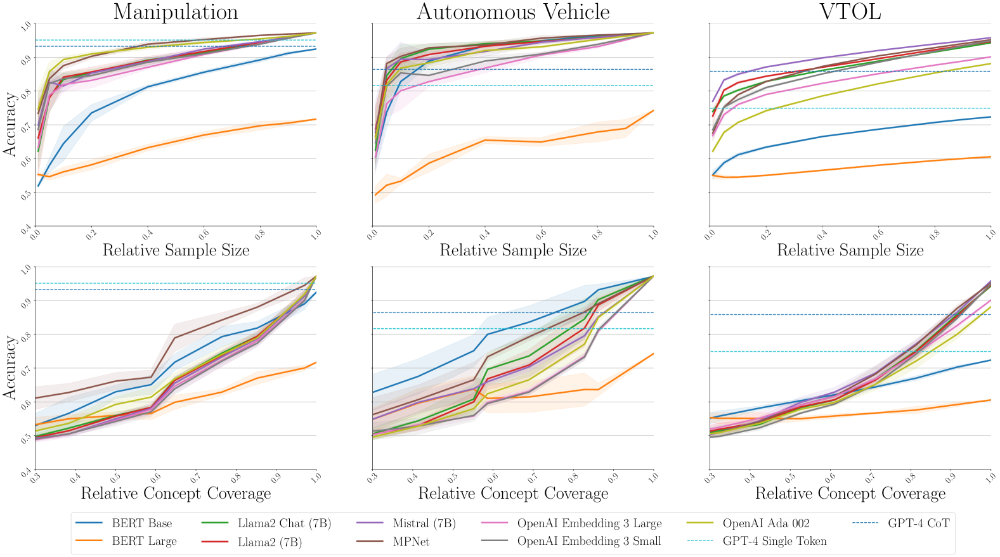

# 大型语言模型在实时异常检测与反应性规划中的应用

发布时间：2024年07月11日

`LLM应用` `机器人` `自动驾驶`

> Real-Time Anomaly Detection and Reactive Planning with Large Language Models

# 摘要

> 基础模型，如大型语言模型 (LLM)，在海量互联网数据上训练，具备零-shot 泛化能力，有望检测并缓解机器人系统的异常行为。但要充分发挥其潜力，需克服两大难题：一是降低其高昂的计算成本，以便实时应用；二是将其对异常的判断融入安全控制框架。为此，我们设计了一个两阶段推理框架：首阶段是快速异常检测器，在 LLM 嵌入空间中分析数据，一旦发现异常，即启动次阶段的慢速回退机制，利用生成 LLM 的深度推理能力。这一设计确保了模型预测控制策略的灵活性与安全性，即便在异常检测后也能维持多重回退方案的可行性。实验表明，我们的快速异常检测器性能超越了顶尖 GPT 模型的自回归推理，即使在小型语言模型上也能实现。这使得我们的实时监控系统在资源与时间受限的情况下，仍能提升如四旋翼无人机或自动驾驶汽车等动态机器人系统的可靠性。相关模拟与实测视频已发布于项目页面：https://sites.google.com/view/aesop-llm。

> Foundation models, e.g., large language models (LLMs), trained on internet-scale data possess zero-shot generalization capabilities that make them a promising technology towards detecting and mitigating out-of-distribution failure modes of robotic systems. Fully realizing this promise, however, poses two challenges: (i) mitigating the considerable computational expense of these models such that they may be applied online, and (ii) incorporating their judgement regarding potential anomalies into a safe control framework. In this work, we present a two-stage reasoning framework: First is a fast binary anomaly classifier that analyzes observations in an LLM embedding space, which may then trigger a slower fallback selection stage that utilizes the reasoning capabilities of generative LLMs. These stages correspond to branch points in a model predictive control strategy that maintains the joint feasibility of continuing along various fallback plans to account for the slow reasoner's latency as soon as an anomaly is detected, thus ensuring safety. We show that our fast anomaly classifier outperforms autoregressive reasoning with state-of-the-art GPT models, even when instantiated with relatively small language models. This enables our runtime monitor to improve the trustworthiness of dynamic robotic systems, such as quadrotors or autonomous vehicles, under resource and time constraints. Videos illustrating our approach in both simulation and real-world experiments are available on this project page: https://sites.google.com/view/aesop-llm.

[Arxiv](https://arxiv.org/abs/2407.08735)