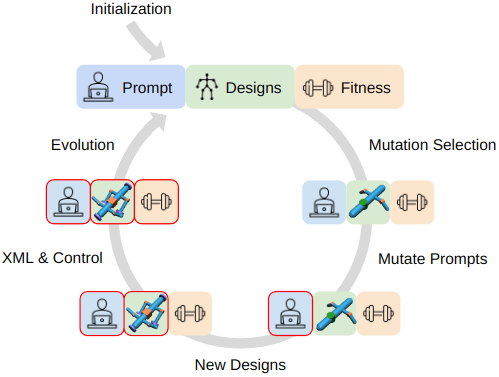
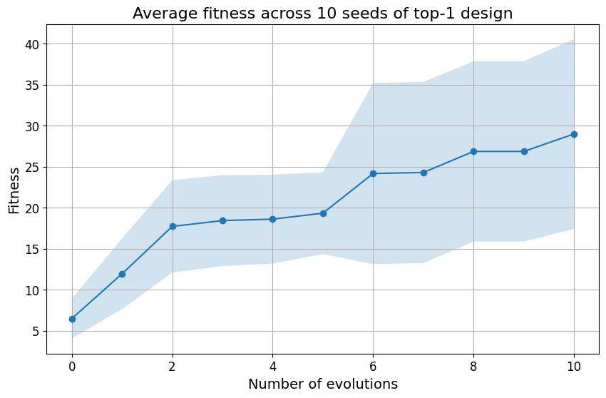
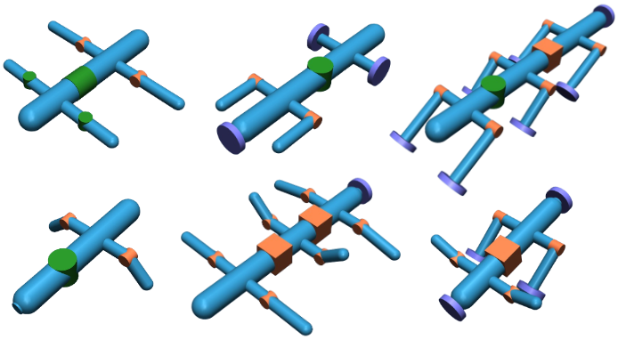
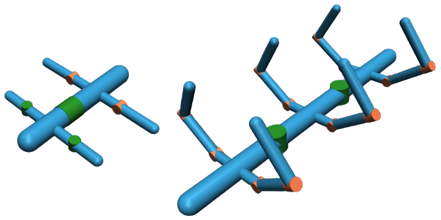

# RoboMorph：借助大型语言模型，探索机器人形态的进化之路

发布时间：2024年07月11日

`LLM应用` `机器人` `自动化设计`

> RoboMorph: Evolving Robot Morphology using Large Language Models

# 摘要

> 我们推出了 RoboMorph，一种结合大型语言模型和进化算法，自动生成并优化模块化机器人设计的创新方法。在此框架下，每个机器人设计被视为一种语法，借助 LLM 的力量，我们能够高效探索传统方法难以企及的广阔设计领域。通过融合自动提示设计和强化学习控制算法，RoboMorph 通过迭代反馈不断精进设计。实验证明，RoboMorph 不仅能创造出适应特定地形的复杂机器人，还能在连续进化中优化其形态。这一方法不仅展示了 LLM 在机器人设计领域的应用潜力，也为其他拥有相似设计需求的领域提供了可借鉴的路径。

> We introduce RoboMorph, an automated approach for generating and optimizing modular robot designs using large language models (LLMs) and evolutionary algorithms. In this framework, we represent each robot design as a grammar and leverage the capabilities of LLMs to navigate the extensive robot design space, which is traditionally time-consuming and computationally demanding. By integrating automatic prompt design and a reinforcement learning based control algorithm, RoboMorph iteratively improves robot designs through feedback loops. Our experimental results demonstrate that RoboMorph can successfully generate nontrivial robots that are optimized for a single terrain while showcasing improvements in morphology over successive evolutions. Our approach demonstrates the potential of using LLMs for data-driven and modular robot design, providing a promising methodology that can be extended to other domains with similar design frameworks.

[Arxiv](https://arxiv.org/abs/2407.08626)