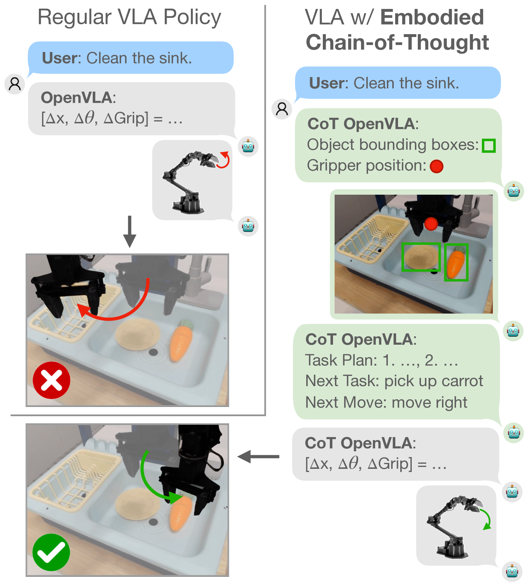
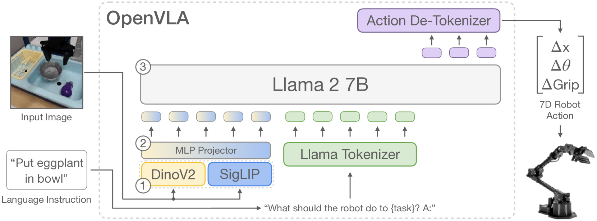
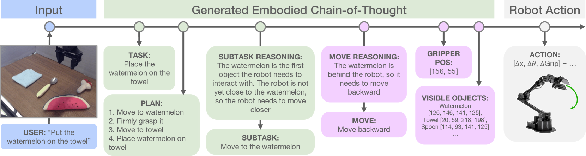
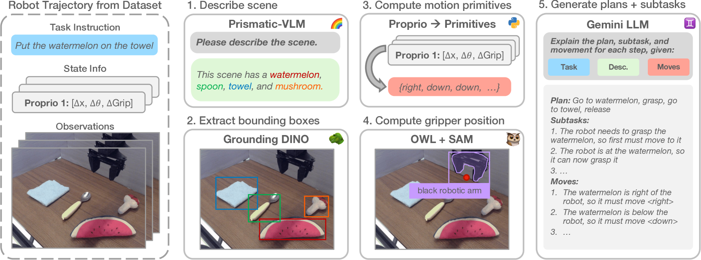
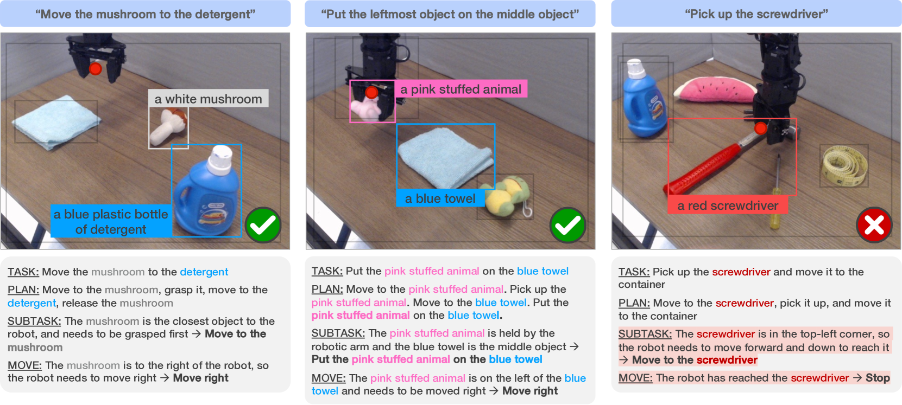
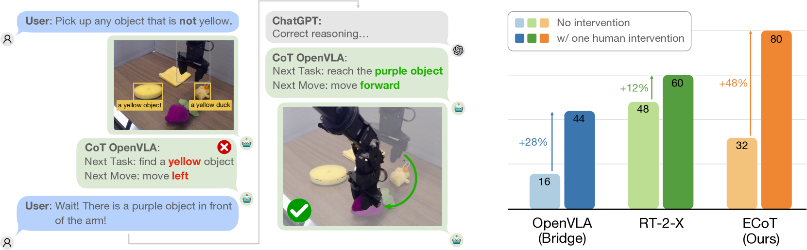
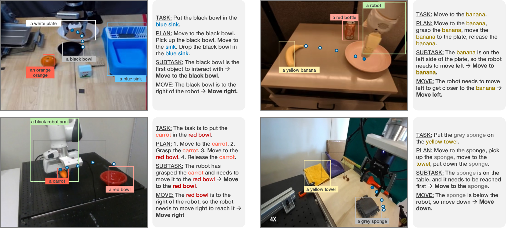

# 机器人控制：基于具身思维链的智能推理

发布时间：2024年07月11日

`Agent` `机器人学` `人工智能`

> Robotic Control via Embodied Chain-of-Thought Reasoning

# 摘要

> 学习型机器人控制策略面临的一大挑战是难以泛化至训练数据之外。近期，视觉-语言-动作模型（VLAs）的研究显示，采用互联网预训练的大型视觉-语言模型作为核心，能大幅提升策略的鲁棒性与泛化力。然而，大型视觉-语言模型在其他领域的一大亮点——迭代解决复杂问题的能力，能否应用于机器人学，让策略在执行前通过任务推理提升性能？由于标准VLAs训练示例相对简单，直接采用“思维链”（CoT）式提示效果不佳。此外，常规CoT中对子任务的纯语义推理，对于需基于感官与状态进行推理的机器人策略而言，并不充分。为此，我们提出了具身思维链推理（ECoT），训练VLAs在行动前对计划、子任务、运动及视觉基础特征（如物体边界框与末端执行器位置）进行多步推理。我们设计了可扩展的流水线，为ECoT在大规模机器人数据集上生成合成训练数据。实验表明，ECoT在不增加额外训练数据的情况下，将最强开源VLA策略OpenVLA在泛化任务中的成功率提升了28%。同时，ECoT也便于人类理解策略失败原因，并使用自然语言进行行为修正。

> A key limitation of learned robot control policies is their inability to generalize outside their training data. Recent works on vision-language-action models (VLAs) have shown that the use of large, internet pre-trained vision-language models as the backbone of learned robot policies can substantially improve their robustness and generalization ability. Yet, one of the most exciting capabilities of large vision-language models in other domains is their ability to reason iteratively through complex problems. Can that same capability be brought into robotics to allow policies to improve performance by reasoning about a given task before acting? Naive use of "chain-of-thought" (CoT) style prompting is significantly less effective with standard VLAs because of the relatively simple training examples that are available to them. Additionally, purely semantic reasoning about sub-tasks, as is common in regular CoT, is insufficient for robot policies that need to ground their reasoning in sensory observations and the robot state. To this end, we introduce Embodied Chain-of-Thought Reasoning (ECoT) for VLAs, in which we train VLAs to perform multiple steps of reasoning about plans, sub-tasks, motions, and visually grounded features like object bounding boxes and end effector positions, before predicting the robot action. We design a scalable pipeline for generating synthetic training data for ECoT on large robot datasets. We demonstrate, that ECoT increases the absolute success rate of OpenVLA, the current strongest open-source VLA policy, by 28% across challenging generalization tasks, without any additional robot training data. Additionally, ECoT makes it easier for humans to interpret a policy's failures and correct its behavior using natural language.

[Arxiv](https://arxiv.org/abs/2407.08693)