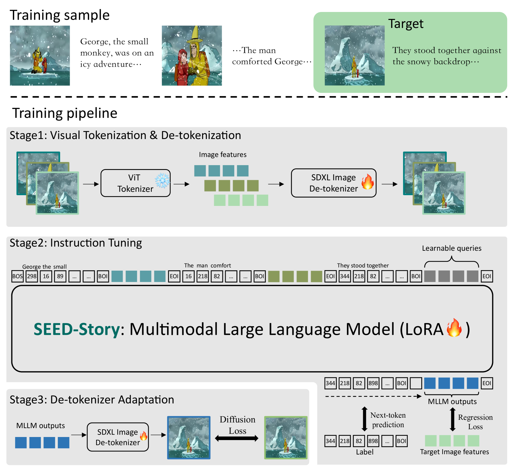
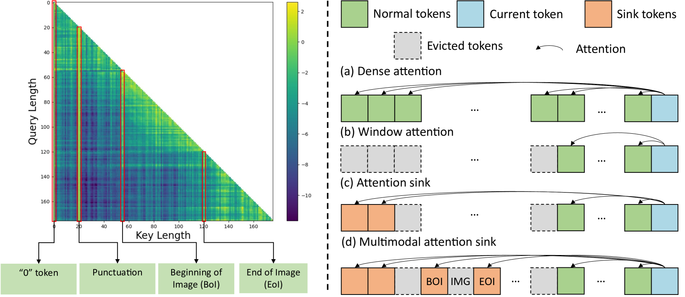
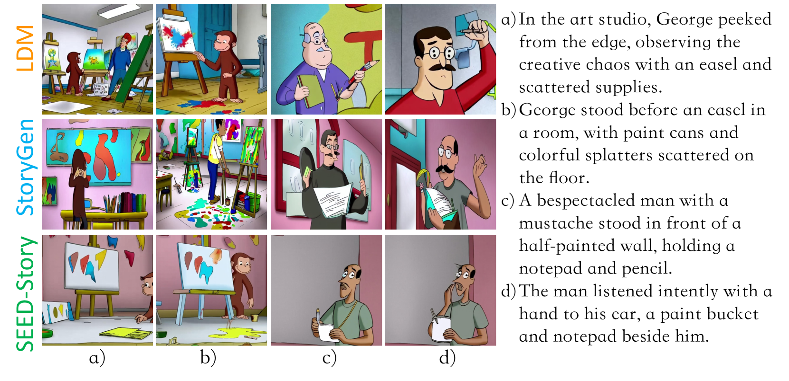
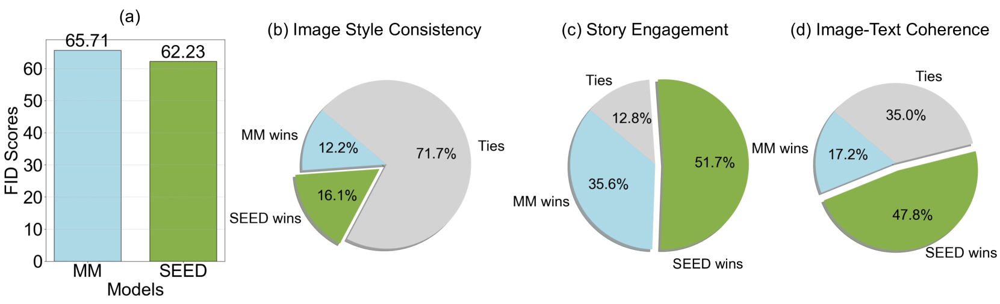
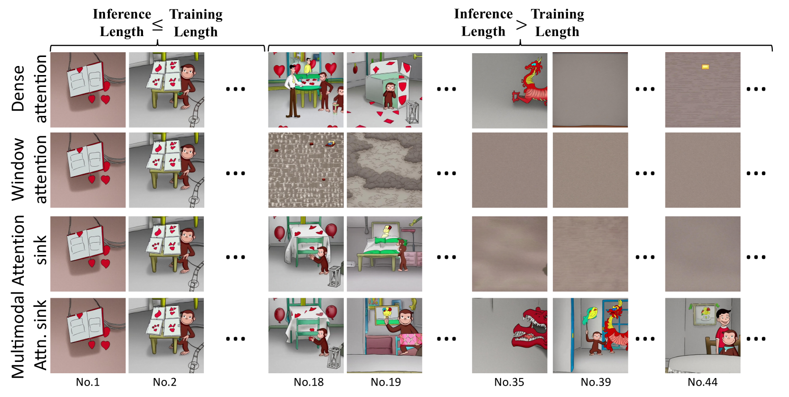
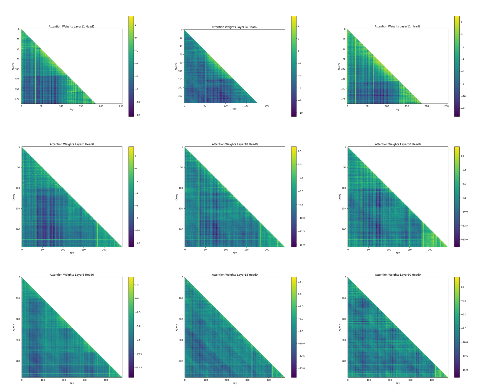
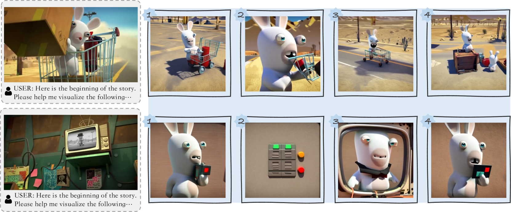
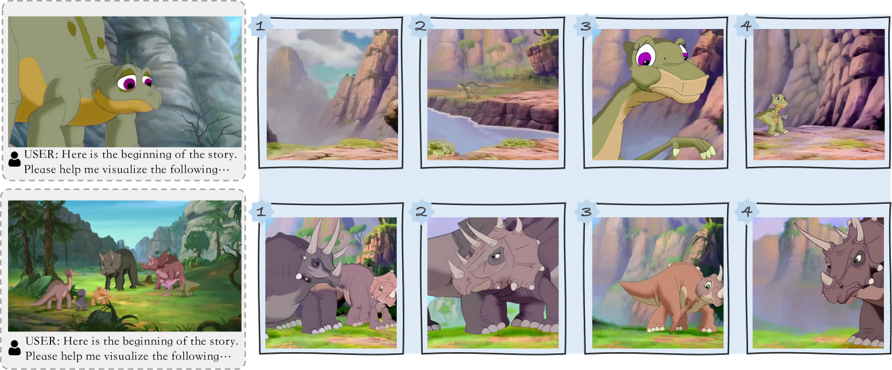

# SEED-Story：利用大型语言模型创作多模态长篇故事

发布时间：2024年07月11日

`LLM应用` `媒体与娱乐`

> SEED-Story: Multimodal Long Story Generation with Large Language Model

# 摘要

> 随着图像与文本生成技术的飞速发展，交错式图像-文本内容的创作正变得愈发引人入胜。多模态故事生成，即以交错方式融合叙事文本与生动图像，已成为一项极具价值且实用的任务，应用前景广阔。然而，这一任务极具挑战性，因为它要求深刻理解文本与图像间的复杂互动，并能生成连贯且上下文相关的大量文本与视觉内容。为此，我们推出了SEED-Story，一种基于多模态大型语言模型（MLLM）的创新方法，旨在生成丰富的多模态故事。我们的模型依托MLLM的深厚理解力，不仅能预测文本元素，还能生成视觉元素，再通过特制的视觉去标记器，产出风格与角色一致的图像。此外，我们引入了多模态注意力下沉机制，使得模型能以高效的自回归方式，生成多达25个序列的故事（训练中仅用10个序列）。同时，我们还发布了大规模高分辨率数据集StoryStream，用于模型的训练与多模态故事生成任务的全面定量评估。

> With the remarkable advancements in image generation and open-form text generation, the creation of interleaved image-text content has become an increasingly intriguing field. Multimodal story generation, characterized by producing narrative texts and vivid images in an interleaved manner, has emerged as a valuable and practical task with broad applications. However, this task poses significant challenges, as it necessitates the comprehension of the complex interplay between texts and images, and the ability to generate long sequences of coherent, contextually relevant texts and visuals. In this work, we propose SEED-Story, a novel method that leverages a Multimodal Large Language Model (MLLM) to generate extended multimodal stories. Our model, built upon the powerful comprehension capability of MLLM, predicts text tokens as well as visual tokens, which are subsequently processed with an adapted visual de-tokenizer to produce images with consistent characters and styles. We further propose multimodal attention sink mechanism to enable the generation of stories with up to 25 sequences (only 10 for training) in a highly efficient autoregressive manner. Additionally, we present a large-scale and high-resolution dataset named StoryStream for training our model and quantitatively evaluating the task of multimodal story generation in various aspects.

[Arxiv](https://arxiv.org/abs/2407.08683)