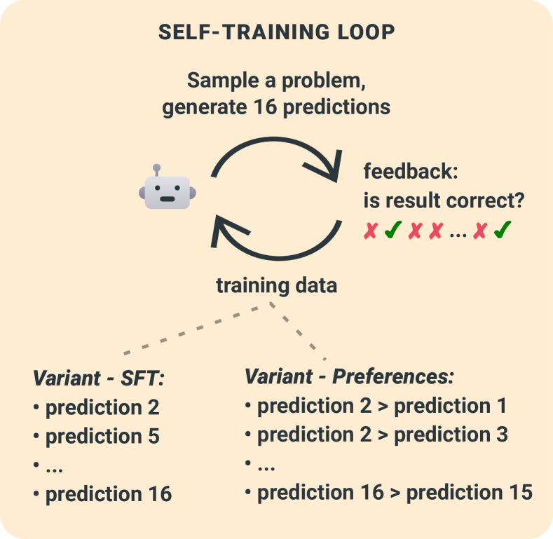

# 算术推理中的语言模型自我训练

发布时间：2024年07月11日

`LLM理论` `人工智能` `机器学习`

> Self-training Language Models for Arithmetic Reasoning

# 摘要

> 语言模型在复杂推理任务中表现出色，但通常需要大量标注数据来提升性能。本研究探索了无需新数据，仅通过自动反馈验证预测有效性（自我训练）来提升模型能力的方法。实验表明，无论是在单轮（离线）还是在线自我训练中，模型均有显著进步。离线时，监督方法与偏好优化效果相当；而在线自我训练中，偏好优化因其对新问题的稳定性和鲁棒性，远超监督训练。

> Language models achieve impressive results in tasks involving complex multistep reasoning, but scaling these capabilities further traditionally requires expensive collection of more annotated data. In this work, we explore the potential of improving the capabilities of language models without new data, merely using automated feedback to the validity of their predictions in arithmetic reasoning (self-training). We find that models can substantially improve in both single-round (offline) and online self-training. In the offline setting, supervised methods are able to deliver gains comparable to preference optimization, but in online self-training, preference optimization shows to largely outperform supervised training thanks to superior stability and robustness on unseen types of problems.

[Arxiv](https://arxiv.org/abs/2407.08400)