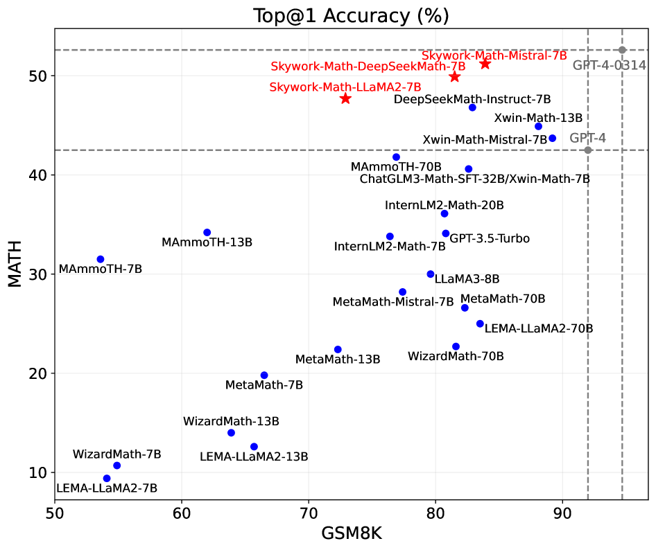
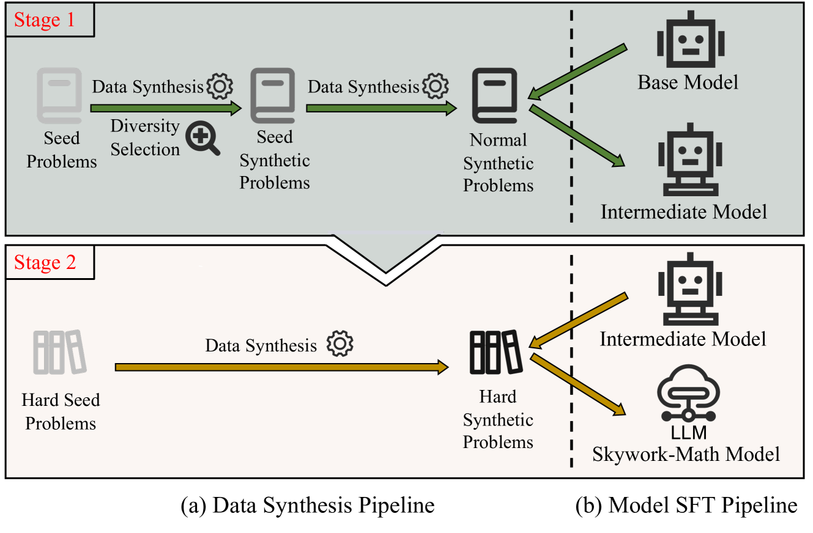
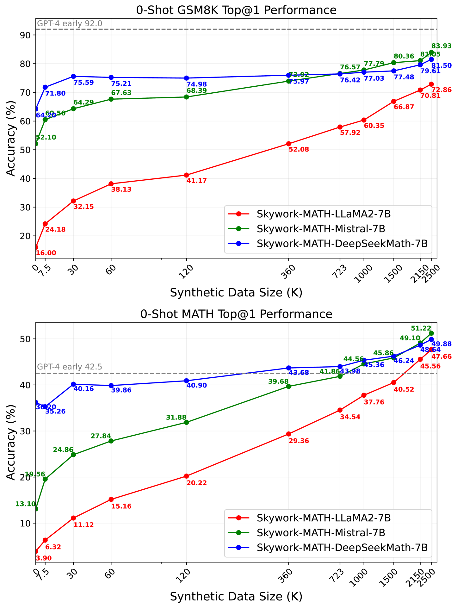
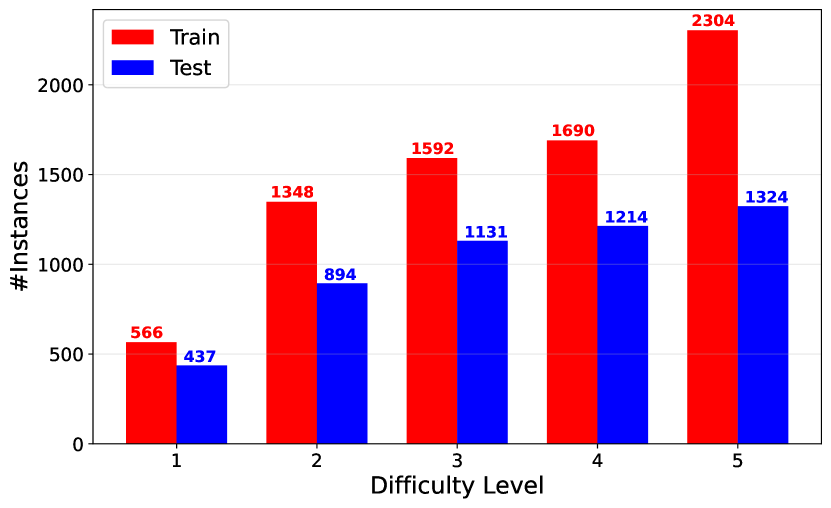
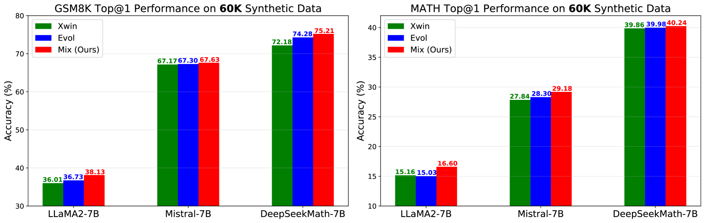

# Skywork-Math：探究大型语言模型中数学推理的数据缩放规律，故事仍在继续。

发布时间：2024年07月11日

`LLM应用` `人工智能`

> Skywork-Math: Data Scaling Laws for Mathematical Reasoning in Large Language Models -- The Story Goes On

# 摘要

> 本文深入探讨了提升大型语言模型（LLM）数学推理能力的潜在因素。我们指出，现代LLM的数学推理能力数据缩放规律远未饱和，突显了数据量增加对模型质量的积极影响。为此，我们推出了Skywork-Math模型系列，该系列在7B LLM上利用2.5M实例的Skywork-MathQA数据集进行监督微调（SFT）。Skywork-Math 7B在MATH基准测试中取得了51.2%的准确率，在GSM8K基准测试中达到了83.9%，超越了早期GPT-4在MATH上的表现。这一成就得益于我们创新的两阶段数据合成与模型SFT流程，涵盖三种增强方法及多样化的种子问题集，确保了Skywork-MathQA数据集在各难度级别上的高质量与丰富性。此外，我们还提供了实用的建议，以提升LLM在数学推理方面的能力，适用于研究和工业领域。

> In this paper, we investigate the underlying factors that potentially enhance the mathematical reasoning capabilities of large language models (LLMs). We argue that the data scaling law for math reasoning capabilities in modern LLMs is far from being saturated, highlighting how the model's quality improves with increases in data quantity. To support this claim, we introduce the Skywork-Math model series, supervised fine-tuned (SFT) on common 7B LLMs using our proposed 2.5M-instance Skywork-MathQA dataset. Skywork-Math 7B has achieved impressive accuracies of 51.2% on the competition-level MATH benchmark and 83.9% on the GSM8K benchmark using only SFT data, outperforming an early version of GPT-4 on MATH. The superior performance of Skywork-Math models contributes to our novel two-stage data synthesis and model SFT pipelines, which include three different augmentation methods and a diverse seed problem set, ensuring both the quantity and quality of Skywork-MathQA dataset across varying difficulty levels. Most importantly, we provide several practical takeaways to enhance math reasoning abilities in LLMs for both research and industry applications.

[Arxiv](https://arxiv.org/abs/2407.08348)