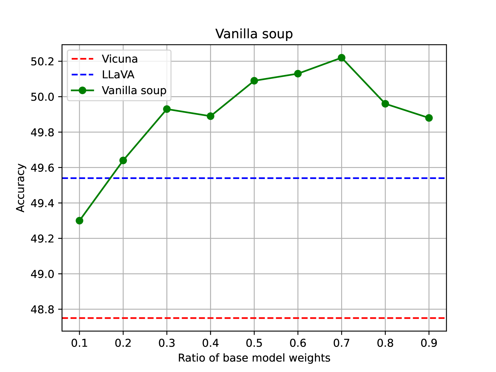
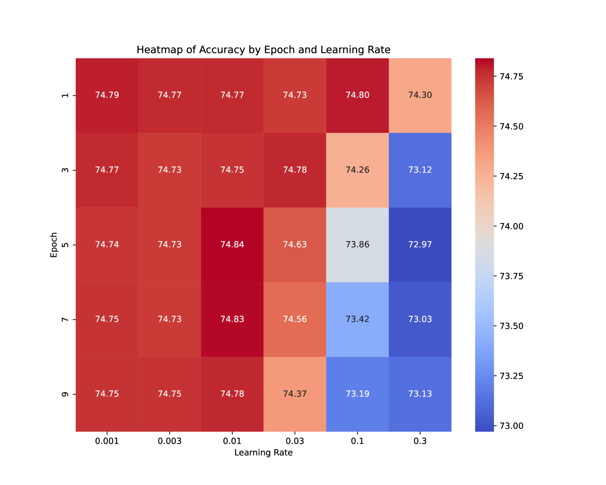
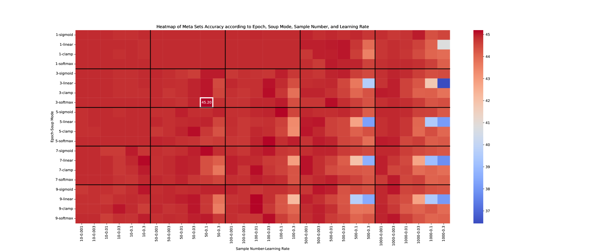
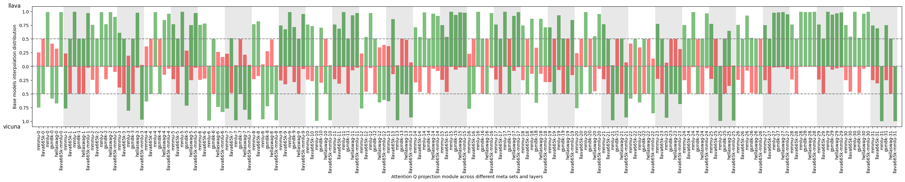
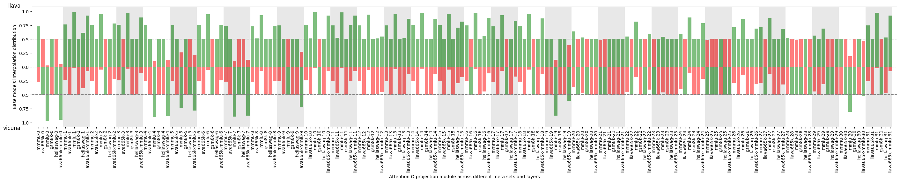
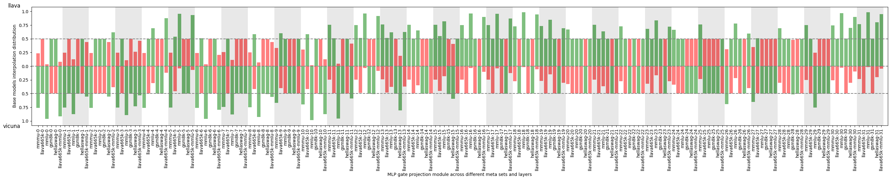

# SoupLM：融合大型语言与多模态模型中的模型集成技术

发布时间：2024年07月11日

`LLM理论` `人工智能` `多模态学习`

> SoupLM: Model Integration in Large Language and Multi-Modal Models

# 摘要

> 训练大型语言模型和多模态模型需要庞大的计算资源，而现有的公开模型通常在多样化的私人精选数据集上进行预训练。例如，LLaMA、Vicuna 和 LLaVA 这三种模型，虽然都基于 LLaMA 基础模型，但采用了截然不同的训练方法、任务和数据模态。随着这些变体的训练成本和复杂性迅速增加，我们提出了一种经济高效的“汤策略”，将这些变体融合成一个泛化能力强的多模态模型 SoupLM。通过这种策略，我们可以将不同领域和数据模态的知识和专长整合起来，避免重复训练的计算成本。此外，我们还提出了一系列策略，系统地评估不同配置下的性能提升，并探索在插值空间中基础模型间的汤行为。

> Training large language models (LLMs) and multimodal LLMs necessitates significant computing resources, and existing publicly available LLMs are typically pre-trained on diverse, privately curated datasets spanning various tasks. For instance, LLaMA, Vicuna, and LLaVA are three LLM variants trained with LLaMA base models using very different training recipes, tasks, and data modalities. The training cost and complexity for such LLM variants grow rapidly. In this study, we propose to use a soup strategy to assemble these LLM variants into a single well-generalized multimodal LLM (SoupLM) in a cost-efficient manner. Assembling these LLM variants efficiently brings knowledge and specialities trained from different domains and data modalities into an integrated one (e.g., chatbot speciality from user-shared conversations for Vicuna, and visual capacity from vision-language data for LLaVA), therefore, to avoid computing costs of repetitive training on several different domains. We propose series of soup strategies to systematically benchmark performance gains across various configurations, and probe the soup behavior across base models in the interpolation space.

[Arxiv](https://arxiv.org/abs/2407.08196)