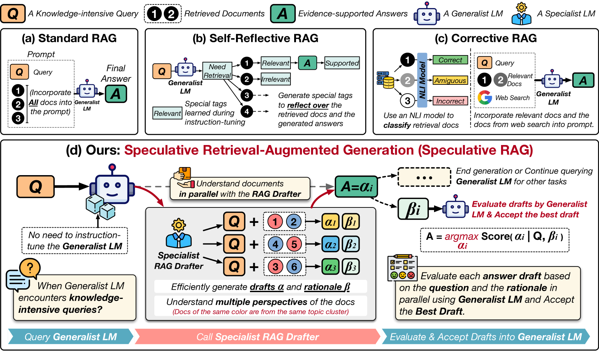
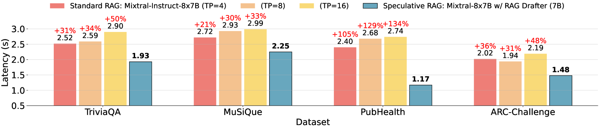
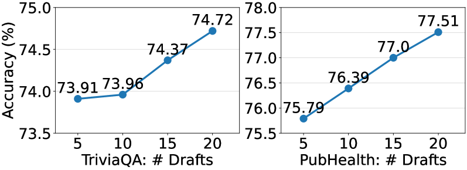
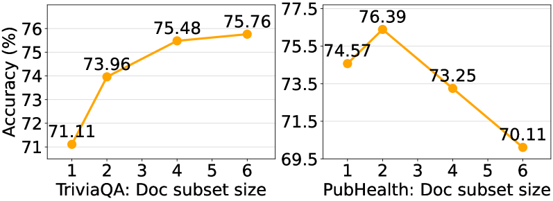

# 推测性RAG：借助草稿增强检索生成能力

发布时间：2024年07月11日

`RAG` `人工智能` `信息技术`

> Speculative RAG: Enhancing Retrieval Augmented Generation through Drafting

# 摘要

> 检索增强生成（RAG）通过结合大型语言模型（LLM）的生成能力与外部知识源，提供更精准、更及时的响应。最新进展通过迭代LLM改进或自我批评能力提升检索效果。我们提出的推测性RAG框架，利用大型通才LM高效验证小型专业LM并行生成的多个RAG草稿，每个草稿基于不同检索文档子集，提供多样视角并减少输入令牌数。此方法加深对各子集理解，减少长上下文偏差。通过将草稿任务交给小型专业LM，大型通才LM进行单次验证，加速RAG流程。实验显示，推测性RAG在多个基准测试中达到顶尖性能，显著提升准确性（高达12.97%）并大幅降低延迟（51%）。

> Retrieval augmented generation (RAG) combines the generative abilities of large language models (LLMs) with external knowledge sources to provide more accurate and up-to-date responses. Recent RAG advancements focus on improving retrieval outcomes through iterative LLM refinement or self-critique capabilities acquired through additional instruction tuning of LLMs. In this work, we introduce Speculative RAG - a framework that leverages a larger generalist LM to efficiently verify multiple RAG drafts produced in parallel by a smaller, distilled specialist LM. Each draft is generated from a distinct subset of retrieved documents, offering diverse perspectives on the evidence while reducing input token counts per draft. This approach enhances comprehension of each subset and mitigates potential position bias over long context. Our method accelerates RAG by delegating drafting to the smaller specialist LM, with the larger generalist LM performing a single verification pass over the drafts. Extensive experiments demonstrate that Speculative RAG achieves state-of-the-art performance with reduced latency on TriviaQA, MuSiQue, PubHealth, and ARC-Challenge benchmarks. It notably enhances accuracy by up to 12.97% while reducing latency by 51% compared to conventional RAG systems on PubHealth.

[Arxiv](https://arxiv.org/abs/2407.08223)