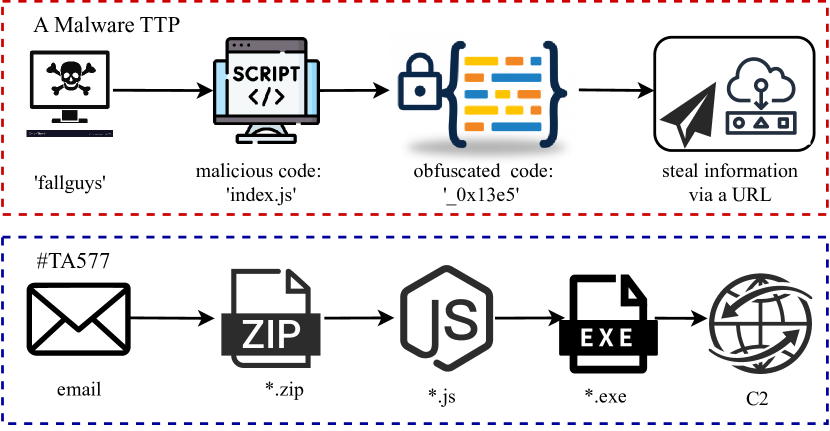
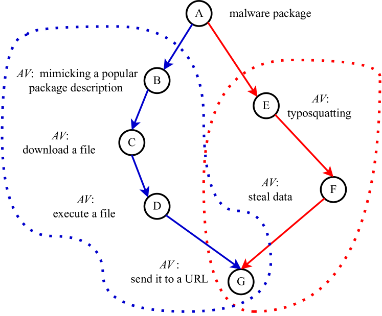
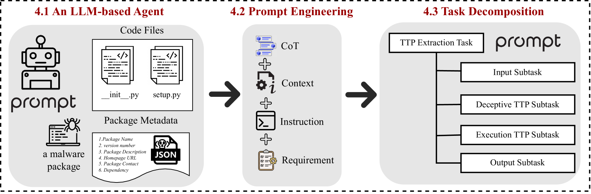
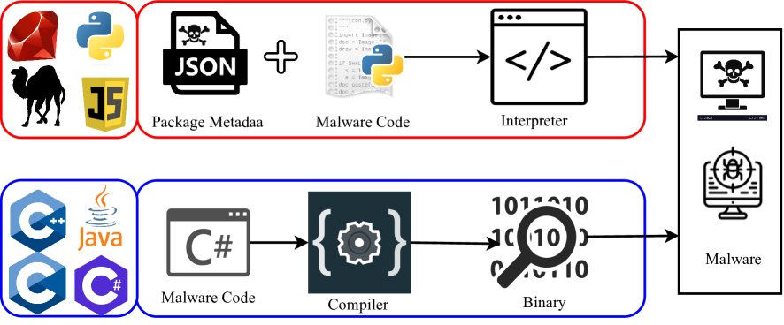
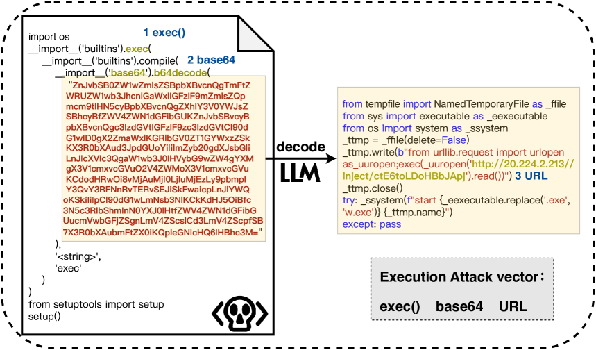
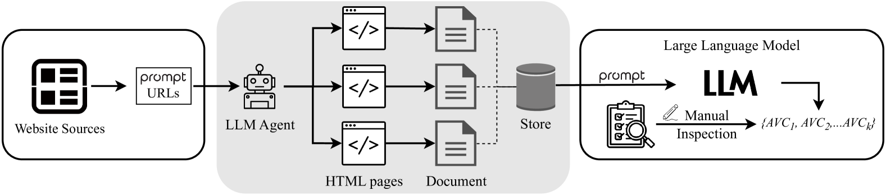
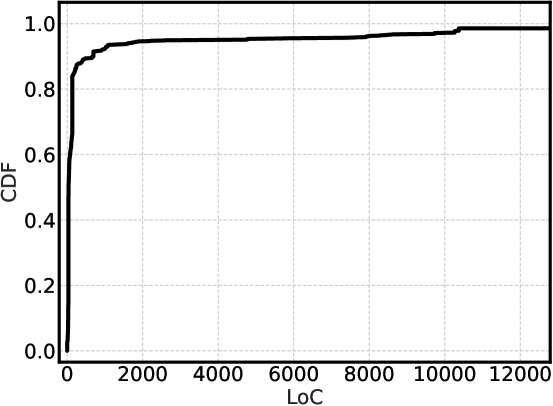
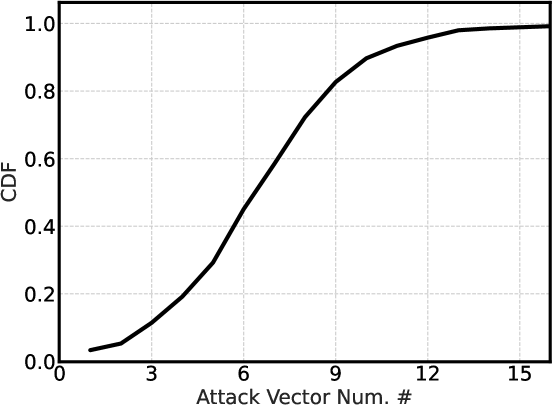
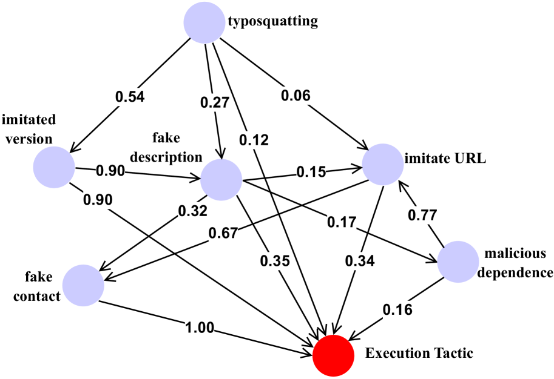
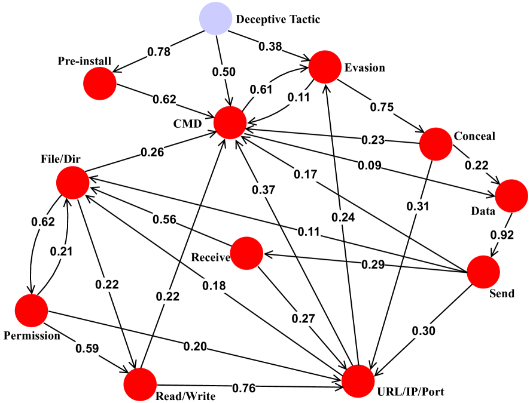

# 利用大型语言模型对解释型恶意软件的 TTPs 进行零-shot 生成研究

发布时间：2024年07月11日

`LLM应用` `软件安全` `人工智能`

> Tactics, Techniques, and Procedures (TTPs) in Interpreted Malware: A Zero-Shot Generation with Large Language Models

# 摘要

> 当前，开源软件生态正面临软件供应链攻击的安全挑战。解释型开源软件恶意代码在供应链攻击中尤为关键，因其为犯罪分子提供了多种手段诱导用户安装并执行恶意行为。本文中，我们借鉴MITRE ATT&CK框架中的战术、技术和程序（TTPs），将其应用于解释型恶意软件分析，以揭示攻击过程的各个阶段。我们创新性地提出了GENTTP方法，利用大型语言模型（LLMs）实现零-shot学习，自动从恶意软件包中提取TTP。该方法以恶意软件包为输入，输出攻击向量的欺骗与执行战术。为验证GENTTP的性能，我们收集了两个数据集：一个标注真实标签，另一个来自实际环境。实验表明，GENTTP能高效准确地生成TTP。此外，我们基于3700多个PyPI恶意软件的TTP，构建了一个基于LLM的聊天机器人，并进行了大规模的TTP定量分析。研究发现：（1）尽管恶意软件数量激增，许多恶意包的TTP仍保持稳定；（2）TTP揭示了恶意攻击的特性；（3）TTP与攻击者的意图紧密相关。

> Nowadays, the open-source software (OSS) ecosystem suffers from security threats of software supply chain (SSC) attacks. Interpreted OSS malware plays a vital role in SSC attacks, as criminals have an arsenal of attack vectors to deceive users into installing malware and executing malicious activities. In this paper, we introduce tactics, techniques, and procedures (TTPs) proposed by MITRE ATT\&CK into the interpreted malware analysis to characterize different phases of an attack lifecycle. Specifically, we propose GENTTP, a zero-shot approach to extracting a TTP of an interpreted malware package. GENTTP leverages large language models (LLMs) to automatically generate a TTP, where the input is a malicious package, and the output is a deceptive tactic and an execution tactic of attack vectors. To validate the effectiveness of GENTTP, we collect two datasets for evaluation: a dataset with ground truth labels and a large dataset in the wild. Experimental results show that GENTTP can generate TTPs with high accuracy and efficiency. To demonstrate GENTTP's benefits, we build an LLM-based Chatbot from 3,700+ PyPI malware's TTPs. We further conduct a quantitative analysis of malware's TTPs at a large scale. Our main findings include: (1) many OSS malicious packages share a relatively stable TTP, even with the increasing emergence of malware and attack campaigns, (2) a TTP reflects characteristics of a malware-based attack, and (3) an attacker's intent behind the malware is linked to a TTP.

[Arxiv](https://arxiv.org/abs/2407.08532)