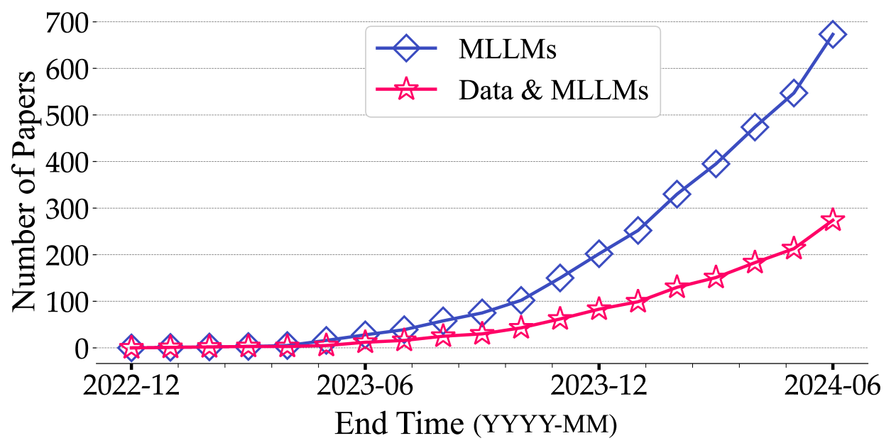
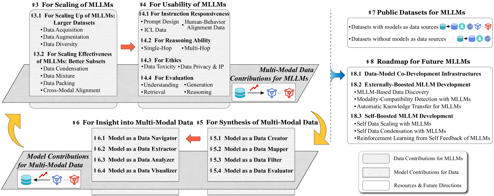

# 数据与多模态大型语言模型的协同效应：协同开发视角的探索

发布时间：2024年07月11日

`LLM应用` `人工智能` `数据科学`

> The Synergy between Data and Multi-Modal Large Language Models: A Survey from Co-Development Perspective

# 摘要

> 近年来，大型语言模型（LLMs）的迅猛发展引人瞩目。多模态LLMs（MLLMs）在此基础上，将应用领域从文本扩展至更广阔的范畴，因其广泛的应用场景而备受关注。LLMs和MLLMs的成功，离不开庞大的模型参数和数据支持，这使得数据的重要性日益凸显。通过追踪近期以数据为核心的MLLMs研究，我们发现模型与数据的发展实则相辅相成。一方面，更丰富、更优质的数据能提升MLLMs的性能；另一方面，MLLMs的发展也能推动数据进步。为了实现多模态数据与MLLMs的协同发展，我们需要明确：在MLLMs的不同发展阶段，如何运用数据中心方法来增强特定能力；以及模型如何通过其能力与角色，为多模态数据的发展贡献力量。为此，我们系统梳理了从数据与模型协同发展视角出发的相关研究，并提供了一个定期更新的项目链接，供MLLM社区参考：https://github.com/modelscope/data-juicer/blob/main/docs/awesome_llm_data.md。

> The rapid development of large language models (LLMs) has been witnessed in recent years. Based on the powerful LLMs, multi-modal LLMs (MLLMs) extend the modality from text to a broader spectrum of domains, attracting widespread attention due to the broader range of application scenarios. As LLMs and MLLMs rely on vast amounts of model parameters and data to achieve emergent capabilities, the importance of data is receiving increasingly widespread attention and recognition. Tracing and analyzing recent data-oriented works for MLLMs, we find that the development of models and data is not two separate paths but rather interconnected. On the one hand, vaster and higher-quality data contribute to better performance of MLLMs, on the other hand, MLLMs can facilitate the development of data. The co-development of multi-modal data and MLLMs requires a clear view of 1) at which development stage of MLLMs can specific data-centric approaches be employed to enhance which capabilities, and 2) by utilizing which capabilities and acting as which roles can models contribute to multi-modal data. To promote the data-model co-development for MLLM community, we systematically review existing works related to MLLMs from the data-model co-development perspective. A regularly maintained project associated with this survey is accessible at https://github.com/modelscope/data-juicer/blob/main/docs/awesome_llm_data.md.

[Arxiv](https://arxiv.org/abs/2407.08583)