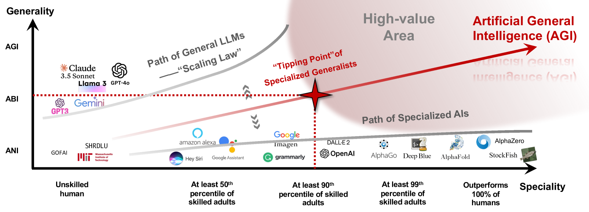
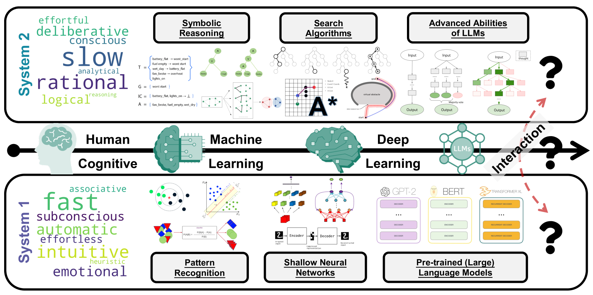
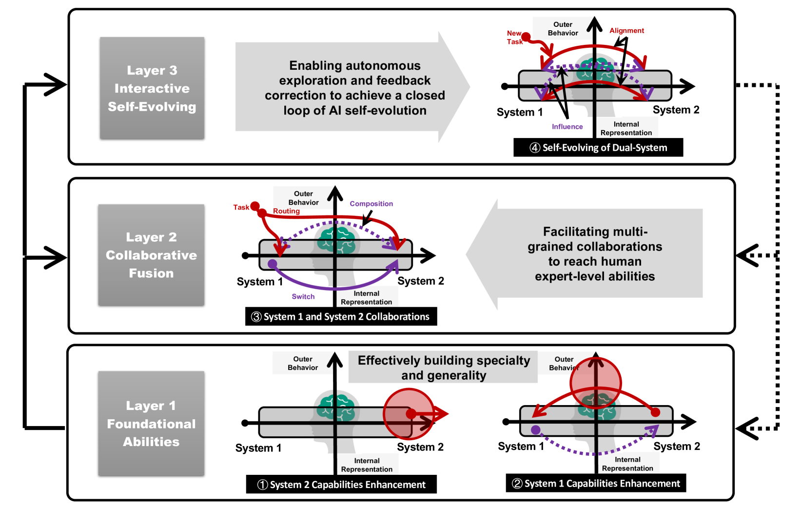

# 探索通过系统1与系统2的融合，打造专才与通才兼备的AI之路

发布时间：2024年07月11日

`LLM理论` `人工智能` `通用人工智能`

> Towards Building Specialized Generalist AI with System 1 and System 2 Fusion

# 摘要

> 本文引入了专业通才型人工智能（SGAI 或 SGI）的概念，作为迈向通用人工智能（AGI）的重要步骤。SGI 不仅在特定任务上超越人类专家，还保持了通用能力，这种融合路径使其快速进入高价值领域。我们将其发展分为三个阶段，并探讨了 SGI 在解决大型语言模型问题中的必要性。此外，我们提出一个整合系统 1 和系统 2 认知优势的开发框架，包含三个层次和四个关键部分，旨在提升个人能力并促进协同进化。最后，我们概述了潜在挑战并展望未来方向，期待 SGI 为 AGI 的研究和应用提供新视角。

> In this perspective paper, we introduce the concept of Specialized Generalist Artificial Intelligence (SGAI or simply SGI) as a crucial milestone toward Artificial General Intelligence (AGI). Compared to directly scaling general abilities, SGI is defined as AI that specializes in at least one task, surpassing human experts, while also retaining general abilities. This fusion path enables SGI to rapidly achieve high-value areas. We categorize SGI into three stages based on the level of mastery over professional skills and generality performance. Additionally, we discuss the necessity of SGI in addressing issues associated with large language models, such as their insufficient generality, specialized capabilities, uncertainty in innovation, and practical applications. Furthermore, we propose a conceptual framework for developing SGI that integrates the strengths of Systems 1 and 2 cognitive processing. This framework comprises three layers and four key components, which focus on enhancing individual abilities and facilitating collaborative evolution. We conclude by summarizing the potential challenges and suggesting future directions. We hope that the proposed SGI will provide insights into further research and applications towards achieving AGI.

[Arxiv](https://arxiv.org/abs/2407.08642)