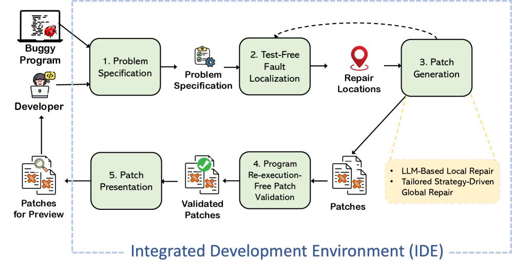

# 实用且高效的自动化程序修复，助力调试工作

发布时间：2024年07月11日

`Agent` `软件开发` `调试工具`

> Towards Practical and Useful Automated Program Repair for Debugging

# 摘要

> 目前的自动化程序修复技术尚未达到实用水平，无法满足现实调试的需求。这些技术依赖于不切实际的假设，如需要全面的测试用例集和频繁的程序重启来验证补丁，且修复复杂错误的能力有限。我们致力于提升APR的实用性与效率，助力开发者调试。为此，我们设计了PracAPR，一个在IDE中运行的交互式修复系统，旨在提供高效的调试修复建议。PracAPR无需测试集或程序重启，它假设开发者在使用IDE调试器时，程序已暂停在问题点。通过与开发者互动获取问题描述，PracAPR进行无测试的流分析故障定位，结合大型语言模型与定制策略进行局部与全局修复，并基于模拟跟踪比较进行无需重启的补丁验证，从而提出修复方案。PracAPR的引入，有望使APR成为日常调试的得力助手。

> Current automated program repair (APR) techniques are far from being practical and useful enough to be considered for realistic debugging. They rely on unrealistic assumptions including the requirement of a comprehensive suite of test cases as the correctness criterion and frequent program re-execution for patch validation; they are not fast; and their ability of repairing the commonly arising complex bugs by fixing multiple locations of the program is very limited. We hope to substantially improve APR's practicality, effectiveness, and usefulness to help people debug. Towards this goal, we envision PracAPR, an interactive repair system that works in an Integrated Development Environment (IDE) to provide effective repair suggestions for debugging. PracAPR does not require a test suite or program re-execution. It assumes that the developer uses an IDE debugger and the program has suspended at a location where a problem is observed. It interacts with the developer to obtain a problem specification. Based on the specification, it performs test-free, flow-analysis-based fault localization, patch generation that combines large language model-based local repair and tailored strategy-driven global repair, and program re-execution-free patch validation based on simulated trace comparison to suggest repairs. By having PracAPR, we hope to take a significant step towards making APR useful and an everyday part of debugging.

[Arxiv](https://arxiv.org/abs/2407.08958)