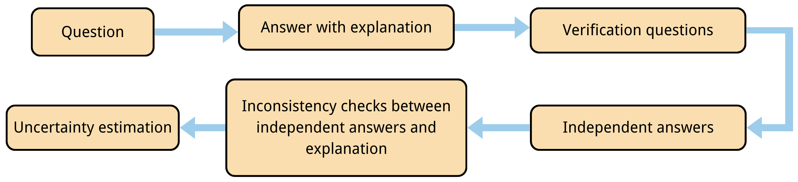
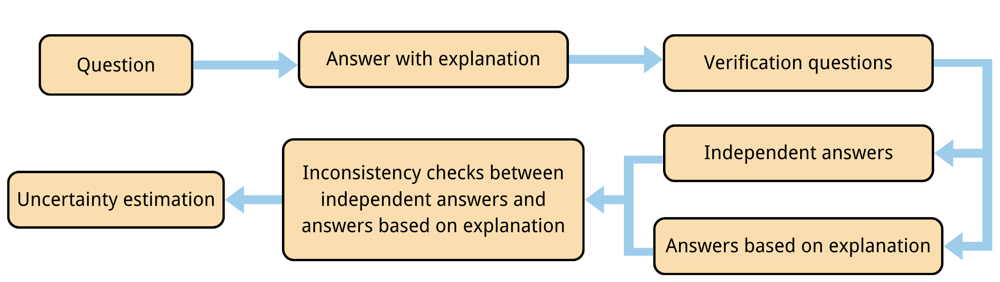
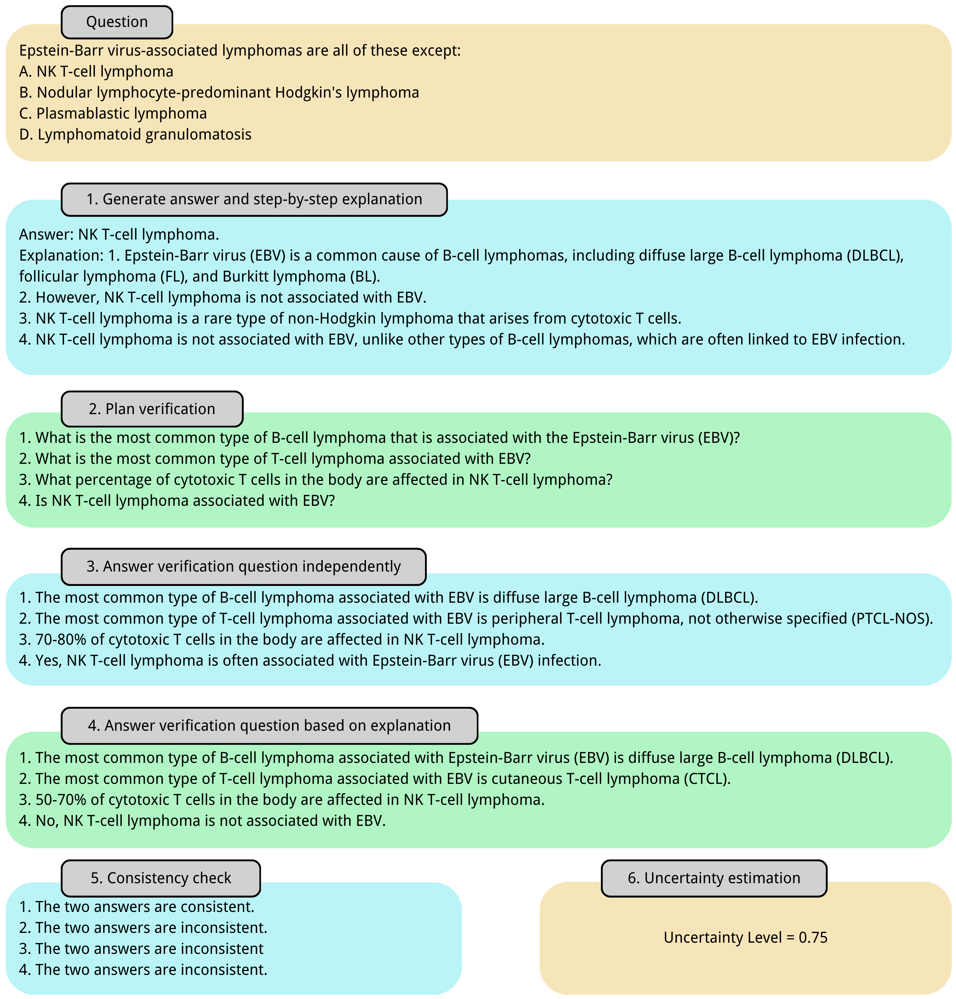
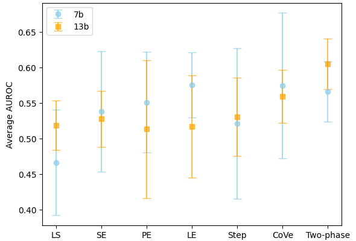

# 在医学问答领域，大型语言模型的不确定性评估

发布时间：2024年07月11日

`LLM应用` `生物医学`

> Uncertainty Estimation of Large Language Models in Medical Question Answering

# 摘要

> 在医疗领域，大型语言模型（LLM）虽在自然语言生成方面潜力巨大，但亦有生成事实错误之风险。为此，医疗问答应用中的LLM部署亟需可靠的不确定性估计（UE）方法以识别幻觉现象。本研究针对不同规模的模型，在医疗问答数据集上对主流UE方法进行了基准测试。结果表明，现有方法在此领域表现普遍欠佳，凸显了医疗应用中UE的挑战性。同时，我们发现模型规模与UE可靠性存在正相关。为应对这些挑战，我们创新性地提出了“两阶段验证”这一无概率UE方法。该方法首先要求LLM在给出答案的同时，提供详尽的推理过程，并据此设计验证问题以核实事实准确性。模型需独立及参照推理过程各回答一次，通过对比两次答案的不一致性来评估原始答案的不确定性。在三个生物医学问答数据集上，我们采用Llama 2 Chat模型对本方法进行了评估，并与基准方法进行了对比。结果表明，“两阶段验证”方法在各类数据集及模型规模下均展现出卓越的整体准确性与稳定性，且其性能随模型规模的扩大而增强。

> Large Language Models (LLMs) show promise for natural language generation in healthcare, but risk hallucinating factually incorrect information. Deploying LLMs for medical question answering necessitates reliable uncertainty estimation (UE) methods to detect hallucinations. In this work, we benchmark popular UE methods with different model sizes on medical question-answering datasets. Our results show that current approaches generally perform poorly in this domain, highlighting the challenge of UE for medical applications. We also observe that larger models tend to yield better results, suggesting a correlation between model size and the reliability of UE. To address these challenges, we propose Two-phase Verification, a probability-free Uncertainty Estimation approach. First, an LLM generates a step-by-step explanation alongside its initial answer, followed by formulating verification questions to check the factual claims in the explanation. The model then answers these questions twice: first independently, and then referencing the explanation. Inconsistencies between the two sets of answers measure the uncertainty in the original response. We evaluate our approach on three biomedical question-answering datasets using Llama 2 Chat models and compare it against the benchmarked baseline methods. The results show that our Two-phase Verification method achieves the best overall accuracy and stability across various datasets and model sizes, and its performance scales as the model size increases.

[Arxiv](https://arxiv.org/abs/2407.08662)