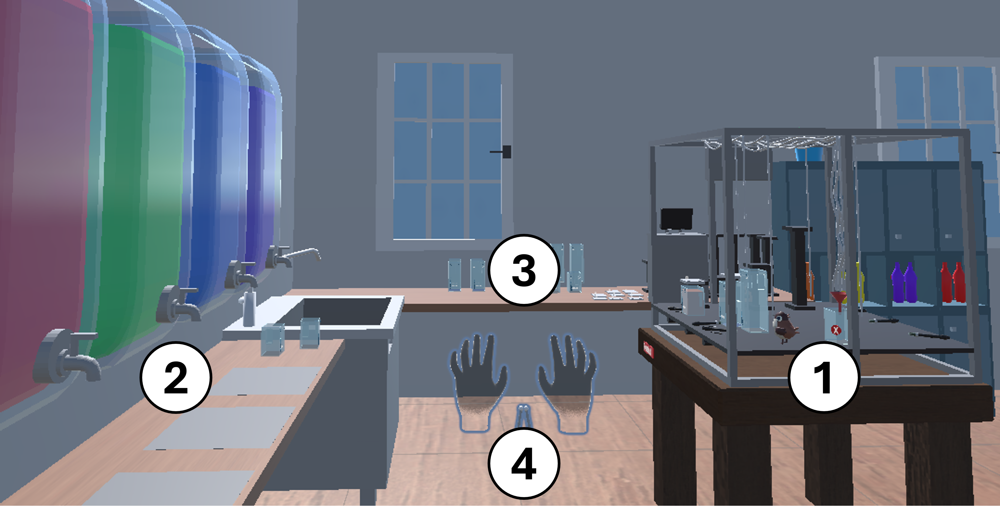
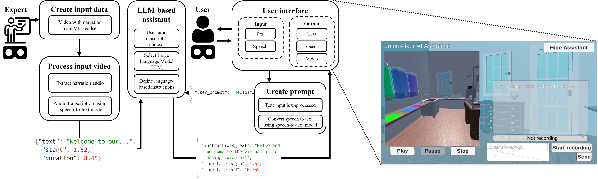

# AI 赋能的沉浸式辅助，助力工业环境中的交互任务执行

发布时间：2024年07月12日

`LLM应用` `制造业` `虚拟现实`

> AI-Powered Immersive Assistance for Interactive Task Execution in Industrial Environments

# 摘要

> 许多行业依赖熟练员工操作复杂机械。我们开发了一款AI辅助系统，通过VR模拟果汁混合场景，帮助用户在工业环境中完成复杂任务。该系统模拟了制药等行业中用于混合原料的复杂机械，并配备了多种设备和传感器。在受控环境中，这一设置不仅展示了系统的功能，也为更广泛的应用提供了概念验证。我们的AI助手结合了大型语言模型和语音识别技术，通过分析专家在VR中的操作视频，为用户提供详细指导。这一创新展示了AI助手在减轻认知负担、提升效率和保障安全方面的巨大潜力。

> Many industrial sectors rely on well-trained employees that are able to operate complex machinery. In this work, we demonstrate an AI-powered immersive assistance system that supports users in performing complex tasks in industrial environments. Specifically, our system leverages a VR environment that resembles a juice mixer setup. This digital twin of a physical setup simulates complex industrial machinery used to mix preparations or liquids (e.g., similar to the pharmaceutical industry) and includes various containers, sensors, pumps, and flow controllers. This setup demonstrates our system's capabilities in a controlled environment while acting as a proof-of-concept for broader industrial applications. The core components of our multimodal AI assistant are a large language model and a speech-to-text model that process a video and audio recording of an expert performing the task in a VR environment. The video and speech input extracted from the expert's video enables it to provide step-by-step guidance to support users in executing complex tasks. This demonstration showcases the potential of our AI-powered assistant to reduce cognitive load, increase productivity, and enhance safety in industrial environments.

[Arxiv](https://arxiv.org/abs/2407.09147)