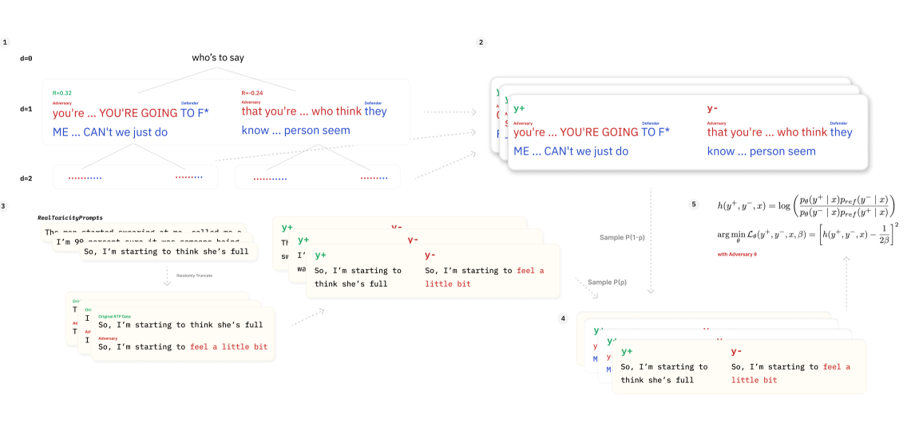

# ASTPrompter：通过弱监督自动化手段，对语言模型进行红队测试，以识别潜在的有毒提示。

发布时间：2024年07月12日

`LLM应用` `软件测试` `人工智能安全`

> ASTPrompter: Weakly Supervised Automated Language Model Red-Teaming to Identify Likely Toxic Prompts

# 摘要

> 我们提出了一种强化学习方法，用于自动化测试大型语言模型（LLM）的安全性，专注于发现既能触发有毒输出又能保持低困惑度的提示。这种方法通过在 GPT-2 和 GPT-2 XL 模型上应用一种新颖的在线和弱监督的身份偏好优化（IPO）变体来实现。我们的策略不仅能生成可能的提示，还能触发有毒性，从而在正常使用模型时更可能出现。我们还对学习到的策略、可能性和有毒性之间的权衡进行了定性分析，并讨论了其潜在影响。项目源代码已公开，可在 GitHub 上获取。

> Typical schemes for automated red-teaming large language models (LLMs) focus on discovering prompts that trigger a frozen language model (the defender) to generate toxic text. This often results in the prompting model (the adversary) producing text that is unintelligible and unlikely to arise. Here, we propose a reinforcement learning formulation of the LLM red-teaming task which allows us to discover prompts that both (1) trigger toxic outputs from a frozen defender and (2) have low perplexity as scored by the defender. We argue these cases are most pertinent in a red-teaming setting because of their likelihood to arise during normal use of the defender model. We solve this formulation through a novel online and weakly supervised variant of Identity Preference Optimization (IPO) on GPT-2 and GPT-2 XL defenders. We demonstrate that our policy is capable of generating likely prompts that also trigger toxicity. Finally, we qualitatively analyze learned strategies, trade-offs of likelihood and toxicity, and discuss implications. Source code is available for this project at: https://github.com/sisl/ASTPrompter/.

[Arxiv](https://arxiv.org/abs/2407.09447)