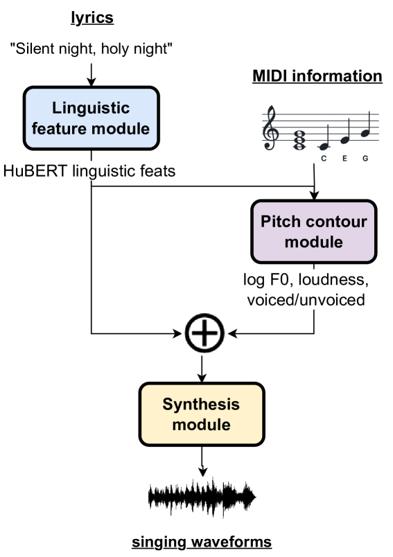
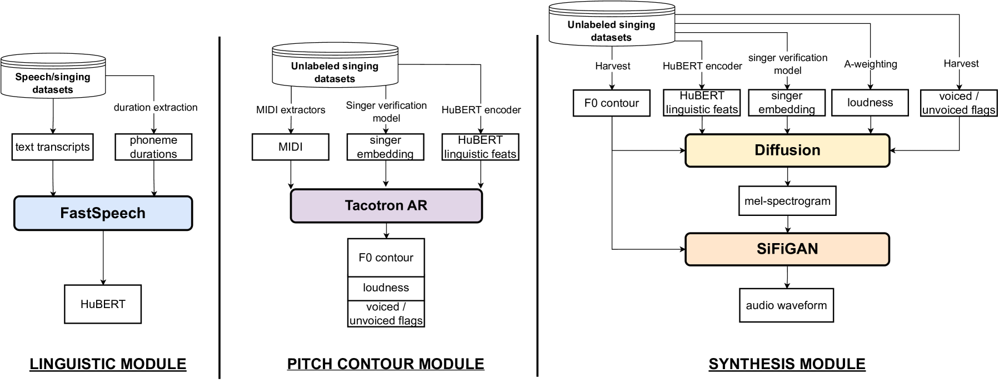

# 本研究初步探索了利用分解框架和可推断特征实现灵活歌唱声音合成的方法。

发布时间：2024年07月12日

`LLM应用` `语音合成`

> A Preliminary Investigation on Flexible Singing Voice Synthesis Through Decomposed Framework with Inferrable Features

# 摘要

> 我们探索了通过分解框架提升歌唱声音合成（SVS）系统灵活性的可行性。传统的SVS系统受限于直接的乐谱到波形映射，仅能合成特定语言或歌手的声音。考虑到大规模标记歌唱数据集的收集成本，我们提出了一种分解SVS系统并推断歌唱声音特征的新方法。该系统被分解为语言、音高和合成三个模块，直接从音频中提取语言内容、音高、声音状态、歌手特征和响度等特征。这一分解框架不仅减轻了对标记数据集的依赖，还能适应多种语言和歌手，并填补歌唱声音的歌词内容。研究表明，尽管增加了功能和灵活性，该框架仍有潜力达到SVS领域的顶尖水平。对当前框架能力的全面分析为实现一个灵活且多功能的SVS系统提供了研究方向。

> We investigate the feasibility of a singing voice synthesis (SVS) system by using a decomposed framework to improve flexibility in generating singing voices. Due to data-driven approaches, SVS performs a music score-to-waveform mapping; however, the direct mapping limits control, such as being able to only synthesize in the language or the singers present in the labeled singing datasets. As collecting large singing datasets labeled with music scores is an expensive task, we investigate an alternative approach by decomposing the SVS system and inferring different singing voice features. We decompose the SVS system into three-stage modules of linguistic, pitch contour, and synthesis, in which singing voice features such as linguistic content, F0, voiced/unvoiced, singer embeddings, and loudness are directly inferred from audio. Through this decomposed framework, we show that we can alleviate the labeled dataset requirements, adapt to different languages or singers, and inpaint the lyrical content of singing voices. Our investigations show that the framework has the potential to reach state-of-the-art in SVS, even though the model has additional functionality and improved flexibility. The comprehensive analysis of our investigated framework's current capabilities sheds light on the ways the research community can achieve a flexible and multifunctional SVS system.

[Arxiv](https://arxiv.org/abs/2407.09346)