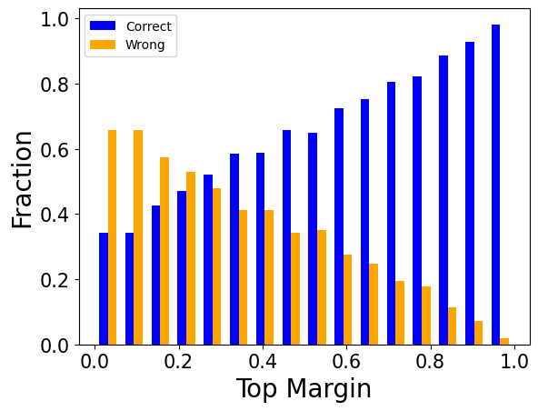

# 准确性并非唯一追求

发布时间：2024年07月12日

`LLM理论` `计算机科学` `人工智能`

> Accuracy is Not All You Need

# 摘要

> 在压缩大型语言模型时，通常通过比较压缩前后模型在基准测试上的准确性来验证压缩技术的有效性。然而，即使准确性相近，我们也发现了一个有趣的现象——“翻转”，即答案在正确与错误之间转换。通过跨多种技术、模型和数据集的深入分析，我们揭示了压缩模型与原始模型在实际应用中的行为差异。此外，通过 MT-Bench 的评估，我们发现压缩模型在自由生成任务中的表现远不如原始模型。因此，我们建议在评估压缩技术时，除了准确性，还应考虑如 KL-散度等距离度量。我们提出的这两种度量方法显示出良好的相关性，为评估提供了新的视角。

> When Large Language Models (LLMs) are compressed using techniques such as quantization, the predominant way to demonstrate the validity of such techniques is by measuring the model's accuracy on various benchmarks.If the accuracies of the baseline model and the compressed model are close, it is assumed that there was negligible degradation in quality.However, even when the accuracy of baseline and compressed model are similar, we observe the phenomenon of flips, wherein answers change from correct to incorrect and vice versa in proportion.We conduct a detailed study of metrics across multiple compression techniques, models and datasets, demonstrating that the behavior of compressed models as visible to end-users is often significantly different from the baseline model, even when accuracy is similar.We further evaluate compressed models qualitatively and quantitatively using MT-Bench and show that compressed models are significantly worse than baseline models in this free-form generative task.Thus, we argue that compression techniques should also be evaluated using distance metrics.We propose two such metrics, KL-Divergence and flips, and show that they are well correlated.

[Arxiv](https://arxiv.org/abs/2407.09141)