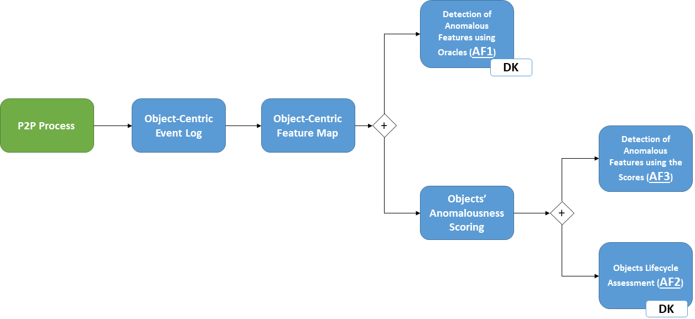
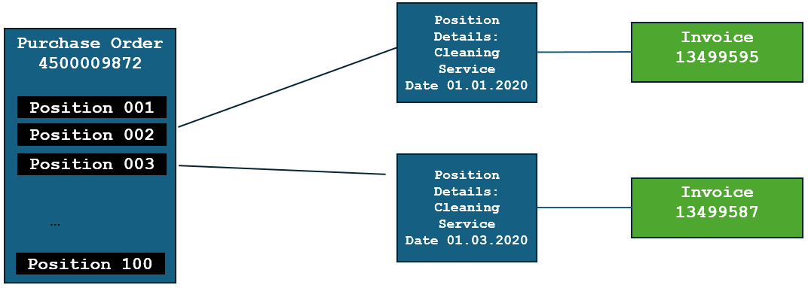

# 以对象为中心的异常检测面临多重挑战，涉及维度问题及领域知识的关键角色。

发布时间：2024年07月12日

`LLM应用` `业务流程管理` `异常检测`

> Challenges of Anomaly Detection in the Object-Centric Setting: Dimensions and the Role of Domain Knowledge

# 摘要

> 以对象为中心的事件日志能够自然地展现业务流程的执行，如 ERP 和 CRM。然而，这类复杂信息的建模需要创新的过程挖掘技术，并可能产生复杂的约束集合。本文探讨了以对象为中心的异常检测方法，利用对象间的生命周期和交互，无需预设模型即可识别异常模式。同时，我们分析了领域知识在方法中的作用，以及大型语言模型在提供领域知识方面的优势与局限。基于实际 P2P 流程的经验，我们还探讨了算法组合（降维与异常检测）的应用，提出了预处理建议，并讨论了特征传播的重要性。

> Object-centric event logs, allowing events related to different objects of different object types, represent naturally the execution of business processes, such as ERP (O2C and P2P) and CRM. However, modeling such complex information requires novel process mining techniques and might result in complex sets of constraints. Object-centric anomaly detection exploits both the lifecycle and the interactions between the different objects. Therefore, anomalous patterns are proposed to the user without requiring the definition of object-centric process models. This paper proposes different methodologies for object-centric anomaly detection and discusses the role of domain knowledge for these methodologies. We discuss the advantages and limitations of Large Language Models (LLMs) in the provision of such domain knowledge. Following our experience in a real-life P2P process, we also discuss the role of algorithms (dimensionality reduction+anomaly detection), suggest some pre-processing steps, and discuss the role of feature propagation.

[Arxiv](https://arxiv.org/abs/2407.09023)