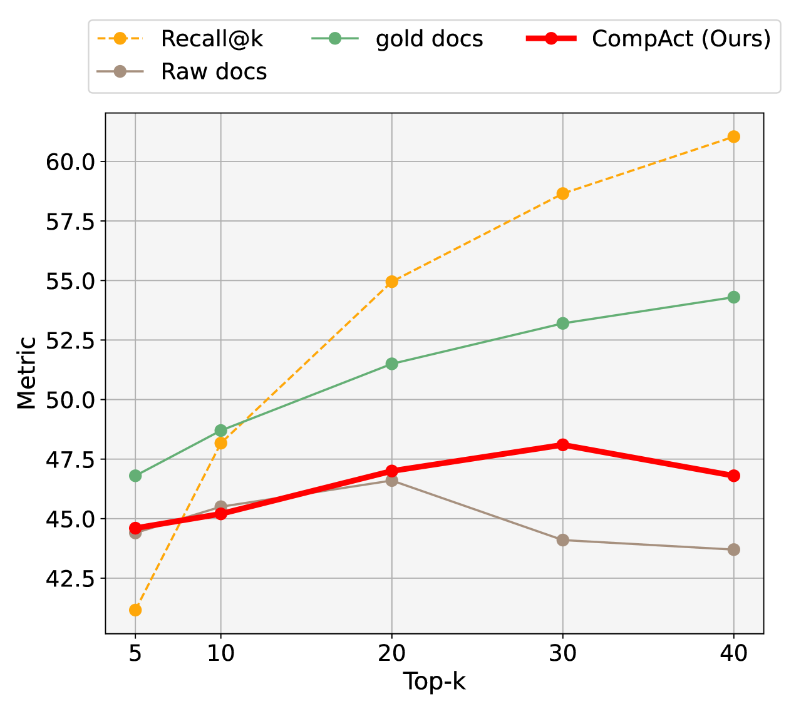

# CompAct：为问答任务主动压缩检索文档

发布时间：2024年07月12日

`RAG` `问答系统` `信息检索`

> CompAct: Compressing Retrieved Documents Actively for Question Answering

# 摘要

> 检索增强生成帮助语言模型通过外部上下文巩固事实基础，但面对海量信息时，模型效能常受挑战。上下文压缩虽能滤除无关信息，但在现实场景中，关键信息难以一蹴而就。为此，我们创新推出CompAct框架，以主动策略精简文档，确保信息不失真。实验显示，CompAct在多跳问答基准上，性能与压缩率双双提升。它如灵活的插件，与各类检索器或阅读器无缝对接，压缩效率高达47倍，成本效益显著。

> Retrieval-augmented generation supports language models to strengthen their factual groundings by providing external contexts. However, language models often face challenges when given extensive information, diminishing their effectiveness in solving questions. Context compression tackles this issue by filtering out irrelevant information, but current methods still struggle in realistic scenarios where crucial information cannot be captured with a single-step approach. To overcome this limitation, we introduce CompAct, a novel framework that employs an active strategy to condense extensive documents without losing key information. Our experiments demonstrate that CompAct brings significant improvements in both performance and compression rate on multi-hop question-answering (QA) benchmarks. CompAct flexibly operates as a cost-efficient plug-in module with various off-the-shelf retrievers or readers, achieving exceptionally high compression rates (47x).

[Arxiv](https://arxiv.org/abs/2407.09014)