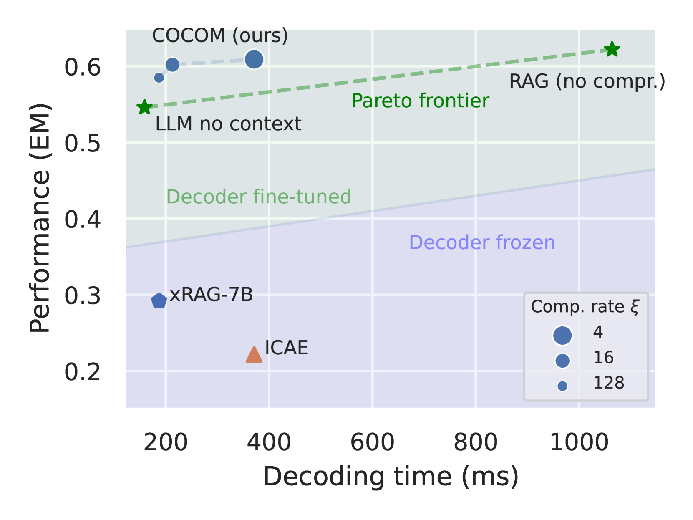
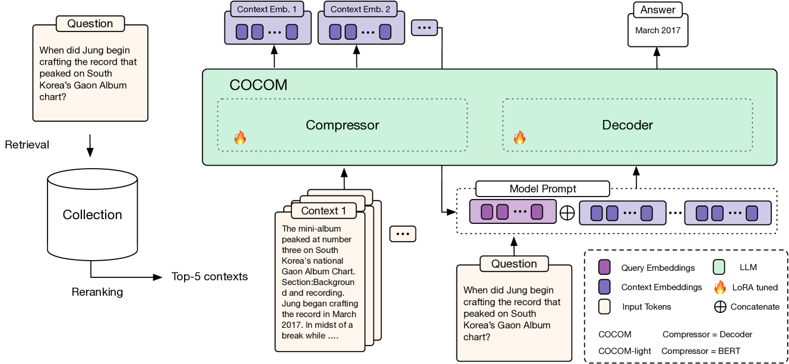
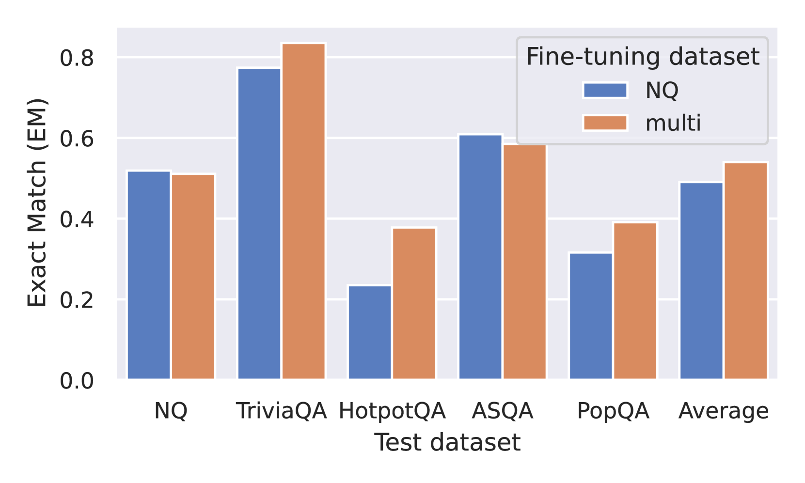

# RAG 中，上下文嵌入助力高效答案生成

发布时间：2024年07月12日

`RAG` `人工智能` `软件开发`

> Context Embeddings for Efficient Answer Generation in RAG

# 摘要

> RAG 通过引入外部信息扩展输入，突破了 LLMs 的知识局限。然而，这使得上下文输入变长，直接延长了用户的等待时间。为此，我们推出了 COCOM，一种高效的上下文压缩技术，将冗长的上下文精简为几个关键嵌入，大幅缩短生成时间。COCOM 允许根据需求调整压缩率，平衡解码速度与答案质量。相较于传统方法，COCOM 在处理复杂上下文时更为出色，显著提升了处理长输入的效率。实验表明，我们的方法在保持高性能的同时，最高可实现 5.69 倍的加速。

> Retrieval-Augmented Generation (RAG) allows overcoming the limited knowledge of LLMs by extending the input with external information. As a consequence, the contextual inputs to the model become much longer which slows down decoding time directly translating to the time a user has to wait for an answer. We address this challenge by presenting COCOM, an effective context compression method, reducing long contexts to only a handful of Context Embeddings speeding up the generation time by a large margin. Our method allows for different compression rates trading off decoding time for answer quality. Compared to earlier methods, COCOM allows for handling multiple contexts more effectively, significantly reducing decoding time for long inputs. Our method demonstrates a speed-up of up to 5.69 $\times$ while achieving higher performance compared to existing efficient context compression methods.

[Arxiv](https://arxiv.org/abs/2407.09252)