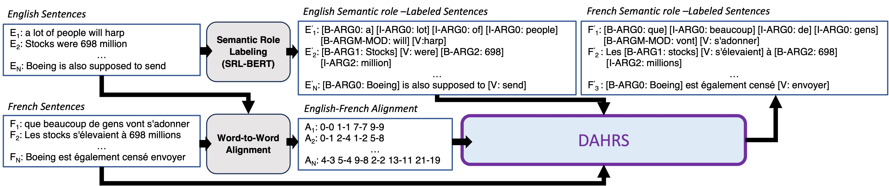
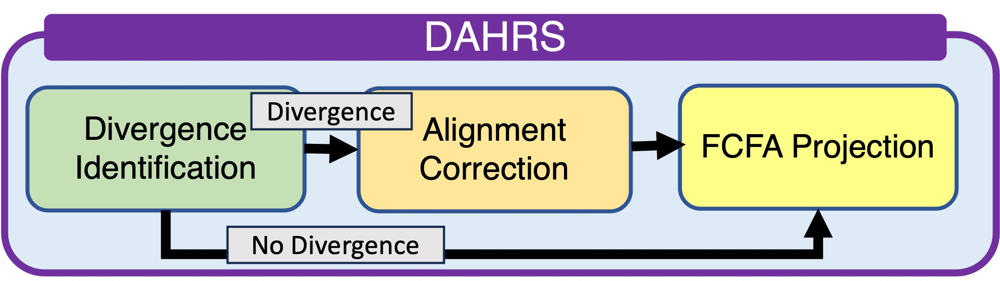

# DAHRS：一种偏差感知型幻觉修正语义角色标注投影技术

发布时间：2024年07月12日

`LLM应用` `机器翻译`

> DAHRS: Divergence-Aware Hallucination-Remediated SRL Projection

# 摘要

> 语义角色标注（SRL）广泛应用于机器翻译、问答、摘要及立场检测等下游任务。然而，多语言SRL模型的构建因语义注释语料库的稀缺而颇具挑战。基于大型语言模型的SRL投影（XSRL）虽先进，但输出常含虚假角色标签，且因模型缺乏解释性，修复不易。我们发现，这些幻觉标签与自然语言中的偏差类型有关，这些偏差影响了初始对齐。为此，我们开发了偏差感知幻觉修复SRL投影（DAHRS），通过语言学引导的对齐修复和先到先得的贪婪投影，DAHRS在不增加复杂机制的情况下提升了投影准确性，超越了XSRL，并扩展至短语级SRL投影（如EN-FR、EN-ES）。以CoNLL-2009为基准，DAHRS在词级F1得分上显著提升，分别为87.6%（EN-FR）和89.0%（EN-ES），人类评估的短语级准确率亦高达89.1%（EN-FR）和91.0%（EN-ES）。此外，我们还引入了一个偏差度量，以便将此方法应用于其他语言对，如英语与他加禄语。

> Semantic role labeling (SRL) enriches many downstream applications, e.g., machine translation, question answering, summarization, and stance/belief detection. However, building multilingual SRL models is challenging due to the scarcity of semantically annotated corpora for multiple languages. Moreover, state-of-the-art SRL projection (XSRL) based on large language models (LLMs) yields output that is riddled with spurious role labels. Remediation of such hallucinations is not straightforward due to the lack of explainability of LLMs. We show that hallucinated role labels are related to naturally occurring divergence types that interfere with initial alignments. We implement Divergence-Aware Hallucination-Remediated SRL projection (DAHRS), leveraging linguistically-informed alignment remediation followed by greedy First-Come First-Assign (FCFA) SRL projection. DAHRS improves the accuracy of SRL projection without additional transformer-based machinery, beating XSRL in both human and automatic comparisons, and advancing beyond headwords to accommodate phrase-level SRL projection (e.g., EN-FR, EN-ES). Using CoNLL-2009 as our ground truth, we achieve a higher word-level F1 over XSRL: 87.6% vs. 77.3% (EN-FR) and 89.0% vs. 82.7% (EN-ES). Human phrase-level assessments yield 89.1% (EN-FR) and 91.0% (EN-ES). We also define a divergence metric to adapt our approach to other language pairs (e.g., English-Tagalog).

[Arxiv](https://arxiv.org/abs/2407.09283)