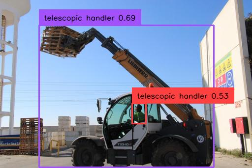
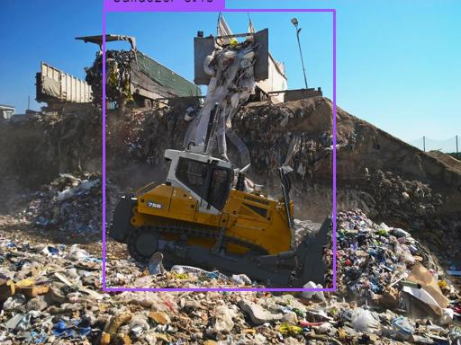
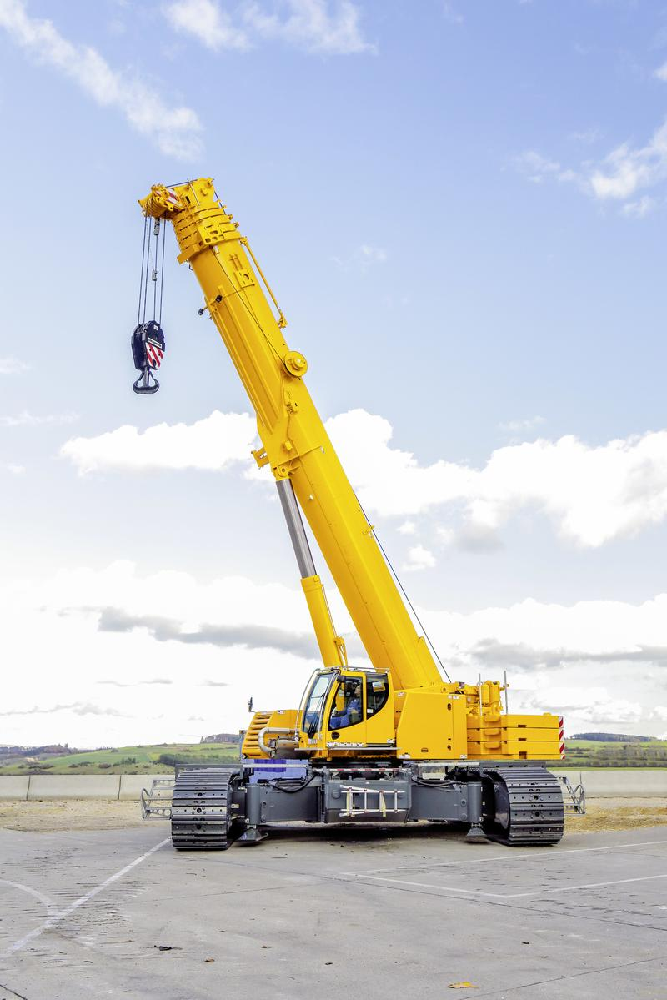
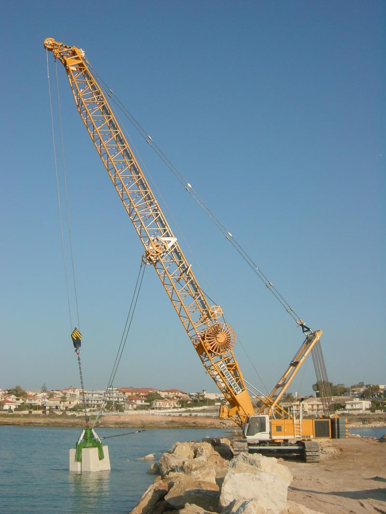
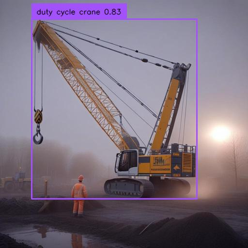
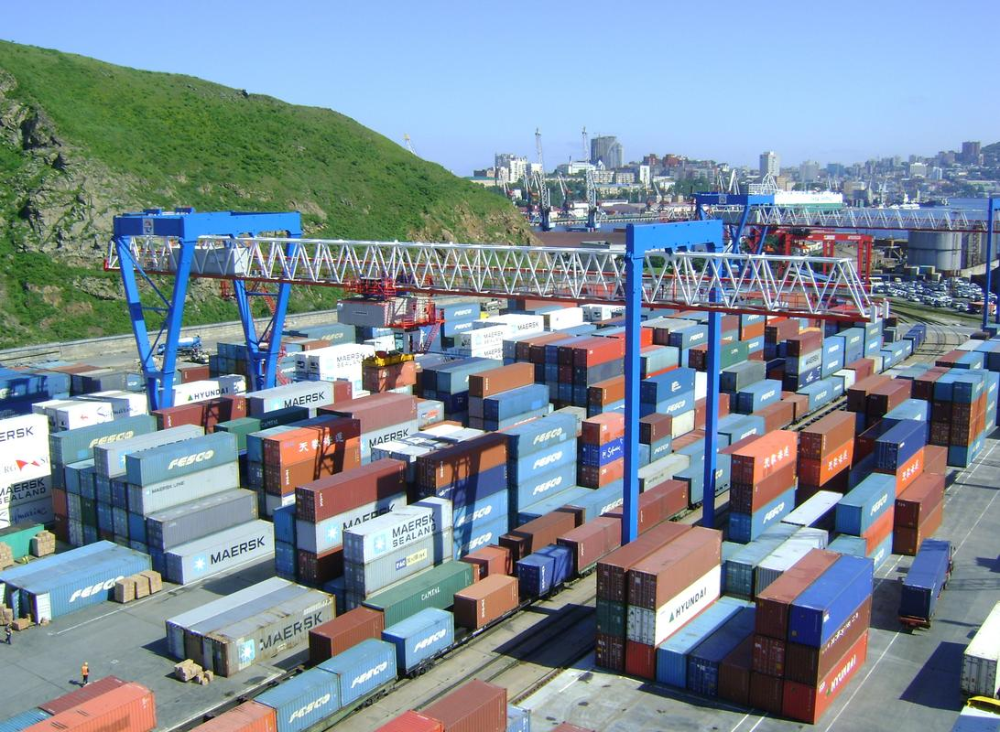

# DART 是一个全自动的物体检测流程，集成了数据多样化、开放词汇的边界框标注、伪标签审核以及模型训练。

发布时间：2024年07月12日

`LLM应用` `工业安全`

> DART: An Automated End-to-End Object Detection Pipeline with Data Diversification, Open-Vocabulary Bounding Box Annotation, Pseudo-Label Review, and Model Training

# 摘要

> 在工业应用中，如建筑工地的安全监控，快速准确地检测特定对象至关重要。传统方法依赖繁琐的手动标注和数据收集，难以适应多变的环境和新对象。为此，我们提出了DART，一个自动化端到端流程，简化对象检测的全流程，无需人工标注和大量数据收集，适应性强。DART通过主题驱动的图像生成模块（DreamBooth with SDXL）丰富数据，再由开放词汇对象检测（Grounding DINO）生成标注，经大型多模态模型（GPT-4o）审核后，用于训练实时检测器（YOLO）。我们在自建的建筑机械数据集Liebherr Product上应用DART，显著提升平均精度（AP）至0.832。DART的模块化设计确保了未来算法的升级、新类别的无缝集成及定制环境的适应性。相关代码和数据集已公开于https://github.com/chen-xin-94/DART。

> Swift and accurate detection of specified objects is crucial for many industrial applications, such as safety monitoring on construction sites. However, traditional approaches rely heavily on arduous manual annotation and data collection, which struggle to adapt to ever-changing environments and novel target objects. To address these limitations, this paper presents DART, an automated end-to-end pipeline designed to streamline the entire workflow of an object detection application from data collection to model deployment. DART eliminates the need for human labeling and extensive data collection while excelling in diverse scenarios. It employs a subject-driven image generation module (DreamBooth with SDXL) for data diversification, followed by an annotation stage where open-vocabulary object detection (Grounding DINO) generates bounding box annotations for both generated and original images. These pseudo-labels are then reviewed by a large multimodal model (GPT-4o) to guarantee credibility before serving as ground truth to train real-time object detectors (YOLO). We apply DART to a self-collected dataset of construction machines named Liebherr Product, which contains over 15K high-quality images across 23 categories. The current implementation of DART significantly increases average precision (AP) from 0.064 to 0.832. Furthermore, we adopt a modular design for DART to ensure easy exchangeability and extensibility. This allows for a smooth transition to more advanced algorithms in the future, seamless integration of new object categories without manual labeling, and adaptability to customized environments without extra data collection. The code and dataset are released at https://github.com/chen-xin-94/DART.

[Arxiv](https://arxiv.org/abs/2407.09174)